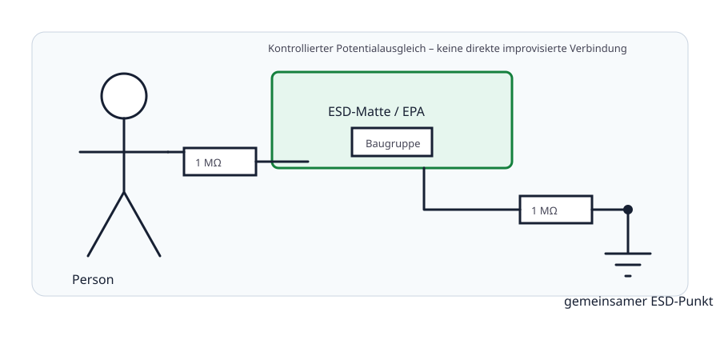

# 00.5 – ESD verstehen und Baugruppen schützen

[← Zurück](04-elektrische-sicherheit-und-sichere-kursgrenzen.md) · [Modulübersicht](README.md) · [Kursübersicht](../README.md) · [Weiter →](06-professioneller-elektronikarbeitsplatz.md)

## Lernziele

Nach dieser Lektion kannst du:

- Entstehung und Schadensarten elektrostatischer Entladung erklären
- einen ESD-Schutzbereich korrekt benutzen
- ESD-bedingte Fehler in der Diagnose berücksichtigen

## Bezug Bildungsplan 2026

- Handlungskompetenzen: `b3-LK04`, `b3-LK11`, `b3-LK14–15`
- Nachweise und Leistungskriterien: [Kompetenzmatrix](../bildungsplan-2026/kompetenzmatrix.md)

## Voraussetzungen

Lektion 00.4 und Einweisung in die lokal verwendete ESD-Ausrüstung.

## Warum ist das wichtig?

Ein Funke, den Menschen spüren, ist deutlich stärker als viele Halbleitereingänge vertragen. Noch schwieriger sind Entladungen, die unbemerkt bleiben: Eine Baugruppe kann zunächst funktionieren und später sporadisch ausfallen.

ESD-Schutz ist deshalb kein Ritual. Er schafft kontrollierte Potentialverhältnisse und verhindert schnelle Entladungen durch empfindliche Strukturen.

## Theorie

### Aufladung und Entladung

Reibung und Trennung unterschiedlicher Materialien können Ladung verschieben. Person, Werkzeug und Baugruppe liegen dann auf verschiedenen Potentialen. Bei Annäherung kann die Spannung dünne Oxidschichten oder pn-Übergänge lokal überlasten.

### Drei Schadensbilder

Ein **katastrophaler Schaden** ist sofort sichtbar. Ein **latenter Schaden** verkürzt die Lebensdauer. Eine **Parameteränderung** erhöht etwa Leckstrom oder Rauschen. Die letzten beiden Formen können wie Firmware- oder Temperaturprobleme erscheinen.

### Kontrollierter Potentialausgleich

ESD-Matte, Handgelenkband und geeignete Werkzeuge werden über definierte Schutzwiderstände an einem gemeinsamen Erdungspunkt zusammengeführt. Das begrenzt den Ausgleichsstrom. Ein Handgelenkband wird nie improvisiert direkt mit Schutzleiter verbunden.

Die Baugruppe kommt geschlossen im ESD-Beutel an den Platz, wird erst im Schutzbereich geöffnet und an Kanten gehalten. Schutzmittel und Prüfdatum werden vor Arbeitsbeginn kontrolliert.

## Anschauliches Beispiel

Ein ADC-Kanal zeigt nur bei trockener Luft gelegentliche Sprünge. Ein Vergleich mit einem bekannten guten Board und die Rückverfolgung der Handhabung können einen latenten Eingangsschaden sichtbar machen.

## Berechnungsbeispiel

Das vereinfachte Körpermodell speichert bei `C = 100 pF` und `U = 2000 V` die Energie `E = ½ × 100 pF × (2000 V)² = 0,2 mJ`. Die Energie wirkt in sehr kurzer Zeit auf eine mikroskopisch kleine Struktur; deshalb kann sie trotz des kleinen Zahlenwerts schädigen.

## Praxisbezug

Prüfe Handgelenkband und Arbeitsplatz nach lokaler Anweisung. Dokumentiere Testergebnis, Datum, verwendete Schutzausrüstung und den Weg einer Baugruppe von der Verpackung bis zur geschützten Ablage.

## 🔗 Hardware ↔ Firmware

Latente ESD-Schäden können ADC-Rauschen, Kommunikationsabbrüche oder undefinierte GPIO-Pegel verursachen. Firmware-Logging hilft beim Eingrenzen, beweist aber keine Softwareursache. Board-ID und ESD-Historie gehören deshalb zur Diagnose.

## Merksatz

> ESD-Schutz bringt Person, Werkzeug und Baugruppe kontrolliert auf dasselbe Potential.

## Häufige Fehler und Missverständnisse

- Die Aussenseite eines ESD-Beutels als Arbeitsfläche verwenden.
- Aus «kein Funke sichtbar» auf «keine Entladung» schliessen.
- Handgelenkband ohne Prüfung oder an ungeeigneten Arbeitsplätzen benutzen.

## Zusammenfassung

ESD kann sofortige, latente oder parametrische Schäden verursachen. Ein geprüfter Schutzbereich schafft langsamen, begrenzten Potentialausgleich und eine dokumentierte Handhabung.

## Übungsfragen

1. Warum sind latente Schäden besonders problematisch?
2. Welche Aufgabe hat der Schutzwiderstand?
3. Wann wird eine Baugruppe aus dem ESD-Beutel genommen?

Weitere Aufgaben: [Übungen zu Modul 00](../uebungen/modul-00.md). Die Lösungen liegen bewusst getrennt.
