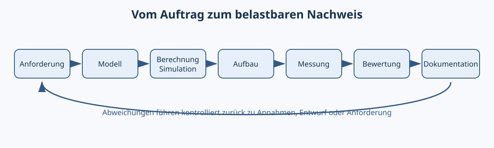

# 00.1 – Kursaufbau, Lernpfad und professionelles Arbeiten

[← Zurück](README.md) · [Modulübersicht](README.md) · [Kursübersicht](../README.md) · [Weiter →](02-gefaehrdungen-schutzmassnahmen-und-sichere-grenzen.md)

## Lernziele

Nach dieser Lektion kannst du die beschriebenen Regeln auf einen realen Laborauftrag anwenden, Risiken und Freigabekriterien begründen sowie deine Arbeit so dokumentieren, dass eine zweite Person sie sicher nachvollziehen kann.

## 1. Was dieser Kurs trainiert

Elektronik wird professionell, wenn eine Schaltung nicht nur einmal funktioniert, sondern ihr Verhalten **vorhergesagt, gemessen und begründet** werden kann. Deshalb beginnt jede Aufgabe mit einer Anforderung und endet mit einem Nachweis:

```text
Anforderung → Modell → Berechnung → Aufbau → Messung → Bewertung → Dokumentation
```

Ein Ergebnis wie „die LED leuchtet“ ist noch kein Nachweis. Besser ist: „Bei 5.00 V Versorgung wurden 2.04 V an der roten LED und 2.96 V am 1.00-kΩ-Vorwiderstand gemessen. Daraus folgen 2.96 mA; erwartet waren 3.0 mA.“ Damit kann eine andere Person das Resultat prüfen.

## 2. Die vier Lernspuren

Der Kurs verbindet vier Spuren, die in jedem Modul wiederkehren:

1. **Verstehen:** Modelle, Begriffe und Gültigkeitsgrenzen erklären.
2. **Entwickeln:** Anforderungen in Schaltungen, Bauteilwerte und Prüfkriterien übersetzen.
3. **Realisieren:** sicher aufbauen, fertigen und in Betrieb nehmen.
4. **Nachweisen:** messen, Abweichungen beurteilen und Änderungen dokumentieren.

Die Module 00–02 bilden das Fundament. Danach folgen Netzwerkanalyse, Bauteile und analoge/digitale Schaltungen. Die späteren Module führen über Stromversorgungen und Mikrocontroller-Hardware bis zu PCB, Fertigung, Inbetriebnahme und Systemintegration.



## 3. Laborjournal als technisches Gedächtnis

Ein Laborjournal ist kein nachträglich schöner Bericht. Es hält während der Arbeit fest:

- Datum, Bearbeiter/in und Aufbauversion,
- Ziel und messbare Akzeptanzkriterien,
- Schema, Bauteile und Geräteeinstellungen,
- erwartete Werte **vor** dem Einschalten,
- Messwerte mit Einheit, Messpunkt und Bedingung,
- Abweichungen, Hypothesen, Änderungen und Resultat.

Fehler werden nicht versteckt. Eine widerlegte Hypothese ist wertvolle Information, wenn nachvollziehbar ist, wie sie geprüft wurde.

## 4. Portfolio und Projektlinien

Übungen trainieren einzelne Fähigkeiten. Labore verbinden Berechnung, Aufbau und Messung. Die drei [Projektlinien](../projekte/README.md) sammeln grössere Nachweise. Für ein Portfolio zählen nicht Dateimenge oder Seitenzahl, sondern reproduzierbare technische Entscheidungen.

## Hardware ↔ Firmware

Hardware und Firmware werden als ein System betrachtet. Ein GPIO-Befehl ist nur dann sinnvoll, wenn Pinmodus, Versorgung, Last, Pegel und Stromgrenze zusammenpassen. Der [STM32-Programmierkurs](https://github.com/matthiasflueck/STM32-Programmierkurs) vertieft die Softwareseite; dieser Kurs liefert die elektrische Begründung und die Messmethoden.

## Praxisregel

**Erst vorhersagen, dann messen.** Ohne erwarteten Wertebereich lässt sich eine Anzeige zwar ablesen, aber kaum beurteilen.


## Bildungsplan 2026

Dieses Thema unterstützt `a1` (Anforderungen erfassen), `d1` (Aufträge planen), `d2` (Verlauf kontrollieren) und `d3` (Ergebnisse auswerten). Sicherheits-, Qualitäts- und Dokumentationsregeln wirken zusätzlich in allen Hardwarekompetenzen `b1–b5`.

## Kurzcheck

1. Welche Information muss vor dem Einschalten feststehen?
2. Woran erkennt eine zweite Person den tatsächlich geprüften Stand?
3. Welche Hardwareeigenschaft kann sich in der Firmware als scheinbar zufälliger Fehler zeigen?
