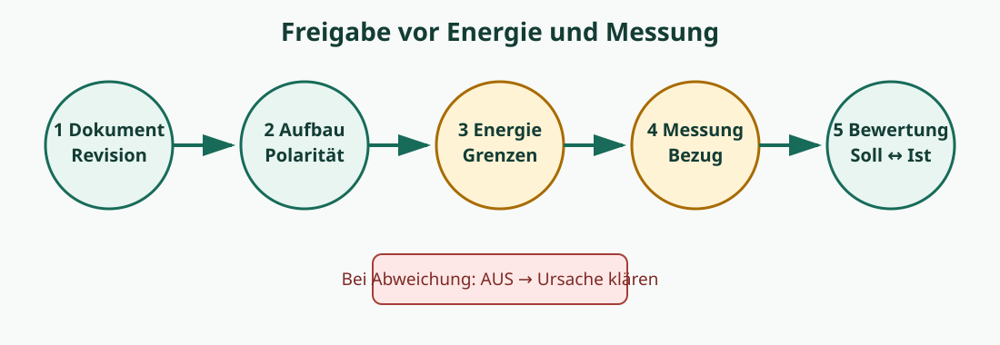

# 00.4 – Laborarbeitsplatz, Ordnung und Freigaben

[← Zurück](03-esd-schutz-und-umgang-mit-baugruppen.md) · [Modulübersicht](README.md) · [Kursübersicht](../README.md) · [Weiter →](05-messstrategie-messprotokoll-und-rueckverfolgbarkeit.md)

## Lernziele

Nach dieser Lektion kannst du die beschriebenen Regeln auf einen realen Laborauftrag anwenden, Risiken und Freigabekriterien begründen sowie deine Arbeit so dokumentieren, dass eine zweite Person sie sicher nachvollziehen kann.

## 1. Funktionszonen

Ein guter Arbeitsplatz trennt Funktionen sichtbar:

- **Aufbauzone:** Schaltung, ESD-Matte und nur benötigte Bauteile,
- **Messzone:** Geräte so angeordnet, dass Anzeigen und Bedienelemente erreichbar sind,
- **Dokumentationszone:** Schema, Messplan und Laborjournal,
- **Ablagezone:** Bauteile und Werkzeuge gegen Verwechslung geschützt.

Getränke, lose Metallteile und nicht benötigte Kabel gehören nicht in die Aufbauzone. Jede Leitung erhält eine eindeutige Funktion; Farbe allein genügt bei komplexeren Aufbauten nicht.

## 2. Geräte vor dem Anschluss einstellen

Das Labornetzgerät wird **vor** dem Verbinden eingestellt: Ausgang aus, Spannung auf sicheren Startwert, Stromgrenze passend zur Schaltung. Ein Funktionsgenerator kann je nach Einstellung und Abschlussimpedanz eine andere tatsächliche Amplitude liefern; `50 Ω`-Anzeige und hochohmige Last müssen unterschieden werden.

Beim Multimeter wird vor jeder Messung geprüft:

- richtige Buchse,
- richtige Messfunktion,
- erwarteter Wertebereich,
- intakte und geeignete Messleitungen.

Nach einer Strommessung kommt die rote Leitung zurück in die Spannungs-/Widerstandsbuchse. So wird der häufige Kurzschlussfehler bei der nächsten Spannungsmessung verhindert.

## 3. Vier Freigaben

Eine Schaltung erhält nacheinander vier Freigaben:

1. **Dokumentenfreigabe:** Schema, Werte und Revision stimmen.
2. **Aufbaufreigabe:** Polarität, Orientierung, Verbindungen und Kurzschlussfreiheit stimmen.
3. **Energiefreigabe:** Quelle, Stromgrenze und Abbruchkriterien sind eingestellt.
4. **Messfreigabe:** Messgerät, Bezugspunkt und Belastung sind geeignet.

## 4. Nach der Messung

Erst Quelle ausschalten, dann gespeicherte Energie prüfen, danach Leitungen entfernen. Aufbau und Bauteile werden gekennzeichnet oder zurückgebaut. Beschädigte Messleitungen werden ausgesondert, nicht „für später“ in die Schublade gelegt.

## Hardware ↔ Firmware

Vor dem Programmieren wird geklärt, welche Pins beim Reset hochohmig, mit Pull-Widerstand oder kurzzeitig anderweitig belegt sind. Der Debugger kann einen Controller anhalten, während Ausgänge ihren letzten Zustand behalten. Die Energiefreigabe muss diesen Fall berücksichtigen.

## Praxisregel

Ein aufgeräumter Arbeitsplatz ist keine Ästhetikfrage, sondern reduziert Verwechslungen, Kurzschlüsse und nicht reproduzierbare Messungen.

## Bildungsplan 2026

Dieses Thema unterstützt `a1` (Anforderungen erfassen), `d1` (Aufträge planen), `d2` (Verlauf kontrollieren) und `d3` (Ergebnisse auswerten). Sicherheits-, Qualitäts- und Dokumentationsregeln wirken zusätzlich in allen Hardwarekompetenzen `b1–b5`.

## Kurzcheck

1. Welche Information muss vor dem Einschalten feststehen?
2. Woran erkennt eine zweite Person den tatsächlich geprüften Stand?
3. Welche Hardwareeigenschaft kann sich in der Firmware als scheinbar zufälliger Fehler zeigen?
