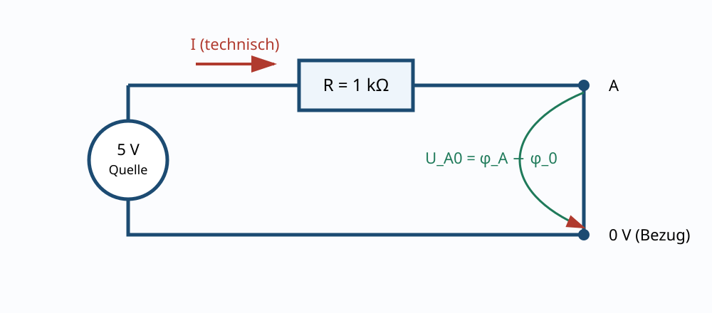

# 01.1 – Ladung, Strom, Spannung und Bezugspotential

[← Zurück](README.md) · [Modulübersicht](README.md) · [Kursübersicht](../README.md) · [Weiter →](02-widerstand-leitwert-und-ohmsches-gesetz.md)

## Lernziele

Nach dieser Lektion kannst du die behandelten Grössen mit korrektem Bezug und Vorzeichen beschreiben, typische Schaltungen berechnen, reale Abweichungen einordnen und eine sichere Messung planen.

## 1. Ladung und Strom

Elektrische Ladung `Q` wird in Coulomb (`C`) angegeben. Strom ist die zeitliche Änderung der Ladung:

$$I = \frac{\mathrm dQ}{\mathrm dt}$$

Ein Ampere bedeutet ein Coulomb pro Sekunde. Die **technische Stromrichtung** zeigt von höherem zu niedrigerem Potential; Elektronen bewegen sich in Metallen entgegengesetzt. Für Schaltungsberechnungen bleibt die technische Richtung massgeblich.

Strom fliesst nur in einem geschlossenen Pfad. Ein Messwert von `0 A` kann deshalb eine unterbrochene Leitung, eine gesperrte Komponente oder schlicht einen falschen Messaufbau bedeuten.

## 2. Spannung ist eine Differenz

Spannung `U_AB` beschreibt die Potentialdifferenz zwischen zwei Punkten:

$$U_{AB} = \varphi_A - \varphi_B$$

„Die Spannung an A beträgt 3.3 V“ ist unvollständig, solange der Bezugspunkt fehlt. In vielen Schaltungen heisst er `GND`, `0 V`, `AGND` oder `DGND`; diese Namen bedeuten nicht automatisch Schutzleiter oder Erde.

Wird die rote DMM-Spitze an A und die schwarze an B gehalten, zeigt das Gerät `U_AB`. Vertauschte Spitzen ändern nur das Vorzeichen. Das Vorzeichen ist Information, kein Messfehler.

## 3. Masse ist eine Vereinbarung

In einer galvanisch getrennten Kleinspannungsschaltung kann ein Knoten als `0 V` gewählt werden. Erst eine zusätzliche Verbindung kann dieses Netz mit Erde, Gehäuse oder einem zweiten Gerät koppeln. Besonders Oszilloskope mit schutzgeerdeter BNC-Masse können dadurch unbeabsichtigt einen Knoten erden.

## 4. Kontinuität und Energiequelle

Ein vollständiger Stromkreis benötigt Quelle, Hinleiter, Verbraucher und Rückleiter. Das Wort „Rückstrom“ bedeutet nicht, dass Strom verbraucht zurückfliesst; derselbe Strom durchläuft in einer Reihenschaltung alle Elemente. Die Quelle überträgt Energie auf die Ladung, die Last wandelt sie um.

## Hardware ↔ Firmware

Ein Mikrocontroller liest keine absolute Spannung, sondern die Differenz zwischen ADC-Pin und seiner Referenz/Masse. Unterschiedliche Massepotentiale, fehlender Rückleiter oder negative Eingangsspannung können falsche Werte oder Schäden verursachen. Siehe [ADC-Grundlagen im STM32-Kurs](https://github.com/matthiasflueck/STM32-Programmierkurs/blob/main/08-adc/01-von-analog-zu-digital.md).

## Beispiel

Zwischen `TP1` und `GND` werden `+2.50 V` gemessen. Zwischen `TP2` und `GND` sind es `+1.20 V`. Dann ist `U_TP1,TP2 = 2.50 V - 1.20 V = 1.30 V`.

## Bildungsplan 2026

Primär: `b1` (dimensionieren und Schema verstehen), `b4` (messen und Fehler eingrenzen), `b5` (Anforderungen überprüfen). Die begründete Machbarkeit unterstützt `a3`.

## Kurzcheck

1. Welche Bezugsrichtung oder welcher Bezugspunkt wurde verwendet?
2. Welche Bauteiltoleranz oder Messbeeinflussung ist im realen Aufbau relevant?
3. Ist das Ergebnis hinsichtlich Einheit und Grössenordnung plausibel?
