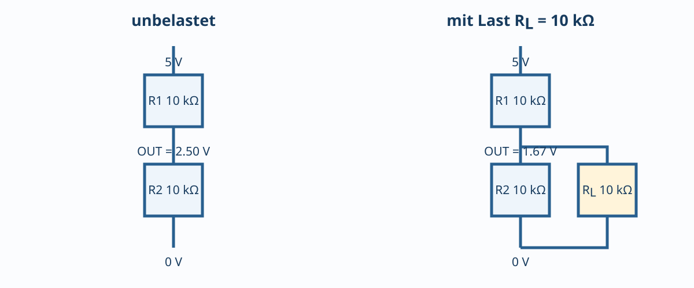

# 01.4 – Reihen- und Parallelschaltungen

[← Zurück](03-leistung-energie-und-wirkungsgrad.md) · [Modulübersicht](README.md) · [Kursübersicht](../README.md) · [Weiter →](05-kirchhoffsche-regeln-und-knotenpotentiale.md)

## Lernziele

Nach dieser Lektion kannst du die behandelten Grössen mit korrektem Bezug und Vorzeichen beschreiben, typische Schaltungen berechnen, reale Abweichungen einordnen und eine sichere Messung planen.

## 1. Reihenschaltung

Durch alle Elemente eines unverzweigten Pfades fliesst derselbe Strom. Für Widerstände:

$$R_\text{ges} = R_1 + R_2 + \dots$$

Die Teilspannungen teilen sich proportional zu den Widerständen auf:

$$U_2 = U_\text{in}\frac{R_2}{R_1+R_2}.$$

Diese Spannungsteilerformel gilt zunächst ohne zusätzliche Last am Ausgang.

## 2. Parallelschaltung

Parallele Zweige liegen an derselben Spannung. Die Ströme addieren sich:

$$\frac{1}{R_\text{ges}} = \frac{1}{R_1}+\frac{1}{R_2}+\dots$$

Für zwei Widerstände: `Rges = R1·R2/(R1+R2)`. Der Gesamtwiderstand ist immer kleiner als der kleinste Einzelwiderstand — ein schneller Plausibilitätscheck.

## 3. Belasteter Spannungsteiler

Eine Last `R_L` liegt parallel zu `R_2`. Deshalb wird in der Formel `R_2` durch `R_2 || R_L` ersetzt. Beispiel: `R1 = R2 = 10 kΩ`, `Uin = 5 V`. Unbelastet entstehen `2.5 V`. Mit `RL = 10 kΩ` ist der untere Ersatzwiderstand `5 kΩ`; der Ausgang sinkt auf `5 V · 5/(10+5) = 1.67 V`.

## 4. Toleranz und Grenzfälle

Für Worst Case wird nicht pauschal jede Toleranz addiert. Man wählt die Kombination, die den betrachteten Ausgang maximiert oder minimiert. Bei einem Teiler wird `Uout` maximal, wenn der obere Widerstand klein und der untere gross ist.

## Hardware ↔ Firmware

ADC-Eingänge belasten einen Teiler statisch meist wenig, ziehen aber während des Samplings kurzzeitig Ladung. Sehr hohe Widerstände können deshalb trotz korrektem DC-Teiler falsche ADC-Werte liefern. Der [STM32-Kurs zu Sampling Time und Quellimpedanz](https://github.com/matthiasflueck/STM32-Programmierkurs/blob/main/08-adc/03-sampling-time-quellimpedanz-und-eingangsschaltung.md) vertieft diesen Effekt.

## Designregel

Ein Spannungsteiler ist keine belastbare Stromversorgung. Seine Ausgangsspannung hängt von Last und Quellwiderstand ab.

## Bildungsplan 2026

Primär: `b1` (dimensionieren und Schema verstehen), `b4` (messen und Fehler eingrenzen), `b5` (Anforderungen überprüfen). Die begründete Machbarkeit unterstützt `a3`.

## Kurzcheck

1. Welche Bezugsrichtung oder welcher Bezugspunkt wurde verwendet?
2. Welche Bauteiltoleranz oder Messbeeinflussung ist im realen Aufbau relevant?
3. Ist das Ergebnis hinsichtlich Einheit und Grössenordnung plausibel?
