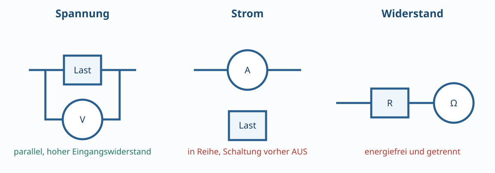

# 01.7 – Messen von Spannung, Strom und Widerstand

[← Zurück](06-reale-quellen-lasten-und-innenwiderstand.md) · [Modulübersicht](README.md) · [Kursübersicht](../README.md) · [Weiter →](../uebungen/modul-01.md)

## Lernziele

Nach dieser Lektion kannst du die behandelten Grössen mit korrektem Bezug und Vorzeichen beschreiben, typische Schaltungen berechnen, reale Abweichungen einordnen und eine sichere Messung planen.

## 1. Spannungsmessung: parallel

Ein Voltmeter wird zwischen zwei Messpunkte geschaltet. Sein hoher Eingangswiderstand soll die Schaltung wenig belasten. Vor Anschluss werden DC/AC-Funktion, Messbereich, Bezugspunkt und maximal zulässige Eingangsspannung geprüft.

## 2. Strommessung: in Reihe

Das Amperemeter ersetzt ein Stück des Strompfads. Es hat einen kleinen Shunt und eine Sicherung. Wird es parallel an eine Spannungsquelle gehalten, entsteht nahezu ein Kurzschluss. Deshalb:

1. Schaltung ausschalten.
2. Strompfad öffnen.
3. Leitung in richtige A/mA-Buchse stecken und höchsten sinnvollen Bereich wählen.
4. Messgerät in Reihe einsetzen.
5. Einschalten und Anzeige beobachten.
6. Danach Leitung sofort zurück in die V/Ω-Buchse.

Der Spannungsabfall am Strommessgerät heisst Burden Voltage und kann die Schaltung beeinflussen.

## 3. Widerstandsmessung: nur energiefrei

Das Ohmmeter speist selbst einen Prüfstrom ein. Fremdspannung verfälscht die Messung oder beschädigt das Gerät. Kondensatoren werden sicher entladen; parallele Schaltungspfade können den angezeigten Widerstand verkleinern. Für eine genaue Einzelmessung wird mindestens ein Anschluss des Bauteils getrennt.

## 4. Messunsicherheit lesen

Eine Spezifikation `±(0.5 % vom Messwert + 2 Digits)` ergibt bei `5.00 V` im `6.000-V`-Bereich mit `1 mV` Auflösung: `±(0.025 V + 0.002 V) = ±0.027 V`. Mehr angezeigte Stellen bedeuten nicht automatisch höhere Genauigkeit.

## Hardware ↔ Firmware

Ein Shunt mit Verstärker ermöglicht Strommessung durch ADC und Firmware, verändert aber ebenfalls den Strompfad. Messbereich, Auflösung, Offset und Überlastschutz müssen zusammen mit ADC-Referenz und Kalibrierung ausgelegt werden.

## Entscheidungsregel

Vor jeder Messung: **Welche Grösse, zwischen welchen Punkten, mit welcher Belastung, in welchem Betriebszustand und mit welchem Risiko?**

## Bildungsplan 2026

Primär: `b1` (dimensionieren und Schema verstehen), `b4` (messen und Fehler eingrenzen), `b5` (Anforderungen überprüfen). Die begründete Machbarkeit unterstützt `a3`.

## Kurzcheck

1. Welche Bezugsrichtung oder welcher Bezugspunkt wurde verwendet?
2. Welche Bauteiltoleranz oder Messbeeinflussung ist im realen Aufbau relevant?
3. Ist das Ergebnis hinsichtlich Einheit und Grössenordnung plausibel?
