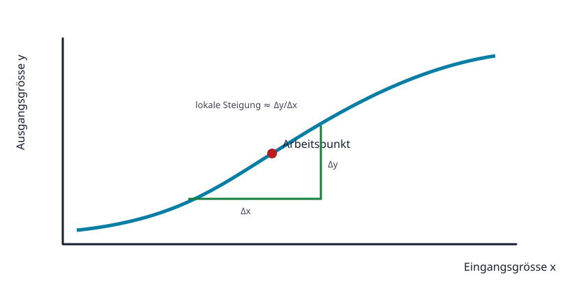

# 01.5 – Diagramme, Kennlinien und Steigungen lesen

[← Zurück](04-prozentrechnung-abweichung-und-toleranz.md) · [Modulübersicht](README.md) · [Kursübersicht](../README.md) · [Weiter →](06-grundlegende-mechanik-energie-und-leistung.md)

## Lernziele

Nach dieser Lektion kannst du:

- Achsen, Skalierung und Einheiten eines Diagramms prüfen
- Werte, Steigungen und Bereiche aus Kennlinien lesen
- Interpolation von unzulässiger Extrapolation unterscheiden

## Bezug Bildungsplan 2026

- Handlungskompetenzen: `a3`, `b1-LK02`, `b4`, `b5`
- Nachweise und Leistungskriterien: [Kompetenzmatrix](../bildungsplan-2026/kompetenzmatrix.md)

## Voraussetzungen

Vorherige Lektionen dieses Moduls.

## Warum ist das wichtig?

Datenblätter beschreiben Bauteile häufig besser mit Kennlinien als mit einer einzigen Zahl. Wer nur einen Punkt abliest, kann Temperatur, Streuung oder den nichtlinearen Verlauf übersehen.

## Theorie

### Zuerst die Achsen

Vor jeder Interpretation werden x- und y-Grösse, Einheit, lineare oder logarithmische Skalierung und Messbedingungen gelesen. Mehrere Kurven können unterschiedliche Temperaturen oder Betriebszustände darstellen.

### Steigung als Änderungsrate

Die mittlere Steigung zwischen zwei Punkten ist `Δy/Δx`. Eine positive Steigung bedeutet, dass y mit x wächst. Bei nichtlinearen Kennlinien hängt die lokale Steigung vom Arbeitspunkt ab.

### Interpolation und Extrapolation

Interpolation schätzt zwischen gemessenen Punkten. Extrapolation setzt einen Verlauf ausserhalb des dargestellten Bereichs fort und ist riskanter. Absolute Grenzwerte dürfen nicht aus einer typischen Kennlinie extrapoliert werden.

## Anschauliches Beispiel

Eine NTC-Kennlinie fällt mit steigender Temperatur. Zwischen 20 °C und 30 °C kann ein Wert näherungsweise interpoliert werden. Oberhalb des dokumentierten Bereichs darf der Verlauf nicht einfach linear verlängert werden.

## Berechnungsbeispiel

Eine Gerade geht durch `(1 V, 2 mA)` und `(3 V, 6 mA)`. Die Steigung ist `(6−2) mA / (3−1) V = 2 mA/V = 2 mS`. Der Kehrwert entspricht hier `500 Ω`.

## Praxisbezug

Wähle eine reale Widerstands- oder Sensorkennlinie. Markiere Achsen, Bedingungen, einen Arbeitspunkt, Interpolationsbereich und eine Stelle, an der lineare Näherung nicht mehr passt.

## 🔗 Hardware ↔ Firmware

Firmware nutzt oft Kennlinientabellen oder Näherungsfunktionen. ADC-Wert, Referenzspannung und Eingangsschaltung bestimmen zuerst den elektrischen Messpunkt; erst dann darf die Software in Temperatur oder Druck umrechnen.

## Merksatz

> Keine Kennlinie interpretieren, bevor Achsen, Einheit, Skalierung und Bedingungen gelesen sind.

## Häufige Fehler und Missverständnisse

- Logarithmische Achsen wie lineare behandeln.
- Typische Kurven als garantierte Grenzen lesen.
- Weit ausserhalb der Daten extrapolieren.

## Zusammenfassung

Kennlinien verbinden Betriebsbedingungen und Bauteilverhalten. Achsenprüfung, Steigung und vorsichtige Interpolation liefern belastbare Aussagen.

## Übungsfragen

1. Was prüfst du vor dem Ablesen?
2. Was bedeutet negative Steigung?
3. Warum ist Extrapolation riskanter als Interpolation?

Weitere Aufgaben: [Übungen zu Modul 01](../uebungen/modul-01.md). Die Lösungen liegen bewusst getrennt.
