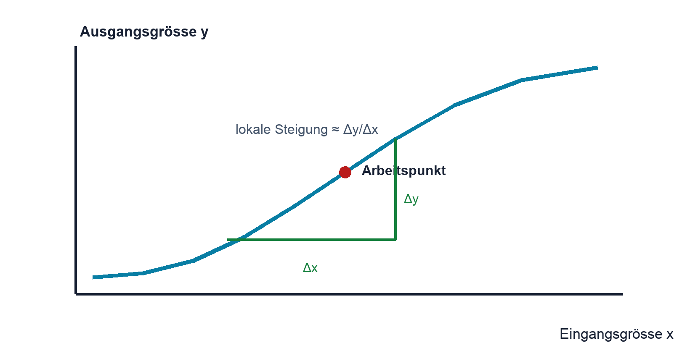

# 01.5 – Diagramme, Kennlinien und Steigungen lesen

[← Zurück](04-prozentrechnung-abweichung-und-toleranz.md) · [Modulübersicht](README.md) · [Kursübersicht](../README.md) · [Weiter →](06-grundlegende-mechanik-energie-und-leistung.md)

## Lernziele

Nach dieser Lektion kannst du:

- Achsen, Skalierung und Einheiten eines Diagramms prüfen
- Werte, Steigungen und Bereiche aus Kennlinien lesen
- Interpolation von unzulässiger Extrapolation unterscheiden

## Einleitung

Datenblätter beschreiben Bauteile häufig besser mit Kennlinien als mit einer einzigen Zahl. Wer nur einen Punkt abliest, kann Temperatur, Streuung oder den nichtlinearen Verlauf übersehen.

<!-- context-expansion-2026 -->
Mathematik ist in der Elektronik kein Selbstzweck, sondern eine gemeinsame Sprache für Datenblatt, Schaltung, Messgerät und Prüfbericht. Eine Rechnung ist erst dann nützlich, wenn Einheit, Grössenordnung, Randbedingungen und physikalische Bedeutung zusammenpassen.

Beim Thema **Diagramme, Kennlinien und Steigungen lesen** geht es deshalb nicht nur um eine einzelne Formel oder Definition. Entscheidend ist, wie die Darstellung beim Rechnen, Lesen von Datenblättern, Auswerten von Messungen und Prüfen der Grössenordnung konkret eingesetzt wird.

## Theorie

<!-- theory-expansion-2026 -->
### Einordnung und Grundidee

Jede mathematische Darstellung besteht aus Grössen, Einheiten, Beziehungen und einem Gültigkeitsbereich. Vor dem Einsetzen von Zahlen wird daher geklärt, was gesucht ist, welche Annahmen gelten und welche Grössenordnung physikalisch zu erwarten ist.

### Zuerst die Achsen

Vor jeder Interpretation werden x- und y-Grösse, Einheit, lineare oder logarithmische Skalierung und Messbedingungen gelesen. Mehrere Kurven können unterschiedliche Temperaturen oder Betriebszustände darstellen.

### Steigung als Änderungsrate

Die mittlere Steigung zwischen zwei Punkten ist $\frac{\Delta y}{\Delta x}$. Eine positive Steigung bedeutet, dass $y$ mit $x$ wächst. Bei nichtlinearen Kennlinien hängt die lokale Steigung vom Arbeitspunkt ab.

### Interpolation und Extrapolation

Interpolation schätzt zwischen gemessenen Punkten. Extrapolation setzt einen Verlauf ausserhalb des dargestellten Bereichs fort und ist riskanter. Absolute Grenzwerte dürfen nicht aus einer typischen Kennlinie extrapoliert werden.

### Messpunkte, Verbindungslinie und Modell unterscheiden

Einzelne Punkte zeigen gemessene oder berechnete Daten. Eine Linie zwischen ihnen kann nur der besseren Lesbarkeit dienen oder ein mathematisches Modell darstellen. Ohne Legende darf nicht angenommen werden, dass zwischen zwei Punkten tatsächlich linearer Verlauf gilt.

Bei Datenblattkennlinien ist zusätzlich zu prüfen, ob typische oder garantierte Werte gezeigt werden. Typische Kurven helfen beim Verständnis und bei einer ersten Dimensionierung, ersetzen aber keine garantierten Min-/Max-Angaben. Die Bedingungen unter dem Diagramm sind Teil der Aussage.

### Arbeitspunkt und lokale Änderung

Der Arbeitspunkt bezeichnet den aktuellen Betriebszustand auf der Kennlinie. Bei nichtlinearem Verlauf kann die Steigung in seiner Nähe für kleine Änderungen genutzt werden, obwohl das Verhältnis vom Ursprung zum Arbeitspunkt anders ist. Diese Unterscheidung wird später bei Diode, Transistor und Sensor wichtig.

## Anwendungsfall

Typische elektronische Anwendungen und Baugruppen für dieses Thema sind:

- Auswertung von Dioden- und Sensorkennlinien
- Bestimmung von Arbeitspunkten
- Erkennen von Sättigung, Linearität und Grenzwerten

In einer konkreten Rechnung werden Formel, Einheiten und Annahmen vollständig notiert. Das Resultat wird anschliessend mit Grenzfällen, Grössenordnung oder einem Messwert geprüft, damit ein formal korrektes, aber physikalisch falsches Ergebnis nicht unbemerkt bleibt.

## Anschauliches Beispiel

Eine NTC-Kennlinie fällt mit steigender Temperatur. Zwischen 20 °C und 30 °C kann ein Wert näherungsweise interpoliert werden. Oberhalb des dokumentierten Bereichs darf der Verlauf nicht einfach linear verlängert werden.

## Berechnungsbeispiel

Eine Gerade geht durch $(1\,\mathrm{V},2\,\mathrm{mA})$ und $(3\,\mathrm{V},6\,\mathrm{mA})$. Die Steigung ist $\frac{(6-2)\,\mathrm{mA}}{(3-1)\,\mathrm{V}}=2\,\mathrm{mA/V}=2\,\mathrm{mS}$. Der Kehrwert entspricht hier $500\,\Omega$.

## Praxisbezug

Wähle eine reale Widerstands- oder Sensorkennlinie. Markiere Achsen, Bedingungen, einen Arbeitspunkt, Interpolationsbereich und eine Stelle, an der lineare Näherung nicht mehr passt.

## 🔗 Hardware ↔ Firmware

Firmware nutzt oft Kennlinientabellen oder Näherungsfunktionen. ADC-Wert, Referenzspannung und Eingangsschaltung bestimmen zuerst den elektrischen Messpunkt; erst dann darf die Software in Temperatur oder Druck umrechnen.

## Merksatz

> Keine Kennlinie interpretieren, bevor Achsen, Einheit, Skalierung und Bedingungen gelesen sind.

## Häufige Fehler und Missverständnisse

- Logarithmische Achsen wie lineare behandeln.
- Typische Kurven als garantierte Grenzen lesen.
- Weit ausserhalb der Daten extrapolieren.

## Zusammenfassung

Kennlinien verbinden Betriebsbedingungen und Bauteilverhalten. Achsenprüfung, Steigung und vorsichtige Interpolation liefern belastbare Aussagen.

## Übungsfragen

1. Was prüfst du vor dem Ablesen?
2. Was bedeutet negative Steigung?
3. Warum ist Extrapolation riskanter als Interpolation?

Weitere Aufgaben: [Übungen zu Modul 01](../uebungen/modul-01.md). Die Lösungen liegen bewusst getrennt.

## Bezug Bildungsplan 2026

- Handlungskompetenzen: `a3`, `b1-LK02`, `b4`, `b5`
- Nachweise und Leistungskriterien: [Kompetenzmatrix](../bildungsplan-2026/kompetenzmatrix.md)
