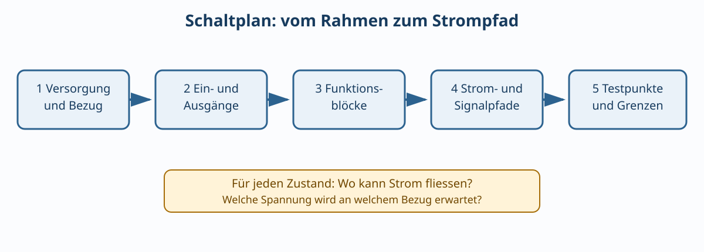

# 02.1 – Schaltplan lesen und Strompfade erkennen

[← Zurück](README.md) · [Modulübersicht](README.md) · [Kursübersicht](../README.md) · [Weiter →](02-widerstaende-kennzeichnung-und-toleranzen.md)

## Lernziele

Nach dieser Lektion kannst du Funktion, Grenzwerte und reale Nichtidealitäten der behandelten Bauteile erklären, sie im Schema und Aufbau sicher zuordnen und ihr Verhalten mit geeigneten Messmitteln prüfen.

## 1. Schema ist Funktionsbeschreibung, kein Lageplan

Ein Schaltplan zeigt elektrische Verbindungen und Funktionszusammenhänge. Die räumliche Lage auf Steckbrett oder PCB kann völlig anders sein. Gleiche Netznamen bedeuten elektrische Verbindung, auch wenn keine durchgehende Linie gezeichnet ist.

Beim Lesen hilft eine feste Reihenfolge:

1. Versorgungsschienen und Bezugspotentiale finden.
2. Ein- und Ausgänge identifizieren.
3. Funktionsblöcke abgrenzen.
4. Gleichstrompfade im ausgeschalteten und eingeschalteten Zustand verfolgen.
5. Bauteilwerte, Polaritäten und Testpunkte prüfen.

## 2. Referenzbezeichner und Werte

Übliche Bezeichner sind `R` für Widerstand, `C` für Kondensator, `L` für Induktivität, `D` für Diode, `Q` für Transistor und `U` oder `IC` für integrierte Schaltung. `R17 4.7 kΩ` identifiziert sowohl Bauteil als auch Wert. Derselbe Bezeichner darf im Projekt nicht doppelt vergeben werden.

## 3. Verbindungen und Kreuzungen

Ein Punkt an einer Kreuzung kennzeichnet eine Verbindung. Eine Kreuzung ohne Punkt ist nach verbreiteter Konvention nicht verbunden, aber ältere oder firmeninterne Darstellungen können abweichen. Im Zweifel Netzliste oder CAD-Markierung prüfen; nicht raten.

## 4. Strompfad als Fehlersuchwerkzeug

Für eine LED-Schaltung lautet der Pfad `+5 V → Vorwiderstand → LED → Schalter → 0 V`. Ist die LED dunkel, wird dieser Pfad in logischer Reihenfolge geprüft: Versorgung vorhanden? Stromkreis geschlossen? LED korrekt gepolt? Spannungsabfälle plausibel?

## Hardware ↔ Firmware

Netznamen sollen zwischen Schema, PCB und Firmware übereinstimmen. Ein Signal `LED_N` oder `/LED` macht aktive LOW-Polarität sichtbar. Die Firmware verwendet eine Abstraktion wie `status_led_on()`, damit die elektrische Polarität nicht überall im Code verteilt ist.

## Kurzbeispiel

Ein Pull-up `R1` verbindet `BUTTON_N` mit `3V3`, der Taster mit `GND`. Offen liest der Eingang HIGH, gedrückt LOW. Firmware muss also aktive LOW-Logik erwarten; ein interner Pull-down wäre widersprüchlich.

## Bildungsplan 2026

Primär: `b1`, `b3`, `b4`, `b5`; je nach Aufbau zusätzlich Anforderungen und Machbarkeit aus `a1–a3`.

## Kurzcheck

1. Welche Energie oder Zustandsgrösse kann dieses Bauteil speichern oder beeinflussen?
2. Welcher Datenblattwert begrenzt den sicheren Betrieb?
3. Wie unterscheidest du Bauteilfehler, Aufbaufehler und falsche Messung?
