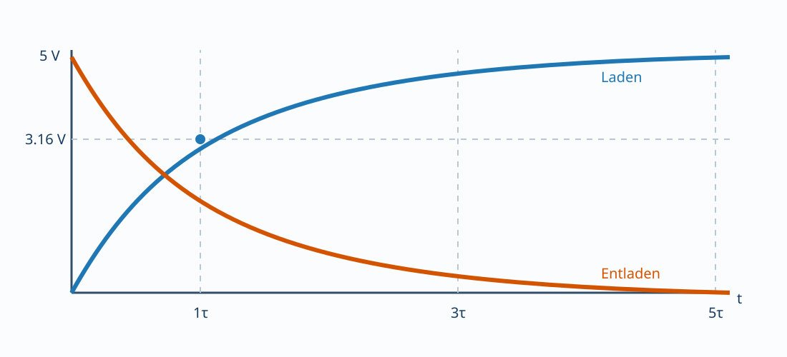

# 02.3 – Kondensatoren, Ladung und Zeitverhalten

[← Zurück](02-widerstaende-kennzeichnung-und-toleranzen.md) · [Modulübersicht](README.md) · [Kursübersicht](../README.md) · [Weiter →](04-induktivitaeten-magnetfeld-und-abschaltenergie.md)

## Lernziele

Nach dieser Lektion kannst du Funktion, Grenzwerte und reale Nichtidealitäten der behandelten Bauteile erklären, sie im Schema und Aufbau sicher zuordnen und ihr Verhalten mit geeigneten Messmitteln prüfen.

## 1. Grundbeziehungen

Ein Kondensator speichert Ladung:

$$Q = C U, \qquad i = C\frac{\mathrm d u}{\mathrm dt}.$$

Seine Spannung kann ideal nicht sprunghaft ändern; ein unendlich schneller Spannungssprung würde unendlichen Strom verlangen. In realen Schaltungen begrenzen Widerstand, ESR und Induktivität den Strom.

## 2. RC-Sprungantwort

Beim Laden über `R` auf `U0` gilt:

$$u_C(t)=U_0\left(1-e^{-t/RC}\right).$$

Die Zeitkonstante ist `τ = R·C`. Nach `1τ` sind `63.2 %`, nach `3τ` etwa `95 %` und nach `5τ` über `99 %` des Endwerts erreicht. Beim Entladen fällt die Spannung exponentiell.

## 3. Bauarten und Polarität

Keramik, Folie, Aluminium-Elektrolyt und Tantal unterscheiden sich stark. Elektrolytkondensatoren sind meist polarisiert; falsche Polarität kann sie zerstören. Bei Klasse-2-Keramik kann die effektive Kapazität unter DC-Vorspannung stark sinken. Nennwert und Nennspannung allein genügen nicht.

## 4. Nichtidealitäten

Reale Kondensatoren besitzen ESR, ESL, Leckstrom, Toleranz und Alterung. Ein grosser Elektrolytkondensator stützt langsame Laständerungen; ein kleiner Keramikkondensator nahe am IC schliesst schnelle Stromschleifen. „Mehr Kapazität“ ist nicht automatisch stabiler.

## 5. Sichere Entladung

Gespeicherte Energie `E = 0.5CU²` bleibt nach Abschalten erhalten. Entladewiderstände werden auf Anfangsleistung und Zeitkonstante dimensioniert. Vor Berührung wird gemessen.

## Hardware ↔ Firmware

RC-Netze erzeugen Resetverzögerungen, Tasterentprellung oder Analogfilter. Firmware-Timing muss reale Toleranzen und Schwellwerte berücksichtigen. Ein Softwaredelay repariert keine Versorgung, die beim Lastsprung einbricht.

## Beispiel

`R = 10 kΩ`, `C = 10 µF` ergeben nominal `τ = 100 ms`. Bei `±5 %` und `−20/+80 %` Bauteiltoleranz kann `τ` grob zwischen `76 ms` und `189 ms` liegen; für präzises Timing ist diese Kombination ungeeignet.

## Bildungsplan 2026

Primär: `b1`, `b3`, `b4`, `b5`; je nach Aufbau zusätzlich Anforderungen und Machbarkeit aus `a1–a3`.

## Kurzcheck

1. Welche Energie oder Zustandsgrösse kann dieses Bauteil speichern oder beeinflussen?
2. Welcher Datenblattwert begrenzt den sicheren Betrieb?
3. Wie unterscheidest du Bauteilfehler, Aufbaufehler und falsche Messung?
