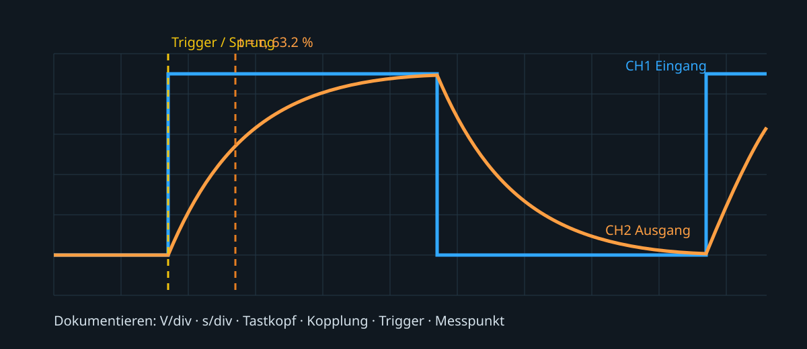

# 02.7 – Erste Messungen mit Funktionsgenerator und Oszilloskop

[← Zurück](06-steckbrett-leitungsfuehrung-und-parasitaere-effekte.md) · [Modulübersicht](README.md) · [Kursübersicht](../README.md) · [Weiter →](../uebungen/modul-02.md)

## Lernziele

Nach dieser Lektion kannst du Funktion, Grenzwerte und reale Nichtidealitäten der behandelten Bauteile erklären, sie im Schema und Aufbau sicher zuordnen und ihr Verhalten mit geeigneten Messmitteln prüfen.

## 1. Was das Oszilloskop zeigt

Ein Oszilloskop zeigt Spannung über Zeit. Vertikalskalierung, Zeitbasis, Trigger, Kopplung, Tastkopffaktor und Bandbreitenbegrenzung bestimmen die Darstellung. „Auto“ kann helfen, ersetzt aber keine Kenntnis dieser Einstellungen.

## 2. Masseklemme ist nicht neutral

Bei vielen Tischoszilloskopen sind BNC-Aussenleiter und Tastkopfmasse mit Schutzleiter verbunden. Wird die Masseklemme an einen nicht dafür vorgesehenen Knoten angeschlossen, kann sie ihn kurzschliessen. Vor Anschluss wird der Erd-/Massebezug der Schaltung geklärt. Kurslabore nutzen galvanisch getrennte SELV-Quellen und einen gemeinsamen `0-V`-Knoten.

## 3. Tastkopf und Kompensation

Ein `10:1`-Tastkopf belastet die Schaltung meist weniger als `1:1` und besitzt höhere Bandbreite. Tastkopffaktor muss am Tastkopf und Kanal übereinstimmen. Die Kompensation wird am Kalibriersignal eingestellt: Unterkompensation rundet, Überkompensation überschwingt.

## 4. Funktionsgenerator verstehen

Viele Generatoren sind für `50 Ω` Quell- und Lastimpedanz spezifiziert. Bei hochohmiger Oszilloskoplast kann die gemessene Leerlaufamplitude doppelt so gross sein wie die für `50 Ω` angezeigte. Einstellung und tatsächliche Spannung werden gemessen, nicht vorausgesetzt.

## 5. Trigger und RC-Messung

Für eine stabile Rechteckdarstellung wählt man Flankentrigger, passenden Pegel und Quelle. Am RC-Tiefpass wird die Zeitkonstante zwischen Sprungbeginn und `63.2 %` des Endwerts gemessen. Abtastrate und Zeitbasis müssen mehrere Punkte über der Flanke und mehrere Zeitkonstanten im Bild liefern.

## Hardware ↔ Firmware

Ein Timer-PWM-Ausgang kann später den Funktionsgenerator ersetzen. Dann müssen GPIO-Flanken, Timerfrequenz und Tastgrad bekannt sein. Der [STM32-Kurs zu PWM](https://github.com/matthiasflueck/STM32-Programmierkurs/blob/main/07-timer-pwm/05-pwm-verstehen-und-berechnen.md) erklärt die Erzeugung; das Oszilloskop prüft das reale Signal.

## Messregel

Ein Oszillogramm ist erst verwertbar, wenn Kanal, Tastkopf, V/div, s/div, Kopplung, Trigger, Messpunkt und Bezug dokumentiert sind.

## Bildungsplan 2026

Primär: `b1`, `b3`, `b4`, `b5`; je nach Aufbau zusätzlich Anforderungen und Machbarkeit aus `a1–a3`.

## Kurzcheck

1. Welche Energie oder Zustandsgrösse kann dieses Bauteil speichern oder beeinflussen?
2. Welcher Datenblattwert begrenzt den sicheren Betrieb?
3. Wie unterscheidest du Bauteilfehler, Aufbaufehler und falsche Messung?
