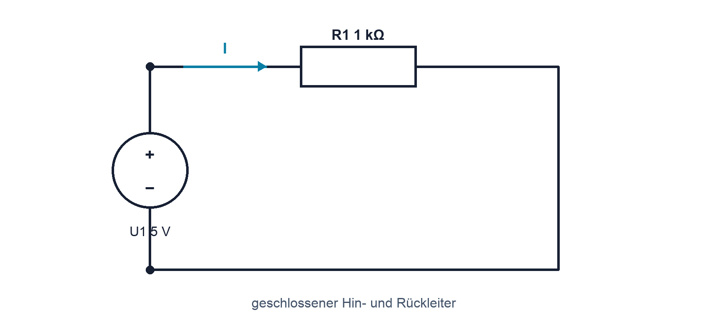

# 02.2 – Elektrischer Strom und geschlossener Stromkreis

[← Zurück](01-elektrische-ladung-und-ladungstraeger.md) · [Modulübersicht](README.md) · [Kursübersicht](../README.md) · [Weiter →](03-spannung-potential-und-bezugspotential.md)

## Lernziele

Nach dieser Lektion kannst du:

- Strom als Ladungsfluss pro Zeit erklären
- technische Stromrichtung und Elektronenbewegung unterscheiden
- einen geschlossenen Strompfad im Schema verfolgen

## Warum ist das wichtig?

Eine Lampe leuchtet nur, wenn Ladung durch einen geschlossenen Weg bewegt wird. Das klingt einfach, verhindert aber viele Denkfehler: Strom wird nicht im Verbraucher «aufgebraucht», und eine einzelne Leitung bildet noch keinen Stromkreis.

## Theorie

### Geschlossener Weg

Eine Quelle trennt Ladung und stellt Energie bereit. Im geschlossenen Kreis verläuft der technische Strom vom Pluspol durch die Last zum Minuspol. In Metall bewegen sich Elektronen entgegengesetzt. Für Schaltpläne und Berechnungen wird die technische Richtung verwendet.

### Stromstärke

Je mehr Ladung pro Zeit einen Querschnitt passiert, desto grösser ist der Strom. Daraus folgt `I = ΔQ/Δt`. Ein Ampere ist ein Coulomb pro Sekunde. Die Formel fasst die vorher beschriebene Bewegung quantitativ zusammen.

### Strom an Knoten

Ladung verschwindet nicht. In einer unverzweigten Reihenschaltung ist der Strom überall gleich. An einem Knoten teilt er sich auf; die Summe hinein entspricht im stationären Zustand der Summe hinaus.

### Bewegung der Träger und Ausbreitung des Feldes

Die einzelnen Elektronen bewegen sich in einem Metallleiter im Mittel relativ langsam. Trotzdem reagiert eine Lampe nahezu sofort nach dem Schliessen des Schalters, weil sich das elektrische Feld im gesamten Stromkreis sehr schnell ausbreitet. Eine Wasserrohr-Analogie kann den geschlossenen Pfad veranschaulichen, darf aber nicht mit der tatsächlichen Geschwindigkeit einzelner Elektronen verwechselt werden.

Die Stromstärke beschreibt einen Querschnitt des Leiters. Wird an einer Stelle pro Sekunde eine bestimmte Ladungsmenge transportiert, muss im unverzweigten stationären Kreis dieselbe Ladungsmenge auch jede andere Stelle passieren. Sonst würde sich dazwischen fortlaufend Ladung ansammeln.

### Gleichstrom und zeitabhängiger Strom

Bei konstantem Gleichstrom bleiben Betrag und Richtung gleich. In realen Schaltungen können Strom und Richtung zeitlich wechseln. Die Definition als Ladungsänderung pro Zeit gilt weiterhin; nur reicht dann ein einzelner Zahlenwert nicht mehr, und der Verlauf muss als Funktion oder Signal betrachtet werden.

## Anschauliches Beispiel

Öffnet ein Schalter den Rückleiter, bleibt die Quelle vorhanden, aber der Pfad ist unterbrochen. Es fliesst ideal kein Dauerstrom und am Widerstand fällt keine Spannung ab.

## Berechnungsbeispiel

In `2 ms` werden `6 µC` übertragen. `I = 6 µC / 2 ms`. Mit gleichen Präfixen ergibt sich `3 mA`. In SI: `6×10⁻⁶ C / 2×10⁻³ s = 3×10⁻³ A`.

## Praxisbezug

Verfolge im abgebildeten Schema Quelle, Hinleiter, R1 und Rückleiter. Markiere den Strompfeil. Überlege vor dem Messen, an welcher Stelle ein Amperemeter eingefügt werden müsste.

## 🔗 Hardware ↔ Firmware

Ein GPIO-Ausgang liefert oder senkt realen Strom. Firmware setzt nur den logischen Zustand; Ausgangstreiber, Last und Rückleiter bestimmen den elektrischen Strom. Die zulässigen Pin- und Summenströme stehen im MCU-Datenblatt.

## Merksatz

> Strom braucht einen geschlossenen Pfad und wird nicht im Verbraucher verbraucht.

## Häufige Fehler und Missverständnisse

- Elektronenrichtung und technische Stromrichtung vermischen.
- Ein Amperemeter parallel zur Quelle anschliessen.
- Bei 0 A sofort die Quelle verdächtigen, ohne den Pfad zu prüfen.

## Zusammenfassung

Strom beschreibt bewegte Ladung pro Zeit. Ein vollständiger Kreis ist notwendig; an Knoten gilt Ladungserhaltung.

## Übungsfragen

1. Warum ist der Strom in einer Reihenschaltung überall gleich?
2. Was bedeutet 1 A?
3. Was geschieht beim Öffnen des Schalters?

Weitere Aufgaben: [Übungen zu Modul 02](../uebungen/modul-02.md). Die Lösungen liegen bewusst getrennt.

## Bezug Bildungsplan 2026

- Handlungskompetenzen: `a3`, `b1-LK02–03`, `b4-LK01–10`, `b5`
- Nachweise und Leistungskriterien: [Kompetenzmatrix](../bildungsplan-2026/kompetenzmatrix.md)
