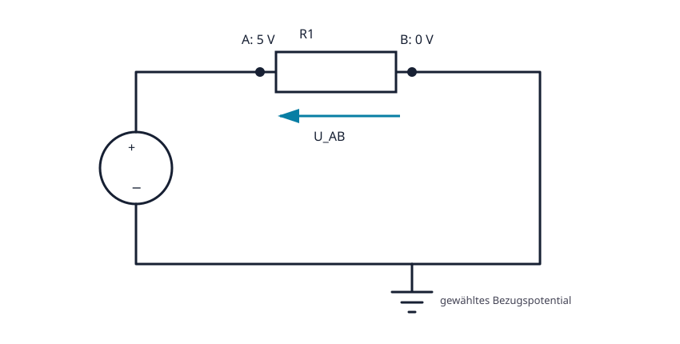

# 02.3 – Spannung, Potential und Bezugspotential

[← Zurück](02-elektrischer-strom-und-geschlossener-stromkreis.md) · [Modulübersicht](README.md) · [Kursübersicht](../README.md) · [Weiter →](04-gnd-erde-und-galvanische-trennung.md)

## Lernziele

Nach dieser Lektion kannst du:

- Spannung als Potentialdifferenz erklären
- Bezugspunkt und Vorzeichen einer Messung angeben
- Potentiale und Spannungsabfälle im Schema eintragen

## Bezug Bildungsplan 2026

- Handlungskompetenzen: `a3`, `b1-LK02–03`, `b4-LK01–10`, `b5`
- Nachweise und Leistungskriterien: [Kompetenzmatrix](../bildungsplan-2026/kompetenzmatrix.md)

## Voraussetzungen

Vorherige Lektionen dieses Moduls sowie sichere Präfix- und Einheitenrechnung.

## Warum ist das wichtig?

Spannung existiert immer zwischen zwei Punkten. Die Aussage «am Pin liegen 3,3 V» ist unvollständig, solange der Bezug fehlt. Diese Sichtweise ist besonders wichtig bei Sensoren, ADCs und Oszilloskopmessungen.

## Theorie

### Elektrisches Potential

Das Potential beschreibt elektrische Energie pro Ladung an einem Punkt relativ zu einer gewählten Referenz. Spannung ist die Differenz zweier Potentiale: Erst nachdem A und B benannt sind, schreiben wir `U_AB = φ_A − φ_B`.

### Vorzeichen

Die rote DMM-Spitze an A und die schwarze an B zeigt `U_AB`. Werden die Spitzen vertauscht, ändert sich das Vorzeichen. Ein negatives Resultat ist oft eine korrekte Information über die tatsächliche Polarität.

### Spannungsabfall und Energie

Die Quelle erhöht die Energie pro Ladung; die Last wandelt sie um. Entlang einer Masche gleichen sich Spannungsanstiege und -abfälle aus. Spannung wird nicht «durch eine Leitung geschickt», sondern zwischen Punkten gemessen.

## Anschauliches Beispiel

TP1 liegt bei 2,50 V gegen GND, TP2 bei 1,20 V gegen GND. Zwischen TP1 und TP2 liegen daher 1,30 V. Gegen einen anderen Bezug hätten beide Einzelwerte andere Zahlen, ihre Differenz bliebe gleich.

## Berechnungsbeispiel

`U_TP1,TP2 = φ_TP1 − φ_TP2 = 2,50 V − 1,20 V = 1,30 V`. Vertauscht: `U_TP2,TP1 = −1,30 V`. Die Einheit Volt ist Joule pro Coulomb.

## Praxisbezug

Wähle in einem ungefährlichen 5-V-Aufbau GND als Bezug. Messe drei Knoten zuerst gegen GND und berechne daraus die Spannung zwischen zwei Knoten. Bestätige sie durch direkte Messung.

## 🔗 Hardware ↔ Firmware

Ein ADC misst die Pinspannung relativ zu Analogmasse und Referenz. Gemeinsamer Rückleiter, zulässiger Eingangsbereich und Referenzspannung müssen stimmen, bevor die Firmware einen Codewert sinnvoll umrechnen kann.

## Merksatz

> Spannung ist immer eine Differenz zwischen zwei eindeutig benannten Punkten.

## Häufige Fehler und Missverständnisse

- Den Bezugspunkt weglassen.
- Ein negatives Vorzeichen als Gerätefehler ansehen.
- Potential und Spannung als identische Begriffe verwenden.

## Zusammenfassung

Potential ist auf eine Referenz bezogen; Spannung ist eine Potentialdifferenz. Polung und Messrichtung legen das Vorzeichen fest.

## Übungsfragen

1. Was fehlt bei «A hat 5 V»?
2. Was zeigt das DMM nach Vertauschen der Spitzen?
3. Berechne U_AB für φA=1 V und φB=3 V.

Weitere Aufgaben: [Übungen zu Modul 02](../uebungen/modul-02.md). Die Lösungen liegen bewusst getrennt.
