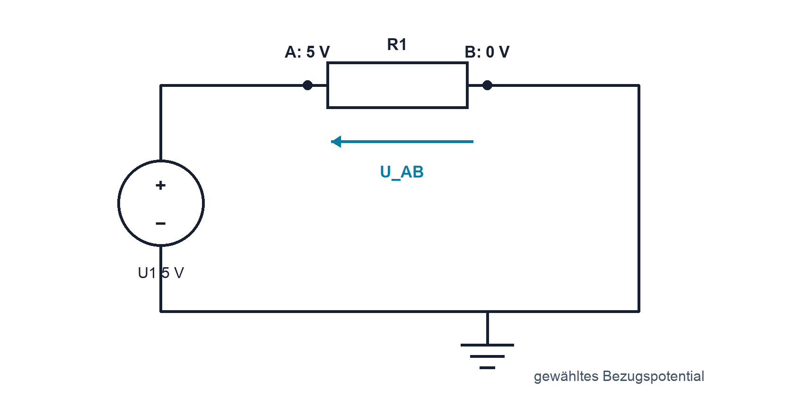

# 02.3 – Spannung, Potential und Bezugspotential

[← Zurück](02-elektrischer-strom-und-geschlossener-stromkreis.md) · [Modulübersicht](README.md) · [Kursübersicht](../README.md) · [Weiter →](04-gnd-erde-und-galvanische-trennung.md)

## Lernziele

Nach dieser Lektion kannst du:

- Spannung als Potentialdifferenz erklären
- Bezugspunkt und Vorzeichen einer Messung angeben
- Potentiale und Spannungsabfälle im Schema eintragen

## Einleitung

Spannung existiert immer zwischen zwei Punkten. Die Aussage «am Pin liegen 3,3 V» ist unvollständig, solange der Bezug fehlt. Diese Sichtweise ist besonders wichtig bei Sensoren, ADCs und Oszilloskopmessungen. Sie verhindert, dass ein korrekt angezeigter Messwert falsch interpretiert oder eine Masseverbindung unbedacht hergestellt wird.

<!-- context-expansion-2026 -->
Elektrische Grössen beschreiben verschiedene Seiten desselben Vorgangs: Ladung wird bewegt, Spannung stellt Energie pro Ladung bereit, Widerstände begrenzen den Strom und Leistung beschreibt den Energieumsatz. Erst der geschlossene Stromkreis und ein festgelegter Bezug machen einzelne Zahlen zu einem verständlichen System.

Beim Thema **Spannung, Potential und Bezugspotential** geht es deshalb nicht nur um eine einzelne Formel oder Definition. Entscheidend ist, wie sich das Prinzip im Schema erkennen, im Datenblatt beurteilen, im Aufbau messen und bei einer Abweichung systematisch überprüfen lässt.

## Theorie

<!-- theory-expansion-2026 -->
### Einordnung und Grundidee

Zur Analyse wird zuerst der reale Strompfad gezeichnet und ein Bezugspotential festgelegt. Danach werden Richtung und Polarität definiert. Formeln beschreiben anschliessend diesen bereits verstandenen Vorgang; sie ersetzen weder Schaltbild noch Plausibilitätskontrolle.

### Elektrisches Potential

Das Potential beschreibt elektrische Energie pro Ladung an einem Punkt relativ zu einer gewählten Referenz. Spannung ist die Differenz zweier Potentiale: Erst nachdem A und B benannt sind, schreiben wir `UAB = φA − φB`.

### Vorzeichen

Die rote DMM-Spitze an A und die schwarze an B zeigt `UAB`. Werden die Spitzen vertauscht, ändert sich das Vorzeichen. Ein negatives Resultat ist oft eine korrekte Information über die tatsächliche Polarität und kein Fehler des Messgeräts.

### Spannungsabfall und Energie

Die Quelle erhöht die Energie pro Ladung; die Last wandelt sie um. Entlang einer Masche gleichen sich Spannungsanstiege und -abfälle aus. Spannung wird nicht «durch eine Leitung geschickt», sondern zwischen Punkten gemessen.

### Höhe als hilfreiche, aber begrenzte Vorstellung

Potential lässt sich zunächst mit einer Höhe vergleichen. Entscheidend für eine Bewegung ist nicht die absolute Höhenzahl, sondern der Unterschied zwischen zwei Orten. Ebenso kann derselbe Schaltungsknoten je nach gewähltem Bezug eine andere Potentialzahl erhalten, während die Spannung zwischen zwei festen Knoten unverändert bleibt.

Die Analogie endet dort, wo elektrische Felder und zeitabhängige Vorgänge wichtig werden. Sie hilft beim Vorzeichen und bei der Idee des Unterschieds, ersetzt aber kein Schaltbild. Im Schema werden daher Bezugspunkt, Knotenbezeichnungen und Spannungspfeile eindeutig eingetragen.

### Quellen und Lasten im Potentialbild

Eine ideale Spannungsquelle hebt das Potential von ihrem Minus- zum Pluspol an. An einer passiven Last fällt es in technischer Stromrichtung ab. Verfolgt man eine vollständige Masche, kehrt man zum Ausgangspotential zurück. Diese Betrachtung bereitet die spätere Kirchhoffsche Maschenregel vor.

## Anwendungsfall

Typische elektronische Anwendungen und Baugruppen für dieses Thema sind:

- Festlegen von Messbezug und Signalpegel
- Bewertung von ADC- und GPIO-Spannungen
- Differenzmessung zwischen zwei Baugruppenknoten

In einer konkreten Entwicklung wird nicht nur geprüft, ob die gewünschte Funktion grundsätzlich entsteht. Ebenso wichtig sind zulässige Grenzwerte, Toleranzen, Temperatur, Messbarkeit und das Verhalten bei Unterbruch, Kurzschluss oder falscher Ansteuerung.

## Anschauliches Beispiel

TP1 liegt bei 2,50 V gegen GND, TP2 bei 1,20 V gegen GND. Zwischen TP1 und TP2 liegen daher 1,30 V. Gegen einen anderen Bezug hätten beide Einzelwerte andere Zahlen, ihre Differenz bliebe gleich.

## Berechnungsbeispiel

`UTP1,TP2 = φTP1 − φTP2 = 2,50 V − 1,20 V = 1,30 V`. Vertauscht: `UTP2,TP1 = −1,30 V`. Die Einheit Volt ist Joule pro Coulomb. Das positive Ergebnis bestätigt, dass TP1 gegenüber TP2 auf dem höheren Potential liegt.

## Praxisbezug

Wähle in einem ungefährlichen 5-V-Aufbau GND als Bezug. Messe drei Knoten zuerst gegen GND und berechne daraus die Spannung zwischen zwei Knoten. Bestätige sie durch direkte Messung. Dokumentiere bei jedem Wert beide Messpunkte und die Polung der Messleitungen.

## 🔗 Hardware ↔ Firmware

Ein ADC misst die Pinspannung relativ zu Analogmasse und Referenz. Gemeinsamer Rückleiter, zulässiger Eingangsbereich und Referenzspannung müssen stimmen, bevor die Firmware einen Codewert sinnvoll umrechnen kann. Ein falscher Bezug kann deshalb wie ein Firmware- oder Skalierungsfehler aussehen, obwohl die Ursache im Messaufbau liegt.

## Merksatz

> Spannung ist immer eine Differenz zwischen zwei eindeutig benannten Punkten.

## Häufige Fehler und Missverständnisse

- Den Bezugspunkt weglassen.
- Ein negatives Vorzeichen als Gerätefehler ansehen.
- Potential und Spannung als identische Begriffe verwenden.
- Eine Oszilloskop-Masseklemme anschliessen, ohne deren Erdbezug zu prüfen.

## Zusammenfassung

Potential ist auf eine Referenz bezogen; Spannung ist eine Potentialdifferenz. Polung und Messrichtung legen das Vorzeichen fest. Einzelne Potentialwerte können sich mit dem Bezug ändern, die Spannung zwischen denselben zwei Punkten bleibt jedoch gleich.

## Übungsfragen

1. Was fehlt bei der Aussage «Punkt A hat 5 V»?
2. Was zeigt das DMM nach dem Vertauschen der Messspitzen?
3. Berechne `UAB` für `φA = 1 V` und `φB = 3 V`.
4. Weshalb benötigt ein ADC neben dem Signaleingang auch einen definierten Masse- und Referenzbezug?

Weitere Aufgaben: [Übungen zu Modul 02](../uebungen/modul-02.md). Die Lösungen liegen bewusst getrennt.

## Bezug Bildungsplan 2026

- Handlungskompetenzen: `a3`, `b1-LK02–03`, `b4-LK01–10`, `b5`
- Nachweise und Leistungskriterien: [Kompetenzmatrix](../bildungsplan-2026/kompetenzmatrix.md)
