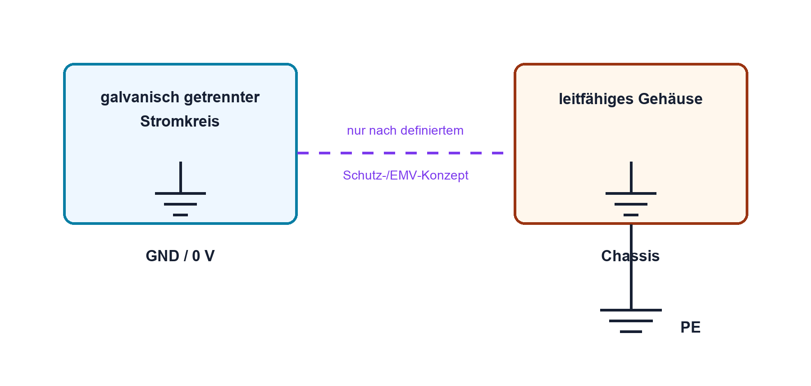

# 02.4 – GND, Erde und galvanische Trennung

[← Zurück](03-spannung-potential-und-bezugspotential.md) · [Modulübersicht](README.md) · [Kursübersicht](../README.md) · [Weiter →](05-widerstand-und-ohmsches-gesetz.md)

## Lernziele

Nach dieser Lektion kannst du:

- Signal-GND, Gehäuse und Schutzleiter unterscheiden
- galvanische Trennung erklären
- gefährliche Masseverbindungen beim Oszilloskop erkennen

## Einleitung

Das Massesymbol wird häufig als universelles Nullpotential missverstanden. In Wirklichkeit kann eine Schaltung mehrere Bezugssysteme besitzen, die getrennt sind oder nur an einem definierten Punkt verbunden werden. Ein Messgerät kann diese Trennung unbeabsichtigt aufheben.

<!-- context-expansion-2026 -->
Elektrische Grössen beschreiben verschiedene Seiten desselben Vorgangs: Ladung wird bewegt, Spannung stellt Energie pro Ladung bereit, Widerstände begrenzen den Strom und Leistung beschreibt den Energieumsatz. Erst der geschlossene Stromkreis und ein festgelegter Bezug machen einzelne Zahlen zu einem verständlichen System.

Beim Thema **GND, Erde und galvanische Trennung** geht es deshalb nicht nur um eine einzelne Formel oder Definition. Entscheidend ist, wie sich das Prinzip im Schema erkennen, im Datenblatt beurteilen, im Aufbau messen und bei einer Abweichung systematisch überprüfen lässt.

## Theorie

<!-- theory-expansion-2026 -->
### Einordnung und Grundidee

Zur Analyse wird zuerst der reale Strompfad gezeichnet und ein Bezugspotential festgelegt. Danach werden Richtung und Polarität definiert. Formeln beschreiben anschliessend diesen bereits verstandenen Vorgang; sie ersetzen weder Schaltbild noch Plausibilitätskontrolle.

### Drei unterschiedliche Begriffe

**GND/0 V** ist der gewählte elektrische Bezug eines Stromkreises. **Chassis** bezeichnet ein leitfähiges Gehäuse. **PE/Schutzleiter** ist ein sicherheitsrelevanter Leiter der Netzinstallation. Sie dürfen im Schema nicht ohne Begründung gleichgesetzt werden.

### Galvanische Trennung

Zwei Stromkreise sind galvanisch getrennt, wenn kein direkter leitender Pfad besteht. Energie oder Information kann dennoch über Transformator, Optokoppler oder isolierten Wandler übertragen werden. Parasitäre Kapazitäten bleiben real bestehen.

### Messgeräte schaffen Verbindungen

Bei vielen Tischoszilloskopen ist die BNC-Aussenleitung mit PE verbunden. Die Masseklemme an einem beliebigen Schaltungsknoten kann diesen hart erden und einen Kurzschluss verursachen. Der Bezug wird deshalb vor dem Anschluss geklärt.

### Mehrere Bezugspotentiale in einem System

Analoge, digitale und leistungsführende Schaltungsteile können eigene GND-Netze besitzen. Unterschiedliche Namen bedeuten zunächst, dass die Verbindung bewusst geplant werden muss. Werden sie an mehreren ungeeigneten Stellen verbunden, können Lastströme über empfindliche Messbezüge fliessen und Signale verfälschen.

Eine galvanisch getrennte Quelle «schwebt» gegenüber Erde, solange kein weiterer Pfad besteht. Sobald USB, Programmiergerät, Oszilloskop oder ein zweites Netzgerät angeschlossen wird, kann sich dieser Zustand ändern. Deshalb wird das gesamte Messsystem betrachtet, nicht nur der Prüfling.

### Common-Mode-Bereich beachten

Auch differentielle Eingänge dürfen nur innerhalb ihres zulässigen Gleichtaktbereichs betrieben werden. Zwei Leitungen können untereinander nur wenige Millivolt Differenz haben und dennoch gemeinsam so weit gegenüber Gerätemasse verschoben sein, dass ein Eingang überlastet wird. Galvanische Trennung und Differentialtastkopf lösen unterschiedliche Aufgaben und sind nicht beliebig austauschbar.

## Anwendungsfall

Typische elektronische Anwendungen und Baugruppen für dieses Thema sind:

- Trennung von Schutzleiter und Signalmasse
- Galvanisch getrennte Schnittstellen
- Vermeidung von Masseschleifen in Messaufbauten

In einer konkreten Entwicklung wird nicht nur geprüft, ob die gewünschte Funktion grundsätzlich entsteht. Ebenso wichtig sind zulässige Grenzwerte, Toleranzen, Temperatur, Messbarkeit und das Verhalten bei Unterbruch, Kurzschluss oder falscher Ansteuerung.

## Anschauliches Beispiel

Ein USB-versorgtes Board ist über den PC bereits mit Erde gekoppelt. Eine zusätzliche Oszilloskopmasse kann einen unerwarteten Strompfad zwischen zwei Geräten bilden, obwohl das Labornetzgerät selbst galvanisch getrennt ist.

## Berechnungsbeispiel

### 🧮 Berechnungsbeispiel: Ausgleichsstrom zwischen zwei GND-Punkten

Zwischen zwei vermeintlich gleichen GND-Punkten werden **50 mV** gemessen. Die leitende Verbindung zwischen ihnen besitzt einen Widerstand von **0.10 Ω**. Gesucht ist der Ausgleichsstrom.

**Gegeben:**

- Potentialdifferenz: **50 mV**
- Verbindungswiderstand: **0.10 Ω**

#### 1. Formel

Nach dem Ohmschen Gesetz gilt:

$$
I = \frac{U}{R}
$$

#### 2. Werte einsetzen

Die Spannung wird vor dem Einsetzen in Volt umgerechnet:

$$
50~\mathrm{mV} = 0.050~\mathrm{V}
$$

$$
I =
\frac{0.050~\mathrm{V}}
     {0.10~\Omega}
$$

#### 3. Berechnen

$$
I = 0.5~\mathrm{A}
$$

#### 4. Ergebnis

$$
\boxed{I = 0.5~\mathrm{A}}
$$

Das Ergebnis zeigt: Selbst eine kleine Potentialdifferenz kann bei einer sehr niederohmigen Verbindung einen erheblichen Ausgleichsstrom erzeugen.

## Praxisbezug

Identifiziere bei ausgeschalteten Geräten anhand der Dokumentation und einer freigegebenen Durchgangsprüfung, welche Anschlüsse mit PE verbunden sind. Zeichne das resultierende Verbindungsschema.

## 🔗 Hardware ↔ Firmware

Kommunikationsfehler können durch fehlenden gemeinsamen Bezug oder Common-Mode-Grenzen entstehen. Firmware erkennt nur fehlerhafte Bits; die elektrische Ursache wird mit Schema und Oszilloskop untersucht.

## Merksatz

> GND ist ein Schaltungsbezug; Erde ist eine physische Sicherheitsverbindung. Beides ist nicht automatisch dasselbe.

## Häufige Fehler und Missverständnisse

- Alle Massesymbole als automatisch verbunden betrachten.
- Oszilloskopmasse ohne Prüfung anklemmen.
- Galvanische Trennung mit völliger kapazitiver Entkopplung verwechseln.

## Zusammenfassung

GND, Chassis und PE erfüllen verschiedene Aufgaben. Trennungen und definierte Kopplungen müssen im Schema sichtbar sein; Messgeräte können neue Verbindungen schaffen.

## Übungsfragen

1. Was unterscheidet GND und PE?
2. Wie kann Information galvanisch getrennt übertragen werden?
3. Warum ist die Scope-Masse potenziell gefährlich?

Weitere Aufgaben: [Übungen zu Modul 02](../uebungen/modul-02.md). Die Lösungen liegen bewusst getrennt.

## Bezug Bildungsplan 2026

- Handlungskompetenzen: `a3`, `b1-LK02–03`, `b4-LK01–10`, `b5`
- Nachweise und Leistungskriterien: [Kompetenzmatrix](../bildungsplan-2026/kompetenzmatrix.md)
