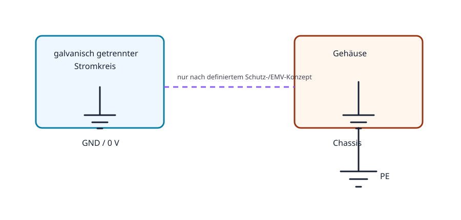

# 02.4 – GND, Erde und galvanische Trennung

[← Zurück](03-spannung-potential-und-bezugspotential.md) · [Modulübersicht](README.md) · [Kursübersicht](../README.md) · [Weiter →](05-widerstand-und-ohmsches-gesetz.md)

## Lernziele

Nach dieser Lektion kannst du:

- Signal-GND, Gehäuse und Schutzleiter unterscheiden
- galvanische Trennung erklären
- gefährliche Masseverbindungen beim Oszilloskop erkennen

## Bezug Bildungsplan 2026

- Handlungskompetenzen: `a3`, `b1-LK02–03`, `b4-LK01–10`, `b5`
- Nachweise und Leistungskriterien: [Kompetenzmatrix](../bildungsplan-2026/kompetenzmatrix.md)

## Voraussetzungen

Vorherige Lektionen dieses Moduls sowie sichere Präfix- und Einheitenrechnung.

## Warum ist das wichtig?

Das Massesymbol wird häufig als universelles Nullpotential missverstanden. In Wirklichkeit kann eine Schaltung mehrere Bezugssysteme besitzen, die getrennt sind oder nur an einem definierten Punkt verbunden werden. Ein Messgerät kann diese Trennung unbeabsichtigt aufheben.

## Theorie

### Drei unterschiedliche Begriffe

**GND/0 V** ist der gewählte elektrische Bezug eines Stromkreises. **Chassis** bezeichnet ein leitfähiges Gehäuse. **PE/Schutzleiter** ist ein sicherheitsrelevanter Leiter der Netzinstallation. Sie dürfen im Schema nicht ohne Begründung gleichgesetzt werden.

### Galvanische Trennung

Zwei Stromkreise sind galvanisch getrennt, wenn kein direkter leitender Pfad besteht. Energie oder Information kann dennoch über Transformator, Optokoppler oder isolierten Wandler übertragen werden. Parasitäre Kapazitäten bleiben real bestehen.

### Messgeräte schaffen Verbindungen

Bei vielen Tischoszilloskopen ist die BNC-Aussenleitung mit PE verbunden. Die Masseklemme an einem beliebigen Schaltungsknoten kann diesen hart erden und einen Kurzschluss verursachen. Der Bezug wird deshalb vor dem Anschluss geklärt.

## Anschauliches Beispiel

Ein USB-versorgtes Board ist über den PC bereits mit Erde gekoppelt. Eine zusätzliche Oszilloskopmasse kann einen unerwarteten Strompfad zwischen zwei Geräten bilden, obwohl das Labornetzgerät selbst galvanisch getrennt ist.

## Berechnungsbeispiel

Zwischen zwei vermeintlichen GND-Punkten liegen 50 mV; über eine 0,10-Ω-Verbindung fliesst `I = 0,050 V / 0,10 Ω = 0,5 A`. Kleine Potentialunterschiede können daher erhebliche Ausgleichsströme erzeugen.

## Praxisbezug

Identifiziere bei ausgeschalteten Geräten anhand der Dokumentation und einer freigegebenen Durchgangsprüfung, welche Anschlüsse mit PE verbunden sind. Zeichne das resultierende Verbindungsschema.

## 🔗 Hardware ↔ Firmware

Kommunikationsfehler können durch fehlenden gemeinsamen Bezug oder Common-Mode-Grenzen entstehen. Firmware erkennt nur fehlerhafte Bits; die elektrische Ursache wird mit Schema und Oszilloskop untersucht.

## Merksatz

> GND ist ein Schaltungsbezug; Erde ist eine physische Sicherheitsverbindung. Beides ist nicht automatisch dasselbe.

## Häufige Fehler und Missverständnisse

- Alle Massesymbole als automatisch verbunden betrachten.
- Oszilloskopmasse ohne Prüfung anklemmen.
- Galvanische Trennung mit völliger kapazitiver Entkopplung verwechseln.

## Zusammenfassung

GND, Chassis und PE erfüllen verschiedene Aufgaben. Trennungen und definierte Kopplungen müssen im Schema sichtbar sein; Messgeräte können neue Verbindungen schaffen.

## Übungsfragen

1. Was unterscheidet GND und PE?
2. Wie kann Information galvanisch getrennt übertragen werden?
3. Warum ist die Scope-Masse potenziell gefährlich?

Weitere Aufgaben: [Übungen zu Modul 02](../uebungen/modul-02.md). Die Lösungen liegen bewusst getrennt.
