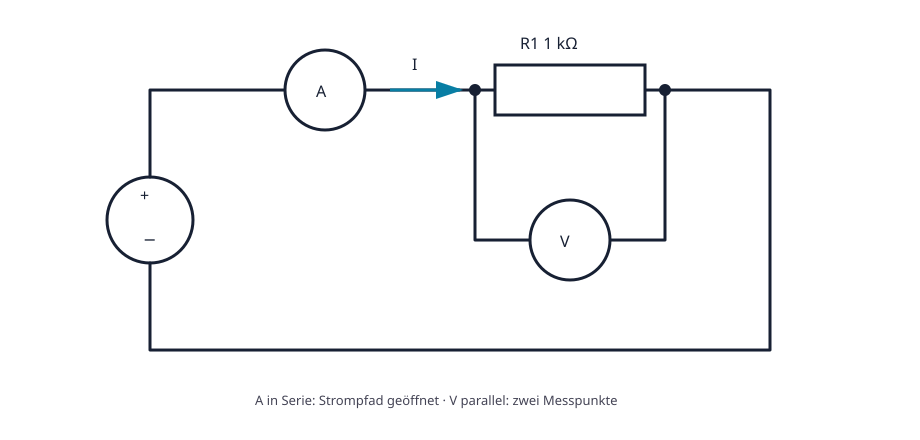

# 02.5 – Widerstand und Ohmsches Gesetz

[← Zurück](04-gnd-erde-und-galvanische-trennung.md) · [Modulübersicht](README.md) · [Kursübersicht](../README.md) · [Weiter →](06-elektrische-leistung-energie-und-wirkungsgrad.md)

## Lernziele

Nach dieser Lektion kannst du:

- Widerstand als Verhältnis und physikalische Eigenschaft erklären
- Ohmsches Gesetz sicher nach U, I und R anwenden
- Gültigkeitsbereich und Verlustleistung berücksichtigen

## Bezug Bildungsplan 2026

- Handlungskompetenzen: `a3`, `b1-LK02–03`, `b4-LK01–10`, `b5`
- Nachweise und Leistungskriterien: [Kompetenzmatrix](../bildungsplan-2026/kompetenzmatrix.md)

## Voraussetzungen

Vorherige Lektionen dieses Moduls sowie sichere Präfix- und Einheitenrechnung.

## Warum ist das wichtig?

Ein Widerstand begrenzt Strom nicht aktiv wie ein Wächter. Seine Material- und Geometrieeigenschaften führen dazu, dass für einen bestimmten Strom eine bestimmte Spannung nötig ist. Dieses Verhältnis lässt sich bei ohmschem Verhalten einfach beschreiben.

## Theorie

### Vom Bauteilverhalten zur Kennlinie

Legt man verschiedene Spannungen an einen idealisierten ohmschen Widerstand und misst den Strom, entsteht eine Gerade durch den Ursprung. Das konstante Verhältnis von Spannung zu Strom heisst Widerstand.

### Ohmsches Gesetz

Nach dieser Beobachtung wird die Beziehung formuliert: `U = R·I`. Daraus folgen `I = U/R` und `R = U/I`. R wird in Ohm gemessen; `1 Ω = 1 V/A`. Praktisch gilt `V/kΩ = mA`.

### Gültigkeitsgrenze

Die einfache Proportionalität gilt für ein ohmsches Bauteil bei annähernd konstanter Temperatur. LED, Diode und Glühlampe besitzen nichtlineare oder temperaturabhängige Kennlinien. Auch ein Widerstand hat Toleranz, Temperaturkoeffizient, maximale Spannung und Leistung.

## Anschauliches Beispiel

Verdoppelt man bei konstantem 1-kΩ-Widerstand die Spannung von 2 V auf 4 V, steigt der ideale Strom von 2 mA auf 4 mA. Erwärmt sich das Bauteil stark, kann der reale Wert leicht abweichen.

## Berechnungsbeispiel

An `R = 1,0 kΩ` liegen `U = 5,0 V`. `I = U/R = 5,0 V / 1,0 kΩ = 5,0 mA`. Rückprüfung: `1,0 kΩ × 5,0 mA = 5,0 V`. Die Leistung ist `25 mW`, weit unter 0,25 W.

## Praxisbezug

Baue die gezeigte Messschaltung mit strombegrenzter 0–5-V-Quelle auf. Sage den Strom für mindestens fünf Spannungen voraus, miss U und I und zeichne die Kennlinie.

## 🔗 Hardware ↔ Firmware

Pull-up- und Pull-down-Widerstände definieren MCU-Eingänge. Zu grosse Werte werden empfindlicher gegen Leckstrom und Störung; zu kleine belasten den Ausgang. Firmware muss interne Pull-Widerstände passend zur externen Schaltung konfigurieren.

## Merksatz

> Ohmsches Gesetz beschreibt ein Bauteilverhalten unter Bedingungen, nicht jedes elektrische Bauteil.

## Häufige Fehler und Missverständnisse

- kΩ und Ω beim Einsetzen verwechseln.
- Die Leistung des Widerstands nicht prüfen.
- Eine Diodenkennlinie mit konstantem R beschreiben.

## Zusammenfassung

Bei ohmschem Verhalten sind Spannung und Strom proportional. Das Gesetz erlaubt drei Umstellungen, gilt aber nur innerhalb des passenden Modells und der Bauteilgrenzen.

## Übungsfragen

1. Welcher Strom fliesst bei 3,3 V und 330 Ω?
2. Wann ist das einfache Modell ungeeignet?
3. Wie wird das Voltmeter angeschlossen?

Weitere Aufgaben: [Übungen zu Modul 02](../uebungen/modul-02.md). Die Lösungen liegen bewusst getrennt.
