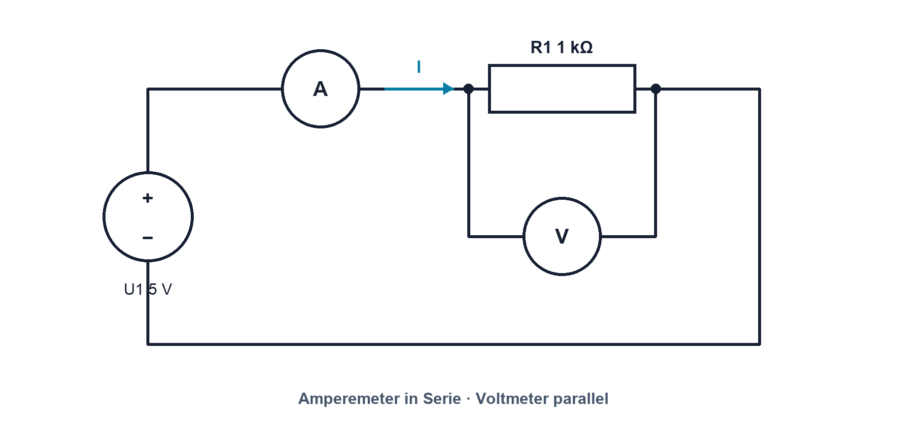

# 02.5 – Widerstand und Ohmsches Gesetz

[← Zurück](04-gnd-erde-und-galvanische-trennung.md) · [Modulübersicht](README.md) · [Kursübersicht](../README.md) · [Weiter →](06-elektrische-leistung-energie-und-wirkungsgrad.md)

## Lernziele

Nach dieser Lektion kannst du:

- Widerstand als Verhältnis und physikalische Eigenschaft erklären
- Ohmsches Gesetz sicher nach U, I und R anwenden
- Gültigkeitsbereich und Verlustleistung berücksichtigen

## Einleitung

Ein Widerstand begrenzt Strom nicht aktiv wie ein Wächter. Seine Material- und Geometrieeigenschaften führen dazu, dass für einen bestimmten Strom eine bestimmte Spannung nötig ist. Dieses Verhältnis lässt sich bei ohmschem Verhalten einfach beschreiben.

<!-- context-expansion-2026 -->
Elektrische Grössen beschreiben verschiedene Seiten desselben Vorgangs: Ladung wird bewegt, Spannung stellt Energie pro Ladung bereit, Widerstände begrenzen den Strom und Leistung beschreibt den Energieumsatz. Erst der geschlossene Stromkreis und ein festgelegter Bezug machen einzelne Zahlen zu einem verständlichen System.

Beim Thema **Widerstand und Ohmsches Gesetz** geht es deshalb nicht nur um eine einzelne Formel oder Definition. Entscheidend ist, wie sich das Prinzip im Schema erkennen, im Datenblatt beurteilen, im Aufbau messen und bei einer Abweichung systematisch überprüfen lässt.

## Theorie

<!-- theory-expansion-2026 -->
### Einordnung und Grundidee

Zur Analyse wird zuerst der reale Strompfad gezeichnet und ein Bezugspotential festgelegt. Danach werden Richtung und Polarität definiert. Formeln beschreiben anschliessend diesen bereits verstandenen Vorgang; sie ersetzen weder Schaltbild noch Plausibilitätskontrolle.

**Der Widerstand besitzt zwei Anschlüsse und keine Polarität.** Sein IEC-Schaltzeichen ist ein Rechteck, der Referenzbezeichner beginnt mit `R`. Ein idealer ohmscher Widerstand erzeugt bei positiver Spannung einen proportionalen Strom; reale Widerstände besitzen zusätzlich Toleranz, Temperaturkoeffizient, maximale Spannung und Belastbarkeit.

### Vom Bauteilverhalten zur Kennlinie

Legt man verschiedene Spannungen an einen idealisierten ohmschen Widerstand und misst den Strom, entsteht eine Gerade durch den Ursprung. Das konstante Verhältnis von Spannung zu Strom heisst Widerstand.

### Ohmsches Gesetz

Nach dieser Beobachtung wird die Beziehung formuliert: `U = R·I`. Daraus folgen `I = U/R` und `R = U/I`. R wird in Ohm gemessen; `1 Ω = 1 V/A`. Praktisch gilt `V/kΩ = mA`.

### Gültigkeitsgrenze

Die einfache Proportionalität gilt für ein ohmsches Bauteil bei annähernd konstanter Temperatur. LED, Diode und Glühlampe besitzen nichtlineare oder temperaturabhängige Kennlinien. Auch ein Widerstand hat Toleranz, Temperaturkoeffizient, maximale Spannung und Leistung.

### Material, Länge und Querschnitt

Der Widerstand eines homogenen Leiters hängt von Material, Länge und Querschnitt ab. Ein längerer Leiter bietet mehr Weg für Stösse der Ladungsträger; ein grösserer Querschnitt stellt mehr parallele Transportwege bereit. Diese Vorstellung führt zur Beziehung `R = ρ·l/A`, wobei der spezifische Widerstand ρ das Material beschreibt.

Temperatur kann ρ verändern. Bei vielen Metallen steigt der Widerstand mit der Temperatur. Deshalb kann ein Bauteil bei der Messung mit kleinem Prüfstrom einen anderen Wert zeigen als im heissen Betriebszustand. Das Ohmsche Gesetz bleibt am jeweiligen Zustand nutzbar, der Widerstand ist aber nicht mehr konstant.

### Statischer und differentieller Widerstand

Bei einer nichtlinearen Kennlinie bezeichnet `U/I` das Verhältnis vom Ursprung zum Arbeitspunkt. Die lokale Steigung `dU/dI` beschreibt dagegen die Reaktion auf eine kleine Änderung um diesen Punkt. Bei einem ideal ohmschen Widerstand sind beide gleich; bei Dioden oder Transistoren nicht.

## Anwendungsfall

Typische elektronische Anwendungen und Baugruppen für dieses Thema sind:

- LED-Vorwiderstand und Pull-up
- Strombegrenzung an Eingängen
- Bewertung ohmscher Lasten und Leitungsverluste

In einer konkreten Entwicklung wird nicht nur geprüft, ob die gewünschte Funktion grundsätzlich entsteht. Ebenso wichtig sind zulässige Grenzwerte, Toleranzen, Temperatur, Messbarkeit und das Verhalten bei Unterbruch, Kurzschluss oder falscher Ansteuerung.

## Anschauliches Beispiel

Verdoppelt man bei konstantem 1-kΩ-Widerstand die Spannung von 2 V auf 4 V, steigt der ideale Strom von 2 mA auf 4 mA. Erwärmt sich das Bauteil stark, kann der reale Wert leicht abweichen.

## Berechnungsbeispiel

An `R = 1,0 kΩ` liegen `U = 5,0 V`. `I = U/R = 5,0 V / 1,0 kΩ = 5,0 mA`. Rückprüfung: `1,0 kΩ × 5,0 mA = 5,0 V`. Die Leistung ist `25 mW`, weit unter 0,25 W.

## Praxisbezug

Baue die gezeigte Messschaltung mit strombegrenzter 0–5-V-Quelle auf. Sage den Strom für mindestens fünf Spannungen voraus, miss U und I und zeichne die Kennlinie.

## 🔗 Hardware ↔ Firmware

Pull-up- und Pull-down-Widerstände definieren MCU-Eingänge. Zu grosse Werte werden empfindlicher gegen Leckstrom und Störung; zu kleine belasten den Ausgang. Firmware muss interne Pull-Widerstände passend zur externen Schaltung konfigurieren.

## Merksatz

> Ohmsches Gesetz beschreibt ein Bauteilverhalten unter Bedingungen, nicht jedes elektrische Bauteil.

## Häufige Fehler und Missverständnisse

- kΩ und Ω beim Einsetzen verwechseln.
- Die Leistung des Widerstands nicht prüfen.
- Eine Diodenkennlinie mit konstantem R beschreiben.

## Zusammenfassung

Bei ohmschem Verhalten sind Spannung und Strom proportional. Das Gesetz erlaubt drei Umstellungen, gilt aber nur innerhalb des passenden Modells und der Bauteilgrenzen.

## Übungsfragen

1. Welcher Strom fliesst bei 3,3 V und 330 Ω?
2. Wann ist das einfache Modell ungeeignet?
3. Wie wird das Voltmeter angeschlossen?

Weitere Aufgaben: [Übungen zu Modul 02](../uebungen/modul-02.md). Die Lösungen liegen bewusst getrennt.

## Bezug Bildungsplan 2026

- Handlungskompetenzen: `a3`, `b1-LK02–03`, `b4-LK01–10`, `b5`
- Nachweise und Leistungskriterien: [Kompetenzmatrix](../bildungsplan-2026/kompetenzmatrix.md)
