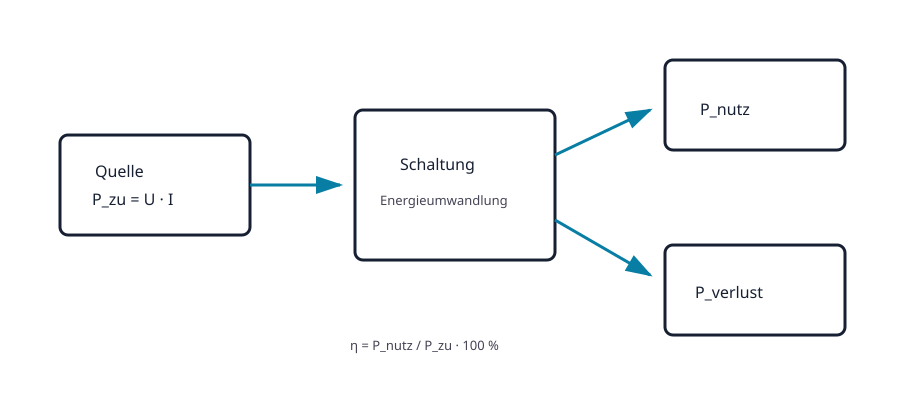

# 02.6 – Elektrische Leistung, Energie und Wirkungsgrad

[← Zurück](05-widerstand-und-ohmsches-gesetz.md) · [Modulübersicht](README.md) · [Kursübersicht](../README.md) · [Weiter →](07-grundgroessen-sicher-berechnen-aufbauen-und-messen.md)

## Lernziele

Nach dieser Lektion kannst du:

- Leistung, Energie und Wirkungsgrad im Strompfad erklären
- elektrische Leistung mit mehreren Formeln berechnen
- Verlustleistung und thermische Reserve beurteilen

## Bezug Bildungsplan 2026

- Handlungskompetenzen: `a3`, `b1-LK02–03`, `b4-LK01–10`, `b5`
- Nachweise und Leistungskriterien: [Kompetenzmatrix](../bildungsplan-2026/kompetenzmatrix.md)

## Voraussetzungen

Vorherige Lektionen dieses Moduls sowie sichere Präfix- und Einheitenrechnung.

## Warum ist das wichtig?

Eine Schaltung kann elektrisch richtig funktionieren und trotzdem überhitzen. Strom und Spannung sagen, was fliesst und anliegt; Leistung sagt, wie schnell Energie umgesetzt wird. Sie entscheidet über Bauteilgrösse, Temperatur und Laufzeit.

## Theorie

### Leistung im Bauteil

Fliesst Ladung durch eine Potentialdifferenz, wird Energie übertragen. Pro Zeit ergibt sich Leistung. Erst aus dieser Vorstellung folgt `P = U·I`. Für einen ohmschen Widerstand dürfen mit dem Ohmschen Gesetz auch `P = I²R` und `P = U²/R` verwendet werden.

### Energie über Zeit

Bei konstanter Leistung gilt `E = P·t`. Joule beziehungsweise Wattsekunde ist die SI-Einheit; bei Energieversorgung wird häufig Wattstunde verwendet. `1 Wh = 3600 J`.

### Wirkungsgrad

`η = P_nutz/P_zu`. Die Differenz `P_verlust = P_zu − P_nutz` erwärmt Bauteile oder wird anderweitig ungewollt umgesetzt. Nennleistung ist kein Zielbetrieb; Reserve und Umgebungstemperatur sind zu beachten.

## Anschauliches Beispiel

Ein Linearregler wandelt 12 V auf 5 V bei 100 mA. Die Last erhält 0,5 W, der Regler verheizt ungefähr 0,7 W. Die Funktion stimmt, doch das thermische Design kann ungenügend sein.

## Berechnungsbeispiel

Am 1-kΩ-Widerstand aus Lektion 02.5 liegen 5 V. `P = U²/R = 25 V² / 1000 Ω = 0,025 W = 25 mW`. In 10 min: `E = 0,025 W × 600 s = 15 J`. Bei 0,25-W-Nennleistung beträgt die statische Auslastung 10 %.

## Praxisbezug

Berechne vor dem Aufbau Strom und Widerstandsleistung. Miss U und I, berechne daraus P und vergleiche. Berühre keine möglicherweise heissen Bauteile; Temperaturmessung erfolgt nach freigegebener Methode.

## 🔗 Hardware ↔ Firmware

PWM kann die mittlere Lastleistung steuern. Momentanstrom, MOSFET-Verluste und thermische Grenzwerte bleiben Hardwarethemen. Firmware muss Tastgrad und Fehlerzustände innerhalb dieser Grenzen halten.

## Merksatz

> Leistung bestimmt die momentane Belastung; Energie berücksichtigt zusätzlich die Zeit.

## Häufige Fehler und Missverständnisse

- Watt und Wattstunde verwechseln.
- Nur Lastleistung, nicht Verlustleistung betrachten.
- Bauteile dauerhaft direkt an der Nennleistungsgrenze betreiben.

## Zusammenfassung

Elektrische Leistung ist U·I, Energie ist Leistung über Zeit. Wirkungsgrad trennt Nutz- und Verlustleistung und verbindet die Rechnung mit thermischer Auslegung.

## Übungsfragen

1. Wie viel Leistung nimmt 100 Ω an 10 V auf?
2. Wie viele Joule sind 2 Wh?
3. Warum kann ein korrekt geregelter Linearregler überhitzen?

Weitere Aufgaben: [Übungen zu Modul 02](../uebungen/modul-02.md). Die Lösungen liegen bewusst getrennt.
