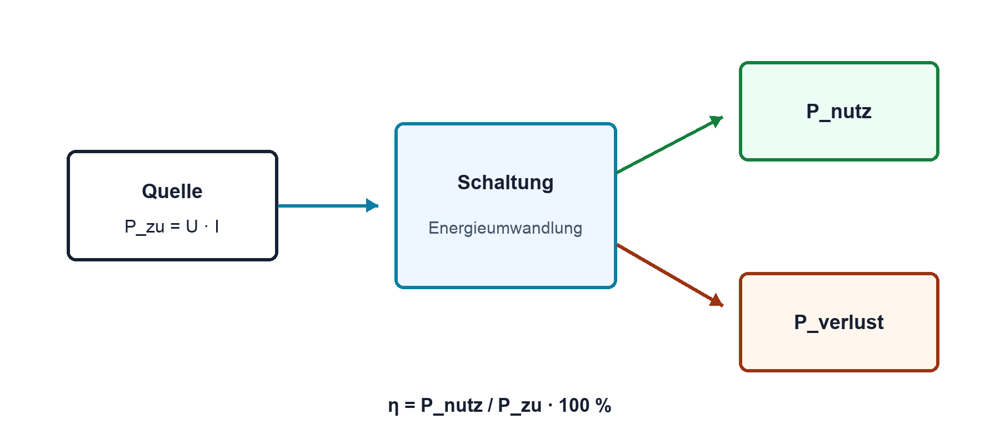

# 02.6 – Elektrische Leistung, Energie und Wirkungsgrad

[← Zurück](05-widerstand-und-ohmsches-gesetz.md) · [Modulübersicht](README.md) · [Kursübersicht](../README.md) · [Weiter →](07-grundgroessen-sicher-berechnen-aufbauen-und-messen.md)

## Lernziele

Nach dieser Lektion kannst du:

- Leistung, Energie und Wirkungsgrad im Strompfad erklären
- elektrische Leistung mit mehreren Formeln berechnen
- Verlustleistung und thermische Reserve beurteilen

## Einleitung

Eine Schaltung kann elektrisch richtig funktionieren und trotzdem überhitzen. Strom und Spannung sagen, was fliesst und anliegt; Leistung sagt, wie schnell Energie umgesetzt wird. Sie entscheidet über Bauteilgrösse, Temperatur und Laufzeit.

<!-- context-expansion-2026 -->
Elektrische Grössen beschreiben verschiedene Seiten desselben Vorgangs: Ladung wird bewegt, Spannung stellt Energie pro Ladung bereit, Widerstände begrenzen den Strom und Leistung beschreibt den Energieumsatz. Erst der geschlossene Stromkreis und ein festgelegter Bezug machen einzelne Zahlen zu einem verständlichen System.

Beim Thema **Elektrische Leistung, Energie und Wirkungsgrad** geht es deshalb nicht nur um eine einzelne Formel oder Definition. Entscheidend ist, wie sich das Prinzip im Schema erkennen, im Datenblatt beurteilen, im Aufbau messen und bei einer Abweichung systematisch überprüfen lässt.

## Theorie

<!-- theory-expansion-2026 -->
### Einordnung und Grundidee

Zur Analyse wird zuerst der reale Strompfad gezeichnet und ein Bezugspotential festgelegt. Danach werden Richtung und Polarität definiert. Formeln beschreiben anschliessend diesen bereits verstandenen Vorgang; sie ersetzen weder Schaltbild noch Plausibilitätskontrolle.

### Leistung im Bauteil

Fliesst Ladung durch eine Potentialdifferenz, wird Energie übertragen. Pro Zeit ergibt sich Leistung. Erst aus dieser Vorstellung folgt `P = U·I`. Für einen ohmschen Widerstand dürfen mit dem Ohmschen Gesetz auch `P = I²R` und `P = U²/R` verwendet werden.

### Energie über Zeit

Bei konstanter Leistung gilt `E = P·t`. Joule beziehungsweise Wattsekunde ist die SI-Einheit; bei Energieversorgung wird häufig Wattstunde verwendet. `1 Wh = 3600 J`.

### Wirkungsgrad

`η = Pnutz/Pzu`. Die Differenz `Pverlust = Pzu − Pnutz` erwärmt Bauteile oder wird anderweitig ungewollt umgesetzt. Nennleistung ist kein Zielbetrieb; Reserve und Umgebungstemperatur sind zu beachten.

### Vorzeichen der Leistung

Wird Strompfeil und Spannungspolung nach der passiven Vorzeichenkonvention gewählt, bedeutet positive Leistung, dass ein Bauteil Energie aufnimmt. Ein negatives Ergebnis bedeutet, dass es Energie abgibt. So lassen sich Quelle, Verbraucher und rückspeisende Systeme mit derselben Gleichung beschreiben.

Die Formeln `I²R` und `U²/R` dürfen nur verwendet werden, wenn U, I und R zum selben ohmschen Bauteil und Betriebszustand gehören. `P = U·I` ist allgemeiner, bei zeitabhängigen Signalen muss jedoch die momentane Leistung oder ein korrekt gebildeter Mittelwert betrachtet werden.

### Temperatur ist nicht Leistung

Watt beschreibt Wärmeentstehung pro Zeit, Grad Celsius einen Temperaturzustand. Zwei Bauteile mit gleicher Verlustleistung können wegen unterschiedlicher Gehäuse und Kühlpfade sehr verschiedene Temperaturen erreichen. Deshalb wird eine Leistungsrechnung später durch thermische Widerstände und zulässige Sperrschichttemperatur ergänzt.

## Anwendungsfall

Typische elektronische Anwendungen und Baugruppen für dieses Thema sind:

- Thermische Auslegung von Reglern und Widerständen
- Batterielaufzeit und Energieverbrauch
- Wirkungsgradvergleich von Versorgungskonzepten

In einer konkreten Entwicklung wird nicht nur geprüft, ob die gewünschte Funktion grundsätzlich entsteht. Ebenso wichtig sind zulässige Grenzwerte, Toleranzen, Temperatur, Messbarkeit und das Verhalten bei Unterbruch, Kurzschluss oder falscher Ansteuerung.

## Anschauliches Beispiel

Ein Linearregler wandelt 12 V auf 5 V bei 100 mA. Die Last erhält 0,5 W, der Regler verheizt ungefähr 0,7 W. Die Funktion stimmt, doch das thermische Design kann ungenügend sein.

## Berechnungsbeispiel

Am 1-kΩ-Widerstand aus Lektion 02.5 liegen 5 V. `P = U²/R = 25 V² / 1000 Ω = 0,025 W = 25 mW`. In 10 min: `E = 0,025 W × 600 s = 15 J`. Bei 0,25-W-Nennleistung beträgt die statische Auslastung 10 %.

## Praxisbezug

Berechne vor dem Aufbau Strom und Widerstandsleistung. Miss U und I, berechne daraus P und vergleiche. Berühre keine möglicherweise heissen Bauteile; Temperaturmessung erfolgt nach freigegebener Methode.

## 🔗 Hardware ↔ Firmware

PWM kann die mittlere Lastleistung steuern. Momentanstrom, MOSFET-Verluste und thermische Grenzwerte bleiben Hardwarethemen. Firmware muss Tastgrad und Fehlerzustände innerhalb dieser Grenzen halten.

## Merksatz

> Leistung bestimmt die momentane Belastung; Energie berücksichtigt zusätzlich die Zeit.

## Häufige Fehler und Missverständnisse

- Watt und Wattstunde verwechseln.
- Nur Lastleistung, nicht Verlustleistung betrachten.
- Bauteile dauerhaft direkt an der Nennleistungsgrenze betreiben.

## Zusammenfassung

Elektrische Leistung ist U·I, Energie ist Leistung über Zeit. Wirkungsgrad trennt Nutz- und Verlustleistung und verbindet die Rechnung mit thermischer Auslegung.

## Übungsfragen

1. Wie viel Leistung nimmt 100 Ω an 10 V auf?
2. Wie viele Joule sind 2 Wh?
3. Warum kann ein korrekt geregelter Linearregler überhitzen?

Weitere Aufgaben: [Übungen zu Modul 02](../uebungen/modul-02.md). Die Lösungen liegen bewusst getrennt.

## Bezug Bildungsplan 2026

- Handlungskompetenzen: `a3`, `b1-LK02–03`, `b4-LK01–10`, `b5`
- Nachweise und Leistungskriterien: [Kompetenzmatrix](../bildungsplan-2026/kompetenzmatrix.md)
