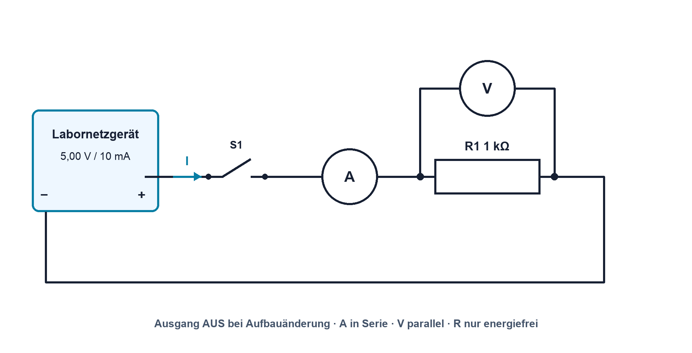

# 02.7 – Grundgrössen sicher berechnen, aufbauen und messen

[← Zurück](06-elektrische-leistung-energie-und-wirkungsgrad.md) · [Modulübersicht](README.md) · [Kursübersicht](../README.md) · [Weiter →](README.md)

## Lernziele

Nach dieser Lektion kannst du:

- einen einfachen Stromkreis vollständig vorhersagen und aufbauen
- Spannung, Strom und Widerstand sicher messen
- Messabweichungen mit Toleranz und Gerätebelastung erklären

## Einleitung

Einzelbegriffe werden erst nützlich, wenn sie in einem realen Stromkreis zusammenpassen. Diese Lektion führt deshalb den ganzen Arbeitsablauf durch: vom Schema über die Rechnung und Freigabe bis zur Messung und Bewertung.

<!-- context-expansion-2026 -->
Elektrische Grössen beschreiben verschiedene Seiten desselben Vorgangs: Ladung wird bewegt, Spannung stellt Energie pro Ladung bereit, Widerstände begrenzen den Strom und Leistung beschreibt den Energieumsatz. Erst der geschlossene Stromkreis und ein festgelegter Bezug machen einzelne Zahlen zu einem verständlichen System.

Beim Thema **Grundgrössen sicher berechnen, aufbauen und messen** geht es deshalb nicht nur um eine einzelne Formel oder Definition. Entscheidend ist, wie sich das Prinzip im Schema erkennen, im Datenblatt beurteilen, im Aufbau messen und bei einer Abweichung systematisch überprüfen lässt.

## Theorie

<!-- theory-expansion-2026 -->
### Einordnung und Grundidee

Zur Analyse wird zuerst der reale Strompfad gezeichnet und ein Bezugspotential festgelegt. Danach werden Richtung und Polarität definiert. Formeln beschreiben anschliessend diesen bereits verstandenen Vorgang; sie ersetzen weder Schaltbild noch Plausibilitätskontrolle.

### Das Schema zuerst lesen

Die Quelle U1 speist R1. Der technische Strom läuft vom Pluspol durch R1 zurück zur Quelle. Das Voltmeter liegt parallel zu R1; das Amperemeter wird in Serie eingefügt. Der Aufbau folgt dem Schema, nicht der räumlichen Anordnung der Zeichnung.

### Sichere Reihenfolge

1. Sollwerte und Toleranzbereich berechnen. 2. Netzgerät bei Ausgang AUS einstellen. 3. Widerstand spannungsfrei messen. 4. Aufbau und Polarität prüfen. 5. Stromgrenze setzen. 6. Spannung parallel messen. 7. Für Strommessung ausschalten, Pfad öffnen, A-Meter in Serie einsetzen. 8. Nachher Messleitung in V/Ω-Buchse zurückstecken.

### Messung beeinflusst den Aufbau

Das Voltmeter hat endlichen Eingangswiderstand, das Amperemeter einen Shunt. Bei 1 kΩ ist die Belastung eines 10-MΩ-Voltmeters klein; bei sehr hochohmigen Schaltungen wird sie relevant. Leitungen und Kontakte erzeugen zusätzliche Widerstände.

### Messstrategie vor dem Verdrahten

Bevor Messleitungen angeschlossen werden, wird festgelegt, welche Frage jede Messung beantworten soll. Die Spannungsmessung bestätigt Quelle und Spannungsabfall. Die Strommessung prüft den Serienpfad. Die Widerstandsmessung kontrolliert das Bauteil im energiefreien Zustand. Dadurch entsteht eine Reihenfolge, in der jede Messung auf der vorherigen aufbaut.

Ein unerwarteter Wert führt nicht sofort zum Umbau. Zuerst werden Messfunktion, Buchse, Bereich, Bezug und Kontakt geprüft. Danach wird eine einzelne Fehlerhypothese getestet. Mehrere gleichzeitige Änderungen würden zwar zufällig zum Erfolg führen können, aber die Ursache bliebe unbekannt.

### Kennlinie statt Einzelpunkt

Mehrere Spannungs-/Strompaare zeigen, ob der Widerstand im untersuchten Bereich annähernd linear bleibt. Die Gerade sollte nahe durch den Ursprung verlaufen; ihre Steigung hängt von der gewählten Achsendarstellung ab. Einzelne Ausreisser werden nicht gelöscht, sondern auf Ablese-, Kontakt- oder Einstellfehler untersucht.

## Anwendungsfall

Typische elektronische Anwendungen und Baugruppen für dieses Thema sind:

- Erstinbetriebnahme einer einfachen Schaltung
- Vergleich von Rechnung, Aufbau und Messung
- Dokumentation von Abweichungen und Messgerätebelastung

In einer konkreten Entwicklung wird nicht nur geprüft, ob die gewünschte Funktion grundsätzlich entsteht. Ebenso wichtig sind zulässige Grenzwerte, Toleranzen, Temperatur, Messbarkeit und das Verhalten bei Unterbruch, Kurzschluss oder falscher Ansteuerung.

## Anschauliches Beispiel

Für 5,00 V und gemessene 997 Ω werden 5,02 mA erwartet. Zeigt das DMM 4,98 mA, ist nicht automatisch etwas defekt. Quellenabweichung, Widerstandstoleranz, Burden Voltage und Gerätegenauigkeit werden verglichen.

## Berechnungsbeispiel

Mit `U = 5,00 V` und `R = 997 Ω`: `Isoll = 5,015 mA`. Gemessen seien `UR = 4,96 V` und `Iist = 4,98 mA`. Aus U/I folgt `R = 996 Ω`. Die relative Stromabweichung ist etwa `(4,98−5,015)/5,015 = −0,70 %` und damit plausibel.

## Praxisbezug

Führe die vollständige [Praxis Modul 02](../praxis/modul-02.md) durch. Trage Soll, Grenzbereich, Ist, Abweichung und Erklärung ins Protokoll ein.

## 🔗 Hardware ↔ Firmware

Ersetzt später ein GPIO die Spannungsquelle, besitzt er einen Ausgangswiderstand und Stromgrenzen. Firmware setzt HIGH oder LOW; gemessen werden reale Pinspannung und Strom. Ein Spannungseinbruch kann sowohl zu hohe Last als auch falsche Pin-Konfiguration bedeuten.

## Merksatz

> Erst vorhersagen, dann spannungsfrei aufbauen, strombegrenzt einschalten und Messwert gegen den Sollbereich bewerten.

## Häufige Fehler und Missverständnisse

- Strommessgerät parallel anschliessen.
- Widerstand in der versorgten Schaltung messen.
- Messabweichung ohne Toleranz- und Unsicherheitsbetrachtung als Fehler bezeichnen.

## Zusammenfassung

Der vollständige Arbeitsablauf verbindet Schema, Rechnung, sichere Freigabe, geeigneten Messanschluss und begründeten Soll-Ist-Vergleich.

## Übungsfragen

1. Warum wird für die Strommessung der Pfad geöffnet?
2. Welche Einflüsse erklären eine kleine Soll-Ist-Abweichung?
3. Was ist nach der Strommessung sofort zu tun?

Weitere Aufgaben: [Übungen zu Modul 02](../uebungen/modul-02.md). Die Lösungen liegen bewusst getrennt.

## Bezug Bildungsplan 2026

- Handlungskompetenzen: `a3`, `b1-LK02–03`, `b4-LK01–10`, `b5`
- Nachweise und Leistungskriterien: [Kompetenzmatrix](../bildungsplan-2026/kompetenzmatrix.md)
