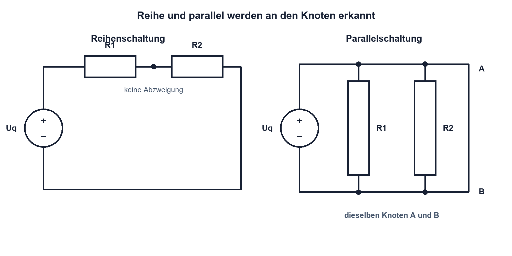

# 03.1 – Reihen- und Parallelschaltungen

[← Zurück](README.md) · [Modulübersicht](README.md) · [Kursübersicht](../README.md) · [Weiter →](02-kirchhoffsche-knoten-und-maschenregel.md)

## Lernziele

Nach dieser Lektion kannst du:

- Reihen- und Parallelschaltungen am Knotenbild sicher unterscheiden
- Gesamtwiderstand, Teilspannungen und Zweigströme berechnen
- Ergebnisse mit Grenzfällen und einer Messung plausibilisieren

## Einleitung

Elektronische Schaltungen bestehen selten aus einem einzelnen Widerstand. Vorwiderstand und LED liegen beispielsweise in Reihe; mehrere Versorgungspfade oder Pull-up-Widerstände können parallel wirken. Wer nur nach der gezeichneten Anordnung «nebeneinander» oder «untereinander» urteilt, erkennt die elektrische Struktur oft falsch.

Entscheidend sind die Knoten. Zwei Bauteile liegen in Reihe, wenn ihr gemeinsamer Knoten keine weitere Abzweigung besitzt: Durch beide fliesst derselbe Strom. Sie liegen parallel, wenn beide Anschlüsse jeweils mit denselben zwei Knoten verbunden sind: An beiden liegt dieselbe Spannung. Diese Definition funktioniert auch bei unübersichtlich gezeichneten Schemas.

<!-- context-expansion-2026 -->
Eine Baugruppe besteht aus verbundenen Quellen, Bauteilen und Lasten. Gleichstromnetzwerke liefern die Regeln, mit denen sich unbekannte Ströme und Spannungen aus Topologie und Bauteilwerten ableiten lassen. Dabei sind Knoten, Maschen und Rückstrompfade ebenso wichtig wie die Zahlenwerte.

Beim Thema **Reihen- und Parallelschaltungen** geht es deshalb nicht nur um eine einzelne Formel oder Definition. Entscheidend ist, wie sich das Prinzip im Schema erkennen, im Datenblatt beurteilen, im Aufbau messen und bei einer Abweichung systematisch überprüfen lässt.

## Theorie

<!-- theory-expansion-2026 -->
### Einordnung und Grundidee

Netzwerke werden aus Sicht ihrer Topologie gelesen: Bauteile in demselben Strompfad liegen in Reihe, Bauteile an denselben zwei Knoten parallel. Erst danach werden Ersatzwerte, Knotenbilanzen oder Maschengleichungen gebildet. Diese Reihenfolge verhindert viele Vorzeichen- und Zuordnungsfehler.

### Reihenschaltung: ein gemeinsamer Strompfad

In einer Reihenschaltung kann sich der Strom an keinem Zwischenknoten aufteilen. Jeder Widerstand wird daher vom gleichen Strom durchflossen. Die Gesamtspannung verteilt sich auf die Einzelwiderstände. Ein grösserer Widerstand verursacht bei gleichem Strom einen grösseren Spannungsabfall.

Die Ersatzschaltung soll bei gleicher Klemmenspannung denselben Strom aufnehmen. Für Widerstände in Reihe gilt deshalb:

$$
R_{\mathrm{eq}} = R_1+R_2+\ldots+R_n
$$

| Formelzeichen | Bedeutung | Einheit |
|---|---|---|
| $R_{\mathrm{eq}}$ | Ersatz- oder Gesamtwiderstand (*equivalent resistance*) | Ω |
| $R_1\ldots R_n$ | einzelne Widerstände | Ω |
| $G$, $G_{\mathrm{eq}}$ | Leitwert eines Zweigs beziehungsweise Gesamtleitwert | S (Siemens) |
| $G_1\ldots G_n$ | einzelne Zweigleitwerte | S |
| $n$ | Anzahl der Widerstände | einheitenlos |

Der Ersatzwiderstand einer Reihenschaltung ist immer grösser als der grösste Einzelwiderstand. Das ist eine schnelle Plausibilitätskontrolle.

### Parallelschaltung: gemeinsame Klemmenspannung

In einer Parallelschaltung liegt jeder Zweig an denselben beiden Knoten. Deshalb ist die Spannung über allen Zweigen gleich. Der Gesamtstrom ist die Summe der Zweigströme. Ein kleiner Widerstand führt bei gleicher Spannung zu einem grossen Zweigstrom.

Rechnerisch ist es hilfreich, zuerst mit dem Leitwert zu denken. Der Leitwert $G$ beschreibt, wie gut ein Pfad Strom leitet, und ist der Kehrwert des Widerstands:

$$
G = \frac{1}{R}
$$

Parallele Leitpfade addieren sich:

$$
G_{\mathrm{eq}} = G_1+G_2+\ldots+G_n
$$

und damit:

$$
\frac{1}{R_{\mathrm{eq}}} =
\frac{1}{R_1}+\frac{1}{R_2}+\ldots+\frac{1}{R_n}
$$

Für genau zwei parallele Widerstände folgt:

$$
R_{\mathrm{eq}} =
\frac{R_1\cdot R_2}
     {R_1+R_2}
$$

Der Gesamtwiderstand muss kleiner sein als der kleinste Einzelwiderstand, weil jeder weitere Zweig einen zusätzlichen Strompfad öffnet.

### Ideale Verbindung und reale Leiter

In der Grundrechnung haben Leitungen null Ohm und jeder gezeichnete Knoten genau ein Potential. Reale Leiterbahnen, Steckkontakte und Messleitungen besitzen jedoch kleine Widerstände. Bei hohen Strömen können dadurch messbare Spannungsabfälle entstehen. Die ideale Netzwerkanalyse bleibt der Ausgangspunkt; parasitäre Widerstände werden ergänzt, wenn ihre Wirkung relevant ist.

## Anwendungsfall

Typische elektronische Anwendungen und Baugruppen für dieses Thema sind:

- LED-Ketten und Serienwiderstände
- Parallele Verbraucher an Versorgungsschienen
- Ersatzwertbildung in Mess- und Sensornetzen

In einer konkreten Entwicklung wird nicht nur geprüft, ob die gewünschte Funktion grundsätzlich entsteht. Ebenso wichtig sind zulässige Grenzwerte, Toleranzen, Temperatur, Messbarkeit und das Verhalten bei Unterbruch, Kurzschluss oder falscher Ansteuerung.

## Anschauliches Beispiel

Drei gleich breite Türen hintereinander machen einen Fluchtweg nicht breiter: Alle Personen müssen nacheinander durch jede Tür. Das ähnelt einer Reihenschaltung. Drei Türen nebeneinander schaffen zusätzliche Wege und erhöhen den möglichen Gesamtfluss. Die Analogie erklärt die Tendenz, ersetzt aber nicht das elektrische Schema: Ladung wird nicht verbraucht, und Spannung ist kein Stoffstrom.

## Berechnungsbeispiel

### 🧮 Berechnungsbeispiel: Reihen- und Parallelschaltung vergleichen

Zwei Widerstände von **1.0 kΩ** und **2.0 kΩ** werden zuerst in Reihe und danach parallel an **12 V** betrieben. Gesucht sind Ersatzwiderstand, Ströme und Teilspannungen.

**Gegeben:**

- Spannung: **12 V**
- Widerstand $R_1$: **1.0 kΩ**
- Widerstand $R_2$: **2.0 kΩ**

#### 1. Formel

Für die Reihenschaltung gilt:

$$
R_{\mathrm{eq,R}} = R_1+R_2
$$

$$
I_{\mathrm{R}} = \frac{U}{R_{\mathrm{eq,R}}}
$$

$$
U_1 = I_{\mathrm{R}}\cdot R_1
\qquad
U_2 = I_{\mathrm{R}}\cdot R_2
$$

Für die Parallelschaltung gilt:

$$
R_{\mathrm{eq,P}} =
\frac{R_1\cdot R_2}
     {R_1+R_2}
$$

$$
I_1 = \frac{U}{R_1}
\qquad
I_2 = \frac{U}{R_2}
$$

$$
I_{\mathrm{ges}} = I_1+I_2
$$

#### 2. Werte einsetzen

Reihenschaltung:

$$
R_{\mathrm{eq,R}} =
1.0~\mathrm{k}\Omega+2.0~\mathrm{k}\Omega
$$

$$
I_{\mathrm{R}} =
\frac{12~\mathrm{V}}
     {3.0~\mathrm{k}\Omega}
$$

Parallelschaltung:

$$
I_1 =
\frac{12~\mathrm{V}}
     {1.0~\mathrm{k}\Omega}
\qquad
I_2 =
\frac{12~\mathrm{V}}
     {2.0~\mathrm{k}\Omega}
$$

#### 3. Berechnen

$$
R_{\mathrm{eq,R}} = 3.0~\mathrm{k}\Omega
$$

$$
I_{\mathrm{R}} = 4.0~\mathrm{mA}
$$

$$
U_1 = 4.0~\mathrm{V}
\qquad
U_2 = 8.0~\mathrm{V}
$$

$$
I_1 = 12~\mathrm{mA}
\qquad
I_2 = 6~\mathrm{mA}
$$

$$
I_{\mathrm{ges}} = 18~\mathrm{mA}
$$

$$
R_{\mathrm{eq,P}} =
\frac{12~\mathrm{V}}
     {18~\mathrm{mA}}
\approx 667~\Omega
$$

#### 4. Ergebnis

$$
\boxed{R_{\mathrm{eq,R}} = 3.0~\mathrm{k}\Omega}
$$

$$
\boxed{R_{\mathrm{eq,P}} \approx 667~\Omega}
$$

Die Reihenschaltung besitzt wie erwartet einen Ersatzwiderstand grösser als beide Einzelwiderstände. Der Parallelersatz liegt dagegen unter dem kleinsten Einzelwiderstand. Zusätzlich bestätigt $U_1+U_2=12~\mathrm{V}$ die Spannungsbilanz der Reihenschaltung.

## Praxisbezug

Miss Widerstände vor dem Aufbau einzeln und danach den Ersatzwiderstand der spannungsfreien Schaltung. Vergleiche berechnete und gemessene Werte unter Berücksichtigung der Bauteiltoleranz. Bei der Strommessung wird das Messgerät in Serie eingesetzt; die Spannung wird parallel zu den benannten Knoten gemessen.

## 🔗 Hardware ↔ Firmware

Ein interner MCU-Pull-up liegt elektrisch parallel zu einem externen Pull-up. Sein schlecht definierter Widerstandsbereich kann den resultierenden Pegel und die Stromaufnahme verändern. Die Firmware entscheidet, ob der interne Pull-up aktiviert ist; das Multimeter zeigt die reale Wirkung am Pin. Bei Abweichungen müssen daher Schaltung und Pin-Konfiguration gemeinsam geprüft werden.

## Merksatz

> Reihe bedeutet gleicher Strom; parallel bedeutet gleiche Spannung – erkennbar an den Knoten, nicht an der Zeichenrichtung.

## Häufige Fehler und Missverständnisse

- Bauteile wegen ihrer optischen Lage statt anhand der Knoten einordnen.
- Bei parallelen Widerständen einen Ersatzwert berechnen, der grösser als der kleinste Zweig ist.
- Das Ohmmeter an einer gespeisten Schaltung verwenden.
- Bei einer realen Platine Leiterbahn- und Kontaktwiderstände grundsätzlich ignorieren.

## Zusammenfassung

Reihenwiderstände addieren sich, weil derselbe Strom nacheinander durch alle Bauteile fliesst. Parallele Leitwerte addieren sich, weil mehrere Zweige zwischen denselben Knoten Strom führen. Grenzwertprüfung, Knotenbild und Messung bilden zusammen eine zuverlässige Kontrolle.

## Übungsfragen

1. Woran erkennst du unabhängig von der Zeichnung, dass zwei Widerstände parallel liegen?
2. Berechne $R_{\mathrm{eq}}$ für 330 Ω und 680 Ω in Reihe sowie parallel.
3. Weshalb muss ein paralleler Ersatzwiderstand kleiner als der kleinste Einzelwiderstand sein?
4. Wie verändert ein aktivierter interner Pull-up eine externe Pull-up-Schaltung?

Weitere Aufgaben: [Übungen zu Modul 03](../uebungen/modul-03.md).

## Bezug Bildungsplan 2026

- Handlungskompetenzen: `a3`, `b1-LK02`, `b1-LK06`, `b4-LK01`, `b4-LK06–10`
- Nachweise: Berechnungen, Messschema und Praxisversuch in Modul 03; [Kompetenzmatrix](../bildungsplan-2026/kompetenzmatrix.md)
