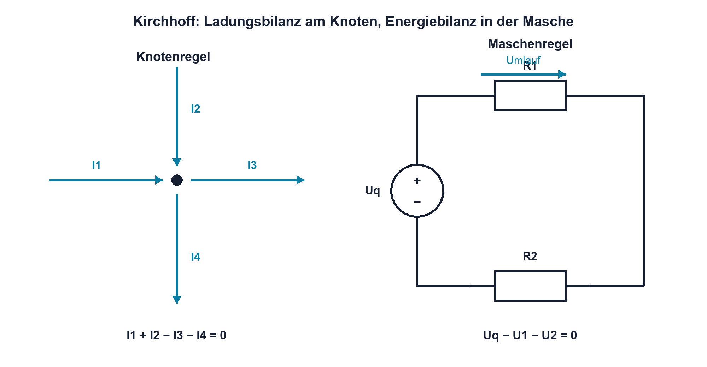

# 03.2 – Kirchhoffsche Knoten- und Maschenregel

[← Zurück](01-reihen-und-parallelschaltungen.md) · [Modulübersicht](README.md) · [Kursübersicht](../README.md) · [Weiter →](03-spannungsteiler-und-belasteter-spannungsteiler.md)

## Lernziele

Nach dieser Lektion kannst du:

- Stromrichtungen und Spannungspolungen konsistent festlegen
- Knoten- und Maschengleichungen aus einem Schema aufstellen
- negative Ergebnisse physikalisch richtig interpretieren

## Warum ist das wichtig?

Bei einfachen Reihen- oder Parallelschaltungen genügt oft eine bekannte Ersatzformel. Sobald mehrere Quellen und Verzweigungen vorkommen, braucht es ein Verfahren, das unabhängig von der Form der Schaltung funktioniert. Die Kirchhoffschen Regeln liefern dieses Gerüst.

Beide Regeln drücken Erhaltungssätze aus. An einem Knoten kann sich elektrische Ladung im stationären Gleichstromfall nicht dauerhaft ansammeln. In einer geschlossenen Masche muss die gesamte Energieänderung pro Ladung wieder null ergeben. Damit werden auch komplexere Netzwerke zu einem lösbaren Gleichungssystem.

## Theorie

### Vorzeichen zuerst festlegen

Vor jeder Rechnung werden angenommene Strompfeile und Spannungspolungen eingezeichnet. Die Richtung darf zunächst frei gewählt werden. Ergibt die Rechnung einen negativen Wert, fliesst der reale Strom entgegengesetzt zum angenommenen Pfeil. Das ist Information und kein Grund, das Vorzeichen nachträglich zu entfernen.

### Knotenregel

Ein Knoten verbindet mindestens drei Zweige. Weil Ladung erhalten bleibt, ist die algebraische Summe aller Knotenströme null:

`Σ I_k = 0`

| Formelzeichen | Bedeutung | Einheit |
|---|---|---|
| `Σ` | Summe über alle betrachteten Grössen | – |
| `I_k` | Strom des Zweigs mit dem Laufindex `k` | A |
| `k` | Kennzeichnung eines Zweigs | – |

Mit der Vereinbarung «zufliessend positiv, abfliessend negativ» wird beispielsweise `I_1 - I_2 - I_3 = 0`. Gleichwertig ist `I_1 = I_2 + I_3`. Wichtig ist nicht die gewählte Konvention, sondern ihre konsequente Anwendung.

### Maschenregel

Eine Masche ist ein geschlossener Umlauf im Netzwerk. Addiert man alle Spannungen mit ihrer durch die Umlaufrichtung bestimmten Polarität, ergibt sich:

`Σ U_k = 0`

Beim Umlauf von `−` nach `+` wird eine Spannung als Anstieg gezählt, von `+` nach `−` als Abfall. Für eine Quelle und zwei Widerstände kann so `U_q - U_1 - U_2 = 0` entstehen. Die Regel sagt nicht, dass an jedem Ort null Volt herrschen; sie sagt, dass man nach einem vollständigen Umlauf wieder dasselbe Potential erreicht.

### Unabhängige Gleichungen

Nicht jede denkbare Knoten- oder Maschengleichung liefert neue Information. Für `n` Knoten werden höchstens `n−1` unabhängige Knotengleichungen benötigt. Bei grösseren Netzwerken helfen systematische Knotenpotential- oder Maschenstromverfahren. In diesem Modul steht zunächst das saubere Übersetzen vom Schema zur Gleichung im Vordergrund.

## Anschauliches Beispiel

An einer Verzweigung fliessen 7 mA zu. Zwei gemessene Abflüsse betragen 2 mA und 5 mA. Die Bilanz ist erfüllt. Würden 2 mA und 4 mA gemessen, fehlt in der Bilanz 1 mA. Dann sind Messabweichung, ein übersehener Zweig oder ein falscher Bezug zu prüfen – nicht «verlorener Strom».

## Berechnungsbeispiel

Eine 9-V-Quelle speist zwei Serienwiderstände `R_1 = 1 kΩ` und `R_2 = 2 kΩ`. Mit der Umlaufrichtung des Stroms gilt `9 V - I·1 kΩ - I·2 kΩ = 0`. Zusammenfassen ergibt `I = 9 V / 3 kΩ = 3 mA`. Die Spannungsabfälle sind 3 V und 6 V; `9 V - 3 V - 6 V = 0` bestätigt die Maschenbilanz.

## Praxisbezug

Trage vor dem Aufbau Knotenbezeichnungen, Strompfeile und Messpolungen in eine Schemakopie ein. Messe danach alle Zweigströme und Spannungen. Bilde die algebraischen Summen mit ungerundeten Messwerten. Eine kleine Restabweichung ist wegen Toleranz, Auflösung und Messgerätebelastung normal; eine grosse Abweichung verlangt eine Fehleranalyse.

## 🔗 Hardware ↔ Firmware

Auch an einem MCU-Pin gilt die Knotenregel. Ausgangstreiber, externer Pull-up, Schutzdiode, Last und Messgerät können gleichzeitig Strompfade bilden. Eine Firmwareeinstellung wie Push-Pull, Open Drain oder Eingang verändert, welcher interne Pfad aktiv ist. Ein scheinbar unerklärlicher Pinpegel wird deshalb als vollständiger Knoten analysiert.

## Merksatz

> Knoten bilanzieren Ströme, Maschen bilanzieren Spannungen; negative Resultate korrigieren die angenommene Richtung.

## Häufige Fehler und Missverständnisse

- Während der Rechnung Vorzeichenkonventionen wechseln.
- Einen Spannungspfeil verwenden, ohne Plus- und Minusbezug festzulegen.
- Abhängige oder doppelte Gleichungen als neue Information zählen.
- Messwerte so stark runden, dass die Bilanz scheinbar nicht mehr stimmt.

## Zusammenfassung

Kirchhoffs Regeln übertragen Ladungs- und Energieerhaltung auf elektrische Netzwerke. Mit eingezeichneten Pfeilen, einer festen Vorzeichenkonvention und einer anschliessenden Bilanzprüfung lassen sich Verzweigungen und geschlossene Strompfade nachvollziehbar analysieren.

## Übungsfragen

1. Was bedeutet ein negativer berechneter Zweigstrom?
2. Stelle für einen Knoten mit zwei Zuflüssen und drei Abflüssen eine Gleichung auf.
3. Weshalb ist die Summe der Spannungen in einer geschlossenen Masche null?
4. Welche Hardwarepfade können an einem MCU-Pin zur Strombilanz gehören?

Weitere Aufgaben: [Übungen zu Modul 03](../uebungen/modul-03.md).

## Bezug Bildungsplan 2026

- Handlungskompetenzen: `a3`, `b1-LK02`, `b1-LK06`, `b1-LK08`, `b4-LK01`, `b4-LK09–10`
- Nachweise: Netzwerkanalyse, Messbilanz und Praxisprotokoll; [Kompetenzmatrix](../bildungsplan-2026/kompetenzmatrix.md)
