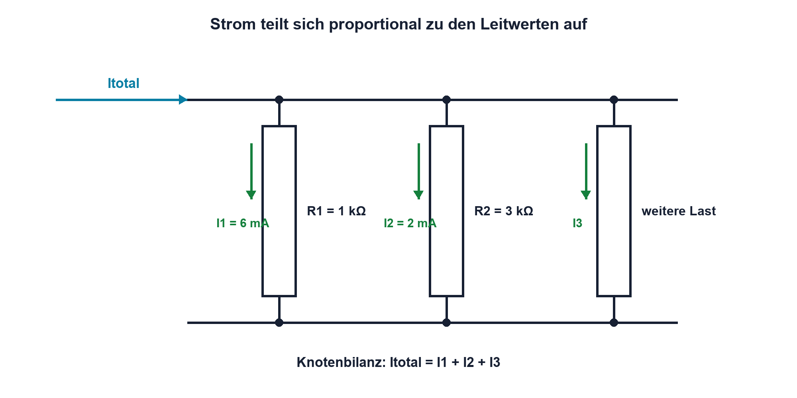

# 03.4 – Stromteiler und Parallelzweige

[← Zurück](03-spannungsteiler-und-belasteter-spannungsteiler.md) · [Modulübersicht](README.md) · [Kursübersicht](../README.md) · [Weiter →](05-reale-spannungs-und-stromquellen.md)

## Lernziele

Nach dieser Lektion kannst du:

- die Stromaufteilung in Parallelzweigen erklären und berechnen
- die Stromteilerformel aus Leitwerten herleiten
- unerwartete Zweigströme systematisch untersuchen

## Einleitung

Versorgungsströme teilen sich auf mehrere Baugruppen, Rückströme suchen verschiedene Massepfade, und Strommess-Shunts können durch parallele Leiter umgangen werden. Eine Stromteilerrechnung ist deshalb mehr als eine Schulformel: Sie hilft, reale Strompfade zu erkennen.

In jedem Parallelzweig liegt dieselbe Spannung. Der niederohmigere Zweig führt mehr Strom. Das wirkt anfangs ungewohnt, weil der grössere Zweigstrom beim kleineren Widerstand entsteht. Mit dem Leitwert wird der Zusammenhang unmittelbar verständlich: Der besser leitende Pfad übernimmt den grösseren Anteil.

<!-- context-expansion-2026 -->
Eine Baugruppe besteht aus verbundenen Quellen, Bauteilen und Lasten. Gleichstromnetzwerke liefern die Regeln, mit denen sich unbekannte Ströme und Spannungen aus Topologie und Bauteilwerten ableiten lassen. Dabei sind Knoten, Maschen und Rückstrompfade ebenso wichtig wie die Zahlenwerte.

Beim Thema **Stromteiler und Parallelzweige** geht es deshalb nicht nur um eine einzelne Formel oder Definition. Entscheidend ist, wie sich das Prinzip im Schema erkennen, im Datenblatt beurteilen, im Aufbau messen und bei einer Abweichung systematisch überprüfen lässt.

## Theorie

<!-- theory-expansion-2026 -->
### Einordnung und Grundidee

Netzwerke werden aus Sicht ihrer Topologie gelesen: Bauteile in demselben Strompfad liegen in Reihe, Bauteile an denselben zwei Knoten parallel. Erst danach werden Ersatzwerte, Knotenbilanzen oder Maschengleichungen gebildet. Diese Reihenfolge verhindert viele Vorzeichen- und Zuordnungsfehler.

### Aufteilung nach Leitwert

Der Gesamtstrom erreicht einen Knoten und verteilt sich auf die parallelen Zweige. Die Knotenregel verlangt, dass die Summe der Zweigströme wieder dem Gesamtstrom entspricht.

Für mehrere Zweige lässt sich der Stromanteil eines Zweigs `k` besonders klar mit Leitwerten schreiben:

`Ik = Itotal · Gk / Gtotal`

| Formelzeichen | Bedeutung | Einheit |
|---|---|---|
| `Itotal` | Gesamtstrom vor der Verzweigung | A |
| `Ik` | Strom im betrachteten Zweig `k` | A |
| `Gk` | Leitwert des betrachteten Zweigs | S (Siemens) |
| `Gtotal` | Summe aller parallelen Leitwerte | S |

Da `G = 1/R` gilt, erhält der Zweig mit kleinerem Widerstand den grösseren Stromanteil.

### Spezialfall mit zwei Widerständen

Für zwei parallele Widerstände kann der Strom durch `R1` direkt berechnet werden:

`I1 = Itotal · R2 / (R1 + R2)`

Im Zähler steht der jeweils andere Widerstand. Diese Form ist korrekt, aber leicht zu verwechseln. Sicherer ist oft: zuerst Parallelersatz bestimmen, daraus die gemeinsame Spannung berechnen und anschliessend jeden Zweigstrom mit dem Ohmschen Gesetz bestimmen. So lässt sich zugleich die Knotenbilanz prüfen.

### Reale Strompfade und Stromdichte

Der Strom «wählt» nicht nur einen Weg. Er verteilt sich auf alle vorhandenen Pfade entsprechend deren Impedanz. Schon kleine Kontakt- oder Leiterbahnwiderstände können bei hohen Strömen beeinflussen, welcher Anteil wo fliesst. Parallele Leiterbahnen teilen den Strom nur dann annähernd gleich, wenn ihre Widerstände und thermischen Bedingungen ähnlich sind.

Bei parallel geschalteten Bauteilen können Temperaturkoeffizienten die Aufteilung verändern. Erwärmt sich ein Pfad und sinkt sein Widerstand, kann er noch mehr Strom übernehmen; das begünstigt thermisches Durchgehen. Widerstände mit positivem Temperaturkoeffizienten wirken dagegen eher ausgleichend. Für Halbleiter reicht eine reine Gleichstrom-Widerstandsbetrachtung oft nicht aus.

### Messung ohne neuen Nebenpfad

Ein Amperemeter wird in den interessierenden Zweig eingeschleift und bringt einen kleinen Innenwiderstand mit. Ein Stromzangen- oder Shuntaufbau kann bei geeigneten Strömen weniger Umbau verlangen. Entscheidend ist, dass die Messung nicht unbemerkt einen vorhandenen Parallelpfad verändert.

## Anwendungsfall

Typische elektronische Anwendungen und Baugruppen für dieses Thema sind:

- Aufteilung von Last- und Rückströmen
- Dimensionierung paralleler Shunts
- Analyse von Stromverteilung in Widerstandsnetzen

In einer konkreten Entwicklung wird nicht nur geprüft, ob die gewünschte Funktion grundsätzlich entsteht. Ebenso wichtig sind zulässige Grenzwerte, Toleranzen, Temperatur, Messbarkeit und das Verhalten bei Unterbruch, Kurzschluss oder falscher Ansteuerung.

## Anschauliches Beispiel

Zwei Widerstände von 1 kΩ und 3 kΩ liegen parallel. Der 1-kΩ-Zweig hat den dreifachen Leitwert und übernimmt deshalb drei Viertel des Gesamtstroms; der 3-kΩ-Zweig erhält ein Viertel. Die Zweigströme stehen umgekehrt proportional zu den Widerständen.

## Berechnungsbeispiel

Ein Gesamtstrom von 8 mA teilt sich auf `R1 = 1 kΩ` und `R2 = 3 kΩ`. Damit gilt `I1 = 8 mA · 3/(1+3) = 6 mA` und `I2 = 2 mA`. Die gemeinsame Spannung beträgt in beiden Zweigen 6 V. Kontrolle: `6 mA + 2 mA = 8 mA`.

## Praxisbezug

Baue zwei parallele Widerstände auf und miss Gesamt- sowie Zweigströme nacheinander. Berechne vorab die erwarteten Werte. Prüfe danach mit einer Spannungsmessung, ob wirklich beide Widerstände an denselben Knoten liegen. Eine deutliche Abweichung kann auf einen falschen Widerstand, Kontaktfehler oder eine falsch platzierte Strommessung hinweisen.

## 🔗 Hardware ↔ Firmware

Im Sleep-Modus eines Mikrocontrollers setzt sich der Versorgungsstrom aus mehreren parallelen Pfaden zusammen: MCU-Kern, Debug-Schnittstelle, Spannungsteiler, LEDs, Sensoren und Leckströme. Firmware kann einzelne Peripherien abschalten, aber ein dauerhaft bestückter Teiler bleibt als Hardwarepfad bestehen. Eine Strombilanz zeigt, welche Optimierung tatsächlich wirksam ist.

## Merksatz

> In parallelen Zweigen teilt sich Strom proportional zum Leitwert und damit umgekehrt proportional zum Widerstand.

## Häufige Fehler und Missverständnisse

- In der Zweierformel den eigenen statt den jeweils anderen Widerstand in den Zähler setzen.
- Nur einen vermuteten «Weg des geringsten Widerstands» betrachten und Nebenpfade ignorieren.
- Zweigströme an unterschiedlichen Betriebszuständen vergleichen.
- Amperemeter versehentlich parallel anschliessen.

## Zusammenfassung

Der Stromteiler folgt aus gemeinsamer Spannung, Ohmschem Gesetz und Knotenregel. Die Leitwertdarstellung ist für viele Zweige besonders übersichtlich. In realen Geräten hilft die Methode, Versorgungs-, Masse- und Leckstrompfade vollständig zu bilanzieren.

## Übungsfragen

1. Weshalb erhält der kleinere Widerstand den grösseren Stromanteil?
2. Teile 10 mA auf 2 kΩ und 8 kΩ auf.
3. Welche Kontrolle muss die Summe der Zweigströme erfüllen?
4. Nenne drei parallele Verbrauchspfade einer Mikrocontrollerbaugruppe.

Weitere Aufgaben: [Übungen zu Modul 03](../uebungen/modul-03.md).

## Bezug Bildungsplan 2026

- Handlungskompetenzen: `a3`, `b1-LK02`, `b1-LK06`, `b1-LK08`, `b4-LK01`, `b4-LK09`
- Nachweise: Zweigstromberechnung, Messbilanz und Fehlersuche; [Kompetenzmatrix](../bildungsplan-2026/kompetenzmatrix.md)
