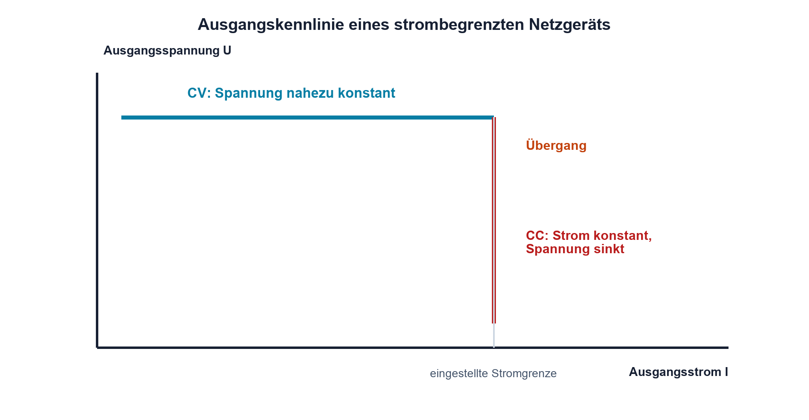

# 03.5 – Reale Spannungs- und Stromquellen

[← Zurück](04-stromteiler-und-parallelzweige.md) · [Modulübersicht](README.md) · [Kursübersicht](../README.md) · [Weiter →](06-innenwiderstand-und-ersatzschaltungen.md)

## Lernziele

Nach dieser Lektion kannst du:

- ideale und reale Quellen unterscheiden
- Klemmenspannung beziehungsweise Ausgangsstrom unter Last berechnen
- Strombegrenzung, Kurzschluss und Leistungsgrenzen richtig einordnen

## Warum ist das wichtig?

Eine ideale Spannungsquelle hält ihre Spannung bei jedem Strom konstant. Eine ideale Stromquelle hält ihren Strom bei jeder Last konstant. Solche Quellen sind nützliche Modelle, aber kein reales Gerät kann unbegrenzt Energie liefern oder beliebige Spannungen erzeugen.

Batterien, Netzgeräte, Sensorstromausgänge und Konstantstromschaltungen verändern ihr Verhalten mit Last, Temperatur und Schutzfunktionen. Wer das Quellenmodell kennt, kann Spannungseinbruch, Strombegrenzung oder Sättigung erklären, statt sie vorschnell als Defekt zu beurteilen.

## Theorie

### Reale Spannungsquelle

Eine reale Spannungsquelle wird im einfachen linearen Modell als ideale Quellenspannung `U_0` in Reihe mit einem Innenwiderstand `R_i` dargestellt. Ohne Last fliesst kein Strom und die Klemmenspannung entspricht ungefähr `U_0`. Unter Last fällt am Innenwiderstand eine Spannung ab.

`U_K = U_0 - I·R_i`

| Formelzeichen | Bedeutung | Einheit |
|---|---|---|
| `U_0` | Leerlauf- oder ideale Quellenspannung | V |
| `U_K` | Spannung an den äusseren Klemmen | V |
| `R_i` | Innenwiderstand der Quelle | Ω |

Das Modell erklärt einen annähernd linearen Spannungseinbruch. Ein reales Labornetzgerät verhält sich nur im normalen CV-Betrieb ähnlich. Erreicht es die eingestellte Stromgrenze, wechselt es in den CC-Betrieb; dann wird der Strom begrenzt und die Ausgangsspannung sinkt so weit wie nötig.

### Reale Stromquelle

Eine reale Stromquelle lässt sich als ideale Stromquelle `I_0` parallel zu einem Innenwiderstand modellieren. Je grösser dieser Parallelwiderstand ist, desto weniger ändert sich der Laststrom mit der Ausgangsspannung. Reale Stromquellen besitzen zusätzlich einen zulässigen Spannungsbereich.

Die maximale Spannung, bei der der geregelte Strom noch eingehalten werden kann, wird häufig als Compliance-Spannung beschrieben. Reicht die verfügbare Spannung nicht aus, verlässt die Quelle ihren Regelbereich. Bei einer LED-Konstantstromquelle kann dann der gewünschte Strom trotz korrekter Sollvorgabe nicht mehr fliessen.

### Kennlinie und Betriebsbereiche

Die Ausgangskennlinie zeigt, welche Kombinationen aus Spannung und Strom möglich sind. Eine Spannungsquelle hat im CV-Bereich eine fast horizontale Kennlinie. An der Stromgrenze knickt sie in den CC-Bereich ab. Diese Darstellung verhindert die falsche Annahme, ein Netzgerät «drücke» unabhängig von der Last immer den eingestellten Maximalstrom durch die Schaltung.

### Kurzschluss und Leistung

Im einfachen Quellenmodell wäre der Kurzschlussstrom `I_K = U_0/R_i`. Dieser Wert kann sehr gross werden. Bei Batterien erwärmen sich Zellen, Leitungen und Kontakte; bei Netzgeräten greift hoffentlich die elektronische Begrenzung. Ein Kurzschluss ist keine zulässige Standardmessung, ausser eine freigegebene Quelle und ein abgesichertes Verfahren sind ausdrücklich dafür vorgesehen.

## Anschauliches Beispiel

Eine 9-V-Blockbatterie zeigt unbelastet nahezu 9 V. An einer niederohmigen Last bricht die Spannung deutlich ein. Das bedeutet nicht zwingend, dass die Leerlaufmessung falsch war; beide Messungen beschreiben unterschiedliche Betriebspunkte derselben realen Quelle.

## Berechnungsbeispiel

Eine Quelle besitzt `U_0 = 5,0 V` und `R_i = 2,0 Ω`. An `R_L = 8,0 Ω` liegt insgesamt 10 Ω im Strompfad. Es fliessen `I = 5,0 V/10 Ω = 0,50 A`. Die Klemmenspannung ist `U_K = 5,0 V - 0,50 A·2,0 Ω = 4,0 V`. Kontrolle an der Last: `0,50 A·8,0 Ω = 4,0 V`.

## Praxisbezug

Beobachte an einem strombegrenzten Kleinspannungsnetzgerät den Übergang von CV zu CC mit sicheren Lastwiderständen. Berechne vorher Strom und Verlustleistung. Die Last muss für die entstehende Wärme ausgelegt sein. Ein Batterie-Innenwiderstand wird in der Praxis aus zwei sicheren Betriebspunkten bestimmt, nicht durch unkontrollierten Kurzschluss.

## 🔗 Hardware ↔ Firmware

Firmware kann eine Last per PWM erhöhen und dadurch die mittlere Quellenbelastung verändern. Sinkt dabei die Versorgung, können Brown-out-Reset oder ADC-Abweichungen auftreten. Der Reset wirkt wie ein Softwareproblem, seine Ursache kann jedoch der Innenwiderstand von Quelle, Kabel oder Steckverbinder sein. Versorgung und Reset-Ursache werden gemeinsam gemessen.

## Merksatz

> Reale Quellen besitzen Grenzen: Spannung, Strom, Leistung und Regelbereich müssen gemeinsam betrachtet werden.

## Häufige Fehler und Missverständnisse

- Den am Netzgerät eingestellten Strom als stets fliessenden Strom interpretieren.
- Eine Batterie zur Innenwiderstandsmessung kurzschliessen.
- Compliance-Spannung einer Stromquelle ignorieren.
- Spannungsabfall in Kabeln und Kontakten der Last zuschreiben.

## Zusammenfassung

Innenwiderstand und Schutzgrenzen erklären das Lastverhalten realer Quellen. Das lineare Ersatzmodell ist ein nützlicher erster Schritt; CV/CC-Übergang, Temperatur und nichtlineare Begrenzungen müssen bei realen Geräten zusätzlich beachtet werden.

## Übungsfragen

1. Warum ist die Klemmenspannung unter Last kleiner als die Leerlaufspannung?
2. Was geschieht beim Übergang eines Netzgeräts von CV zu CC?
3. Berechne die Klemmenspannung für `U_0 = 12 V`, `R_i = 1 Ω` und `R_L = 5 Ω`.
4. Wie kann ein hoher Leitungswiderstand einen Mikrocontroller-Reset verursachen?

Weitere Aufgaben: [Übungen zu Modul 03](../uebungen/modul-03.md).

## Bezug Bildungsplan 2026

- Handlungskompetenzen: `a3`, `b1-LK02–03`, `b1-LK06`, `b4-LK01–06`, `b4-LK09`
- Nachweise: Quellenkennlinie, sichere Lastmessung und Innenwiderstand; [Kompetenzmatrix](../bildungsplan-2026/kompetenzmatrix.md)
