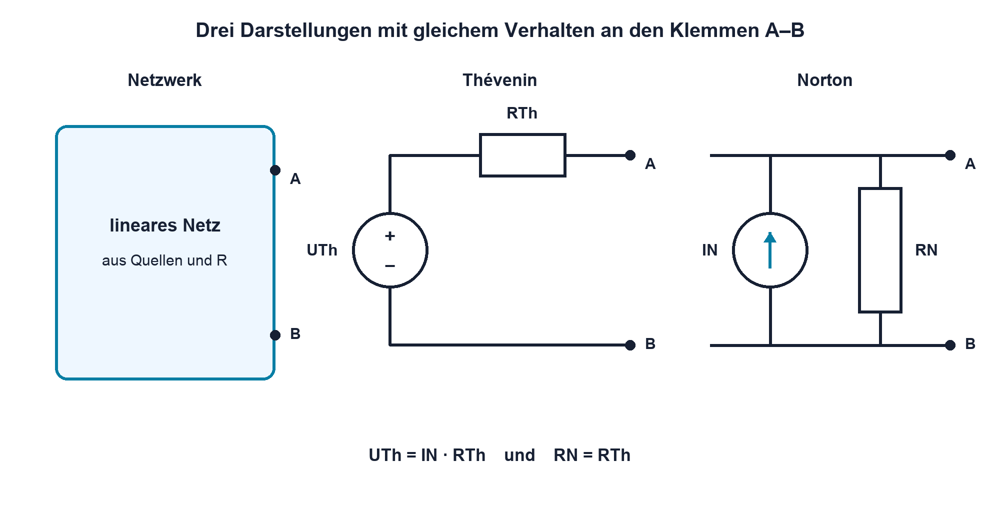

# 03.6 – Innenwiderstand und Ersatzschaltungen

[← Zurück](05-reale-spannungs-und-stromquellen.md) · [Modulübersicht](README.md) · [Kursübersicht](../README.md) · [Weiter →](07-systematische-netzwerkanalyse.md)

## Lernziele

Nach dieser Lektion kannst du:

- ein lineares Zweipolnetzwerk als Thévenin- oder Norton-Ersatzquelle beschreiben
- Ersatzspannung und Ersatzwiderstand bestimmen
- die Grenzen und den praktischen Nutzen einer Ersatzschaltung erklären

## Einleitung

Eine Last «sieht» von aussen oft nur zwei Klemmen. Ob dahinter drei Widerstände, mehrere Quellen oder ein ganzer Schaltungsteil liegen, ist für das Lastverhalten nicht immer relevant. Eine Ersatzschaltung fasst dieses Verhalten in wenigen Grössen zusammen und macht Belastungsrechnungen übersichtlich.

Dabei wird die innere Schaltung nicht als physisch identisch behauptet. Thévenin- und Norton-Modell sind an den betrachteten Klemmen gleichwertig, solange das Netzwerk linear ist und im untersuchten Betriebsbereich bleibt. Für Fehlersuche und Schnittstellendimensionierung ist diese Unterscheidung sehr wertvoll.

<!-- context-expansion-2026 -->
Eine Baugruppe besteht aus verbundenen Quellen, Bauteilen und Lasten. Gleichstromnetzwerke liefern die Regeln, mit denen sich unbekannte Ströme und Spannungen aus Topologie und Bauteilwerten ableiten lassen. Dabei sind Knoten, Maschen und Rückstrompfade ebenso wichtig wie die Zahlenwerte.

Beim Thema **Innenwiderstand und Ersatzschaltungen** geht es deshalb nicht nur um eine einzelne Formel oder Definition. Entscheidend ist, wie sich das Prinzip im Schema erkennen, im Datenblatt beurteilen, im Aufbau messen und bei einer Abweichung systematisch überprüfen lässt.

## Theorie

<!-- theory-expansion-2026 -->
### Einordnung und Grundidee

Netzwerke werden aus Sicht ihrer Topologie gelesen: Bauteile in demselben Strompfad liegen in Reihe, Bauteile an denselben zwei Knoten parallel. Erst danach werden Ersatzwerte, Knotenbilanzen oder Maschengleichungen gebildet. Diese Reihenfolge verhindert viele Vorzeichen- und Zuordnungsfehler.

### Thévenin-Ersatzquelle

Jedes lineare Zweipolnetzwerk aus Quellen und Widerständen lässt sich an zwei Klemmen durch eine ideale Spannungsquelle $U_{\mathrm{Th}}$ in Reihe mit $R_{\mathrm{Th}}$ ersetzen. $U_{\mathrm{Th}}$ ist die Leerlaufspannung an den Klemmen. $R_{\mathrm{Th}}$ beschreibt, wie stark die Klemmenspannung unter Belastung sinkt.

| Formelzeichen | Bedeutung | Einheit |
|---|---|---|
| $U_{\mathrm{Th}}$ | Thévenin- oder Leerlaufspannung | V |
| $R_{\mathrm{Th}}$ | Thévenin-Ersatzwiderstand | Ω |
| $I_N$ | Norton- oder Kurzschlussstrom | A |
| $R_N$ | Norton-Ersatzwiderstand; bei linearen Netzen $R_N=R_{\mathrm{Th}}$ | Ω |

### Norton-Ersatzquelle

Dasselbe Klemmenverhalten kann als ideale Stromquelle $I_N$ parallel zu $R_N$ beschrieben werden. Beide Darstellungen lassen sich umrechnen:

$$
I_N = \frac{U_{\mathrm{Th}}}{R_{\mathrm{Th}}}
$$

$$
U_{\mathrm{Th}} = I_N\cdot R_N
$$

Für lineare Netze gilt ausserdem:

$$
R_N = R_{\mathrm{Th}}
$$

Welche Form übersichtlicher ist, hängt von der angeschlossenen Schaltung ab. Für eine Serienlast ist Thévenin oft anschaulich; für mehrere parallele Pfade kann Norton günstiger sein.

### Ersatzwiderstand bestimmen

Bei einem Netz aus ausschliesslich unabhängigen Quellen werden diese für die Widerstandsbetrachtung deaktiviert: ideale Spannungsquellen werden kurzgeschlossen, ideale Stromquellen geöffnet. Danach wird der von den Klemmen sichtbare Widerstand berechnet. Das bedeutet nicht, reale Quellen unkontrolliert kurzzuschliessen; es ist ein Rechenschritt am idealen Modell.

Alternativ können zwei Betriebspunkte verwendet werden. Ändert sich der Laststrom um $\Delta I$ und die Klemmenspannung um $\Delta U$, gilt für ein lineares Quellenmodell betragsmässig:

$$
R_{\mathrm{Th}} =
\left|\frac{\Delta U}{\Delta I}\right|
$$

Das Delta-Zeichen $\Delta$ bezeichnet die Differenz zwischen zwei Messwerten, nicht einen einzelnen Wert.

Bei abhängigen Quellen dürfen diese nicht deaktiviert werden. Dann wird eine Testspannung oder ein Teststrom an den Klemmen angelegt und das Verhältnis berechnet. Diese Methode wird in späteren Schaltungsmodulen vertieft.

### Gültigkeitsbereich

Eine Ersatzschaltung bewahrt das äussere Strom-Spannungs-Verhalten, nicht interne Leistungen oder einzelne Knotenspannungen. Nichtlineare Bauteile, Strombegrenzung und Temperatur können dazu führen, dass ein einziges lineares Modell nur lokal gilt. Dann müssen Betriebspunkt und Messbereich dokumentiert werden.

## Anwendungsfall

Typische elektronische Anwendungen und Baugruppen für dieses Thema sind:

- Vereinfachung komplexer Sensornetze
- Bestimmung der Belastbarkeit eines Ausgangsknotens
- Vergleich von Thévenin- und Nortonmodell

In einer konkreten Entwicklung wird nicht nur geprüft, ob die gewünschte Funktion grundsätzlich entsteht. Ebenso wichtig sind zulässige Grenzwerte, Toleranzen, Temperatur, Messbarkeit und das Verhalten bei Unterbruch, Kurzschluss oder falscher Ansteuerung.

## Anschauliches Beispiel

Ein Spannungsteiler aus 10 kΩ und 10 kΩ an 10 V wirkt am Mittelabgriff wie eine 5-V-Quelle mit $R_{\mathrm{Th}}=10~\mathrm{k}\Omega\parallel10~\mathrm{k}\Omega=5~\mathrm{k}\Omega$. Damit ist sofort sichtbar, warum eine 5-kΩ-Last die Ausgangsspannung auf 2,5 V zieht.

## Berechnungsbeispiel

### 🧮 Berechnungsbeispiel: Thévenin- in Norton-Ersatzquelle umrechnen und belasten

Ein Zweipol besitzt eine Thévenin-Spannung von **5 V** und einen Thévenin-Widerstand von **5 kΩ**. Zusätzlich wird eine Last von **15 kΩ** angeschlossen. Gesucht sind Norton-Ersatzgrössen, Laststrom und Lastspannung.

**Gegeben:**

- Thévenin-Spannung $U_{\mathrm{Th}}$: **5 V**
- Thévenin-Widerstand $R_{\mathrm{Th}}$: **5 kΩ**
- Lastwiderstand $R_L$: **15 kΩ**

#### 1. Formel

$$
I_N =
\frac{U_{\mathrm{Th}}}
     {R_{\mathrm{Th}}}
$$

$$
R_N = R_{\mathrm{Th}}
$$

$$
I_L =
\frac{U_{\mathrm{Th}}}
     {R_{\mathrm{Th}}+R_L}
$$

$$
U_L = I_L\cdot R_L
$$

#### 2. Werte einsetzen

$$
I_N =
\frac{5~\mathrm{V}}
     {5~\mathrm{k}\Omega}
$$

$$
I_L =
\frac{5~\mathrm{V}}
     {5~\mathrm{k}\Omega+15~\mathrm{k}\Omega}
$$

#### 3. Berechnen

$$
I_N = 1~\mathrm{mA}
$$

$$
R_N = 5~\mathrm{k}\Omega
$$

$$
I_L = 0.25~\mathrm{mA}
$$

$$
U_L =
0.25~\mathrm{mA}\cdot15~\mathrm{k}\Omega =
3.75~\mathrm{V}
$$

#### 4. Ergebnis

$$
\boxed{I_N = 1~\mathrm{mA},\qquad R_N = 5~\mathrm{k}\Omega}
$$

$$
\boxed{I_L = 0.25~\mathrm{mA},\qquad U_L = 3.75~\mathrm{V}}
$$

Thévenin- und Norton-Darstellung beschreiben an den betrachteten Klemmen dasselbe Lastverhalten.

## Praxisbezug

Miss zunächst die Leerlaufspannung eines unbekannten, sicheren Zweipols. Schliesse dann zwei bekannte Lastwiderstände nacheinander an und protokolliere Klemmenspannung sowie Laststrom. Berechne aus der Kennliniensteigung den Innenwiderstand. Prüfe, ob beide Lastpunkte durch dasselbe lineare Modell erklärt werden.

## 🔗 Hardware ↔ Firmware

Ein DAC-, GPIO- oder Sensorsignal kann an der Schnittstelle als Quelle mit Ausgangswiderstand betrachtet werden. Die Firmware legt den logischen oder analogen Sollwert fest; die externe Last bestimmt gemeinsam mit dem Ausgangstreiber den realen Pegel. Das Ersatzmodell hilft zu unterscheiden, ob eine Abweichung durch falschen Sollwert oder elektrische Überlastung entsteht.

## Merksatz

> Eine Ersatzschaltung bildet das Verhalten an festgelegten Klemmen ab – nicht jedes Detail im Inneren.

## Häufige Fehler und Missverständnisse

- Quellen im realen Aufbau statt nur im Rechenmodell «deaktivieren».
- Die Leerlaufspannung mit der belasteten Klemmenspannung verwechseln.
- Eine lineare Ersatzquelle über Strombegrenzung oder nichtlineare Bereiche hinaus verwenden.
- Interne Verlustleistungen aus der Ersatzschaltung ableiten, obwohl nur das Klemmenverhalten gleich ist.

## Zusammenfassung

Thévenin- und Norton-Ersatzquelle beschreiben denselben linearen Zweipol. Leerlaufspannung, Ersatzwiderstand und Kurzschlussstrom verknüpfen beide Darstellungen. Die Methode vereinfacht Lastrechnungen, Schnittstellenanalyse und Messauswertung erheblich.

## Übungsfragen

1. Welche zwei Grössen bestimmen eine Thévenin-Ersatzquelle?
2. Wie werden unabhängige ideale Spannungs- und Stromquellen bei der Widerstandsbestimmung behandelt?
3. Wandle $U_{\mathrm{Th}}=3.3~\mathrm{V}$ und $R_{\mathrm{Th}}=330~\Omega$ in eine Nortonquelle um.
4. Welche Information über die innere Schaltung geht bei der Ersatzbildung verloren?

Weitere Aufgaben: [Übungen zu Modul 03](../uebungen/modul-03.md).

## Bezug Bildungsplan 2026

- Handlungskompetenzen: `a3`, `b1-LK02–03`, `b1-LK06`, `b1-LK08`, `b4-LK01`, `b4-LK06–10`
- Nachweise: Zweipolmodell und experimentelle Innenwiderstandsbestimmung; [Kompetenzmatrix](../bildungsplan-2026/kompetenzmatrix.md)
