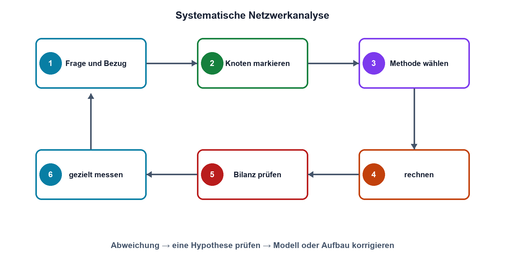
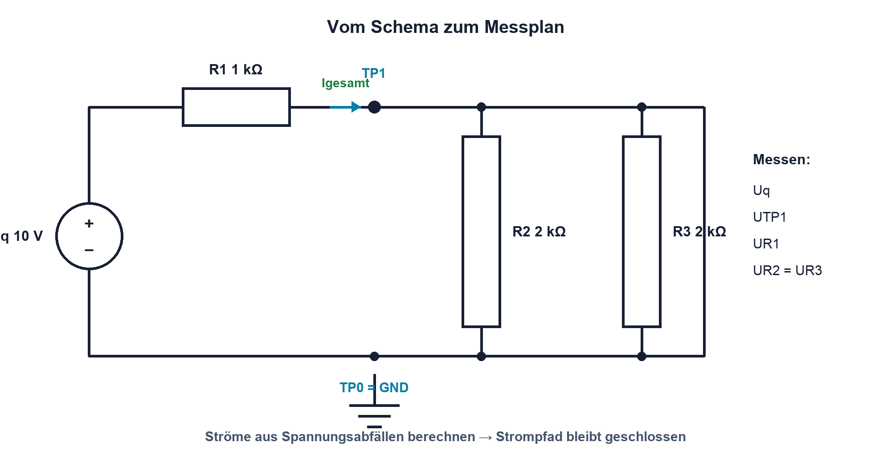

# 03.7 – Systematische Netzwerkanalyse

[← Zurück](06-innenwiderstand-und-ersatzschaltungen.md) · [Modulübersicht](README.md) · [Kursübersicht](../README.md) · [Weiter →](../04-widerstaende-sensoren/README.md)

## Lernziele

Nach dieser Lektion kannst du:

- ein Gleichstromnetzwerk in Knoten, Zweige und Teilprobleme zerlegen
- eine passende Analysemethode auswählen und dokumentieren
- das Resultat durch unabhängige Kontrollen und Messpunkte absichern

## Einleitung

Die meisten Fehler in einer Netzwerkanalyse entstehen nicht beim Taschenrechnen, sondern vorher: Ein Knoten wird übersehen, ein Pfeil fehlt, eine Formel wird ausserhalb ihrer Bedingungen verwendet oder ein Resultat nicht geprüft. Ein festes Vorgehen reduziert diese Fehler und macht den Lösungsweg für andere nachvollziehbar.

Professionelle Analyse bedeutet deshalb mehr als «die richtige Zahl». Das Schema wird strukturiert, Annahmen werden genannt, Einheiten bleiben sichtbar und mindestens eine unabhängige Kontrolle wird durchgeführt. Genau dieses Vorgehen lässt sich später auf Halbleiter-, OPV- und Versorgungsschaltungen übertragen.

<!-- context-expansion-2026 -->
Eine Baugruppe besteht aus verbundenen Quellen, Bauteilen und Lasten. Gleichstromnetzwerke liefern die Regeln, mit denen sich unbekannte Ströme und Spannungen aus Topologie und Bauteilwerten ableiten lassen. Dabei sind Knoten, Maschen und Rückstrompfade ebenso wichtig wie die Zahlenwerte.

Beim Thema **Systematische Netzwerkanalyse** geht es deshalb nicht nur um eine einzelne Formel oder Definition. Entscheidend ist, wie sich das Prinzip im Schema erkennen, im Datenblatt beurteilen, im Aufbau messen und bei einer Abweichung systematisch überprüfen lässt.

## Theorie

<!-- theory-expansion-2026 -->
### Einordnung und Grundidee

Netzwerke werden aus Sicht ihrer Topologie gelesen: Bauteile in demselben Strompfad liegen in Reihe, Bauteile an denselben zwei Knoten parallel. Erst danach werden Ersatzwerte, Knotenbilanzen oder Maschengleichungen gebildet. Diese Reihenfolge verhindert viele Vorzeichen- und Zuordnungsfehler.

### Schritt 1: Aufgabe und Bezug klären

Zuerst wird festgelegt, welche Spannung, welcher Strom oder welche Leistung gesucht ist und zwischen welchen Punkten sie gilt. Danach wird ein Bezugsknoten gewählt. Quellenwerte, Widerstände, Toleranzen und Betriebszustände werden aus dem Schema übernommen. Unbekannte Grössen erhalten eindeutige Namen.

### Schritt 2: Topologie lesen

Markiere elektrisch identische Knoten farblich oder mit Netznamen. Suche echte Reihen- und Parallelschaltungen. Eine Reihenersatzbildung ist nur erlaubt, wenn der Zwischenknoten keine Abzweigung besitzt. Parallele Bauteile müssen an denselben beiden Knoten liegen.

### Schritt 3: Methode auswählen

- **Ersatzwiderstände:** für klar reduzierbare Reihen-/Parallelnetze.
- **Spannungs- oder Stromteiler:** wenn ihre Belastungsbedingungen erfüllt oder berücksichtigt sind.
- **Knotenregel:** besonders geeignet bei vielen parallelen Zweigen.
- **Maschenregel:** anschaulich bei wenigen geschlossenen Maschen.
- **Thévenin/Norton:** wenn das Verhalten an einer Lastschnittstelle interessiert.

Nicht jede Schaltung muss maximal algebraisch gelöst werden. Die einfachste korrekte Methode ist meist die beste. Bei gemischten Netzen werden Verfahren schrittweise kombiniert.

### Schritt 4: Symbolisch und mit Einheiten rechnen

Formeln werden möglichst zuerst mit Symbolen umgestellt. Zahlen erhalten einheitliche Präfixe, beispielsweise Volt, Milliampere und Kiloohm. Zwischenergebnisse werden mit ausreichend Stellen weitergeführt; gerundet wird erst am Schluss passend zur Genauigkeit der Eingangsdaten.

### Schritt 5: Kontrollen

Eine gute Lösung besitzt mehrere Kontrollmöglichkeiten:

- Liegt ein Ersatzwiderstand in einem plausiblen Bereich?
- Stimmen Knoten- und Maschenbilanzen innerhalb der Rundung?
- Ist die von Quellen gelieferte Leistung ungefähr gleich der aufgenommenen Leistung?
- Verhalten sich Grenzfälle sinnvoll, etwa `RL → ∞` für Leerlauf?
- Bleiben Bauteilwerte, Ströme und Leistungen innerhalb sicherer Grenzen?

### Schritt 6: Messplan statt wahlloser Messung

Messpunkte werden aus der Funktion gewählt. Eine Quellenspannung prüft die Speisung, Knotenspannungen prüfen die Verteilung, und ein Spannungsabfall über einem bekannten Widerstand erlaubt eine indirekte Strombestimmung. Die indirekte Methode verändert den Strompfad häufig weniger als ein eingeschleiftes Amperemeter.

Soll und Ist werden mit den Betriebsbedingungen dokumentiert. Bei einer Abweichung wird nur eine Hypothese auf einmal geprüft: falscher Wert, Unterbruch, Kurzschluss, Messgerätebelastung oder Quellenbegrenzung.

## Anwendungsfall

Typische elektronische Anwendungen und Baugruppen für dieses Thema sind:

- Fehlersuche in unbekannten Gleichstromschaltungen
- Vorhersage aller Knotenwerte vor dem Aufbau
- Plausibilitätsprüfung eines vollständigen Messprotokolls

In einer konkreten Entwicklung wird nicht nur geprüft, ob die gewünschte Funktion grundsätzlich entsteht. Ebenso wichtig sind zulässige Grenzwerte, Toleranzen, Temperatur, Messbarkeit und das Verhalten bei Unterbruch, Kurzschluss oder falscher Ansteuerung.

## Anschauliches Beispiel

Ein Netzwerk enthält eine 10-V-Quelle, einen Serienwiderstand und zwei parallele Lasten. Statt sofort eine Gleichung zu raten, werden zuerst die beiden Lasten parallel zusammengefasst, danach der Gesamtstrom berechnet und zuletzt mit der gemeinsamen Zweigspannung die Einzelströme bestimmt. Knoten- und Maschenbilanz bestätigen unabhängig das Ergebnis.

## Berechnungsbeispiel

Das folgende gemischte Netzwerk wird zuerst topologisch vereinfacht. Erst danach werden Gesamtstrom, Knotenspannung und Zweigströme berechnet.

`R1 = 1 kΩ` liegt in Reihe mit `R2 = 2 kΩ || R3 = 2 kΩ` an 10 V. Der Parallelersatz beträgt 1 kΩ, der Gesamtwiderstand 2 kΩ und der Quellenstrom 5 mA. Am Parallelzweig liegen 5 V; dort fliessen zweimal 2,5 mA. Kontrolle: `2,5 mA + 2,5 mA = 5 mA`, und die beiden Spannungsabfälle von je 5 V ergeben 10 V.

## Praxisbezug

Erstelle für den Modulversuch vor dem Aufbau ein Sollwertblatt mit Knotenpotentialen, Zweigströmen, Leistungen und zulässigen Bereichen. Ergänze ein Messschema, in dem Gerätefunktion, Buchsen und Bezugspunkte sichtbar sind. Erst danach wird aufgebaut und jede Abweichung als Mess- oder Fehlerhypothese dokumentiert.

## 🔗 Hardware ↔ Firmware

Bei einer MCU-Schaltung beginnt die Analyse mit einem definierten Pinzustand: Reset, Eingang, Push-Pull, Open Drain oder Analogmodus. Danach wird der externe Strompfad analysiert. Firmware kann die Randbedingung setzen, sie hebt Kirchhoff und Bauteilgrenzen aber nicht auf. Für die Fehlersuche werden Registerzustand und reale Knotenspannung zeitlich passend verglichen.

## Merksatz

> Erst Knoten und Annahmen klären, dann rechnen, danach unabhängig prüfen und gezielt messen.

## Häufige Fehler und Missverständnisse

- Eine bekannte Formel anhand der optischen Form statt der elektrischen Topologie auswählen.
- Zwischenresultate zu früh runden.
- Sollwerte ohne Messbedingungen dokumentieren.
- Bei einer Abweichung mehrere Bauteile oder Einstellungen gleichzeitig verändern.

## Zusammenfassung

Systematische Netzwerkanalyse verbindet Topologie, passende Methode, saubere Einheiten, Plausibilitätskontrolle und Messplan. Der dokumentierte Weg ist ebenso wichtig wie der Endwert, weil er Fehler auffindbar und Ergebnisse reproduzierbar macht.

## Übungsfragen

1. Welche Bedingungen müssen für eine Reihen- beziehungsweise Parallelschaltung erfüllt sein?
2. Nenne vier unabhängige Plausibilitätskontrollen.
3. Warum kann eine indirekte Strommessung über einen bekannten Widerstand vorteilhaft sein?
4. In welcher Reihenfolge würdest du ein gemischtes Netzwerk untersuchen?

Weitere Aufgaben: [Übungen zu Modul 03](../uebungen/modul-03.md).

## Bezug Bildungsplan 2026

- Handlungskompetenzen: `a3`, `b1-LK02`, `b1-LK06`, `b1-LK08`, `b4-LK01–02`, `b4-LK05–10`, `b5-LK01–05`
- Nachweise: vollständiger Rechen-, Mess- und Auswerteweg in Praxis 03; [Kompetenzmatrix](../bildungsplan-2026/kompetenzmatrix.md)
