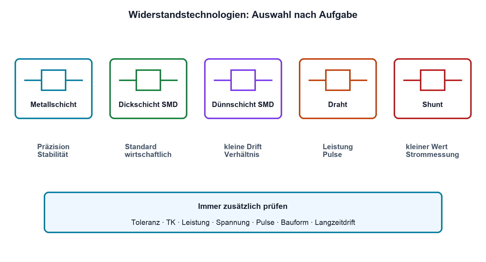
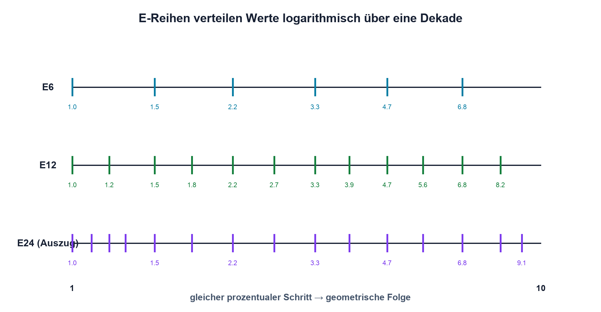

# 04.1 – Widerstandstypen und E-Reihen

[← Zurück](README.md) · [Modulübersicht](README.md) · [Kursübersicht](../README.md) · [Weiter →](02-toleranz-und-worst-case-grundlagen.md)

## Lernziele

Nach dieser Lektion kannst du:

- Widerstandstechnologien nach ihrem Einsatzgebiet unterscheiden
- einen passenden Normwert aus einer E-Reihe auswählen
- neben dem Nennwert weitere entscheidende Datenblattangaben nennen

## Warum ist das wichtig?

«10 kΩ» beschreibt noch kein vollständig ausgewähltes Bauteil. Zwei Widerstände mit demselben Nennwert können sich bei Toleranz, Temperaturverhalten, Rauschen, Spannungsfestigkeit, Pulsbelastbarkeit und Baugrösse deutlich unterscheiden. Für einen LED-Vorwiderstand sind andere Eigenschaften wichtig als für einen präzisen Messverstärker oder einen Hochspannungsteiler.

Normreihen begrenzen die Anzahl produzierter Werte sinnvoll. Die Aufgabe in der Entwicklung besteht deshalb selten darin, irgendeinen exakt berechneten Wert zu bestellen. Man wählt einen verfügbaren Normwert und prüft anschliessend, ob die resultierende Schaltung innerhalb ihrer Anforderungen bleibt.

## Theorie

### Häufige Technologien

- **Metallschichtwiderstände** bieten häufig gute Toleranz, geringen Temperaturkoeffizienten und vergleichsweise niedriges Rauschen. Sie eignen sich für viele Signal- und Präzisionsaufgaben.
- **Kohleschichtwiderstände** sind einfach und preiswert, weisen aber typischerweise grössere Toleranzen und ungünstigere Stabilität auf.
- **Dickschicht-SMD-Widerstände** sind weit verbreitet und wirtschaftlich. Für hohe Genauigkeit, geringe Drift oder anspruchsvolle Pulse reicht ein beliebiger Standardtyp nicht immer.
- **Dünnschicht-SMD-Widerstände** sind für präzisere und stabilere Anwendungen geeignet.
- **Drahtwiderstände** vertragen je nach Bauform hohe Leistungen und Pulse, können durch ihren Wicklungsaufbau aber induktiv wirken.
- **Shuntwiderstände** besitzen kleine, genau definierte Werte und werden zur Strommessung eingesetzt. Anschlussführung und Eigenerwärmung sind besonders wichtig.

Die Technologie allein garantiert keine Eigenschaft. Massgeblich ist immer das Datenblatt des konkreten Bauteils.

### Warum E-Reihen logarithmisch sind

Wenn jeder Normwert um denselben Prozentfaktor grösser als der vorherige sein soll, müssen die Werte geometrisch verteilt werden. Eine E-Reihe besitzt pro Dekade eine festgelegte Anzahl `N` von Werten. Der ideale Schrittungsfaktor ist:

`q = 10^(1/N)`

| Formelzeichen | Bedeutung | Einheit |
|---|---|---|
| `q` | Verhältnis zweier ideal benachbarter Normwerte | einheitenlos |
| `N` | Anzahl der Werte pro Dekade, etwa 12 bei E12 | einheitenlos |

Die gebräuchlichen Reihen E6, E12, E24, E48, E96 und E192 werden mit steigender Zahl feiner. Werte wiederholen sich über Dekaden: Aus 4,7 werden 47 Ω, 470 Ω, 4,7 kΩ oder 47 kΩ. Historisch hängen Reihe und typische Toleranz zusammen; bei der heutigen Auswahl muss die tatsächlich bestellbare Kombination aus Wert und Toleranz geprüft werden.

### Auf- oder abrunden ist eine technische Entscheidung

Für einen LED-Vorwiderstand kann Aufrunden den Strom sicher reduzieren. Bei einem Pull-up kann ein zu grosser Wert die Flanke verschlechtern. Bei einem Spannungsteiler interessiert oft stärker das Verhältnis als der absolute Wert. Es gibt daher keine allgemeine Regel «immer zum nächsten Wert runden».

### Auswahlkriterien aus dem Datenblatt

Neben Nennwert und Toleranz gehören mindestens Nennleistung, maximal zulässige Arbeitsspannung, Temperaturkoeffizient, Temperaturbereich und Bauform in die Prüfung. Bei besonderen Anwendungen kommen Pulsbelastbarkeit, Spannungskoeffizient, Langzeitdrift, Rauschen und Schwefelbeständigkeit hinzu.

## Anschauliches Beispiel

Eine Rechnung ergibt 2,73 kΩ. In E12 liegen 2,2 kΩ und 2,7 kΩ; 2,7 kΩ ist naheliegend. Entscheidend bleibt aber die Funktion: Wenn der Widerstand einen maximal zulässigen Strom begrenzt, kann 3,3 kΩ die robustere Wahl sein. Die Anforderung entscheidet, nicht die kleinste numerische Abweichung.

## Berechnungsbeispiel

Eine 3,3-V-Logik-LED besitzt im gewählten Arbeitspunkt angenommene 2,0 V Flussspannung und soll höchstens 4 mA führen. Rechnerisch ergibt sich `(3,3 V − 2,0 V)/4 mA = 325 Ω`. E24 enthält 330 Ω. Damit beträgt der nominale Strom ungefähr `1,3 V/330 Ω = 3,94 mA`. Flussspannung, Ausgangspegel und Widerstandstoleranz werden später als Grenzfälle geprüft.

## Praxisbezug

Vergleiche mehrere physisch unterschiedliche Widerstände gleichen Nennwerts. Lies Markierung, Bauform und Messwert ab und ordne sie – soweit anhand der vorhandenen Dokumentation möglich – ihrer Technologie und Belastbarkeit zu. Eine optische Grössenschätzung ersetzt niemals das Datenblatt.

## 🔗 Hardware ↔ Firmware

Die Wahl eines Pull-up-Widerstands beeinflusst Stromverbrauch und Signalflanke. Firmware kann I²C-Takt oder Pinmodus ändern, aber keinen ungeeigneten externen Pull-up vollständig kompensieren. In einer Messung werden Buspegel und Flankenform der realen Bestückung geprüft; Details zur I²C-Peripherie folgen im STM32-Kurs.

## Merksatz

> Ein Widerstand wird nach Funktion, Grenzwerten und Datenblatt ausgewählt – nicht nur nach seinem Ohmwert.

## Häufige Fehler und Missverständnisse

- Einen berechneten Wert auswählen, ohne Verfügbarkeit und Grenzfälle zu prüfen.
- Baugrösse mit garantierter Nennleistung gleichsetzen.
- E-Reihe und Toleranz als untrennbare heutige Produkteigenschaft behandeln.
- Einen Standard-Dickschichtwiderstand automatisch als Präzisionsbauteil einsetzen.

## Zusammenfassung

Widerstandstechnologie und Bauform beeinflussen Stabilität, Leistung und dynamisches Verhalten. E-Reihen stellen logarithmisch abgestufte Normwerte bereit. Die endgültige Auswahl entsteht aus Schaltungsfunktion, verfügbarer Reihe und sämtlichen relevanten Datenblattgrenzen.

## Übungsfragen

1. Weshalb sind E-Reihen logarithmisch und nicht linear abgestuft?
2. Welche Technologie würdest du für einen präzisen Messpfad näher prüfen?
3. Wähle zu 7,35 kΩ einen geeigneten E24-Wert und begründe die Rundungsrichtung.
4. Nenne fünf Datenblattangaben ausser Nennwert und Toleranz.

Weitere Aufgaben: [Übungen zu Modul 04](../uebungen/modul-04.md).

## Bezug Bildungsplan 2026

- Handlungskompetenzen: `a3`, `b1-LK01–04`, `b1-LK07`, `b4-LK09`
- Nachweise: begründete Bauteilauswahl und Datenblattvergleich; [Kompetenzmatrix](../bildungsplan-2026/kompetenzmatrix.md)
