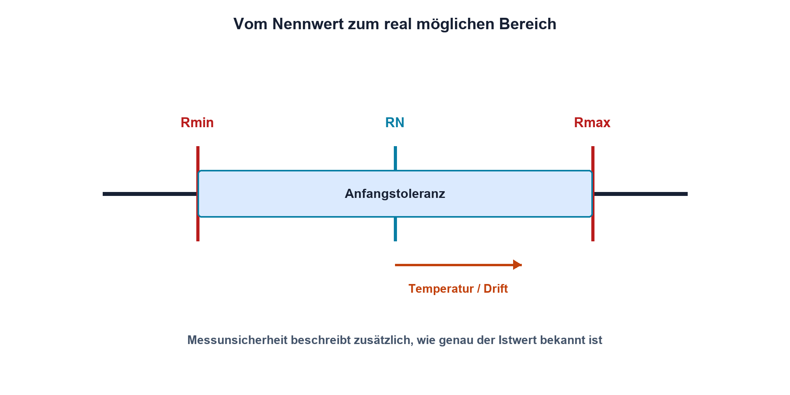
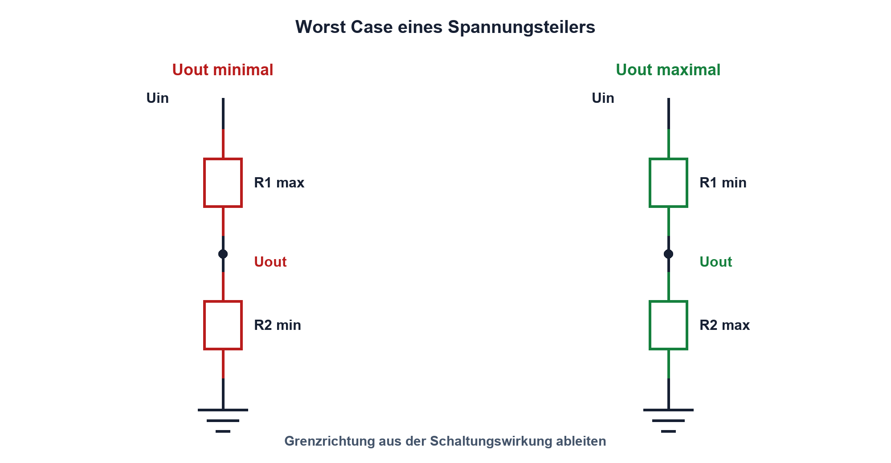

# 04.2 – Toleranz und Worst-Case-Grundlagen

[← Zurück](01-widerstandstypen-und-e-reihen.md) · [Modulübersicht](README.md) · [Kursübersicht](../README.md) · [Weiter →](03-temperaturkoeffizient-und-belastbarkeit.md)

## Lernziele

Nach dieser Lektion kannst du:

- Toleranzgrenzen eines Bauteils berechnen
- einen einfachen Worst-Case für eine Schaltungsfunktion bestimmen
- Toleranz, Genauigkeit, Drift und Messunsicherheit unterscheiden

## Einleitung

Ein Widerstand mit der Aufschrift 10 kΩ besitzt nicht zwingend exakt 10 000 Ω. Produktion, Temperatur, Alterung und Belastung führen zu Abweichungen. Eine Schaltung muss deshalb nicht nur mit Nennwerten, sondern im geforderten Bereich funktionieren.

Worst-Case-Betrachtung fragt nicht nach dem wahrscheinlichsten Ergebnis, sondern nach den zulässigen Grenzkombinationen. Sie ist besonders wichtig bei Schutzschwellen, maximalen Strömen und ADC-Eingängen. Für statistische Serienbetrachtungen gibt es weitere Methoden; am Anfang schafft die Grenzwertrechnung eine sichere und nachvollziehbare Basis.

<!-- context-expansion-2026 -->
Ein Widerstand ist nicht nur ein Zahlenwert in Ohm. Technologie, Toleranz, Temperatur, Spannung, Pulsenergie, Bauform und Alterung entscheiden, ob er seine Aufgabe zuverlässig erfüllt. Widerstandssensoren nutzen dieselben Abhängigkeiten gezielt als Messprinzip.

Beim Thema **Toleranz und Worst-Case-Grundlagen** geht es deshalb nicht nur um eine einzelne Formel oder Definition. Entscheidend ist, wie sich das Prinzip im Schema erkennen, im Datenblatt beurteilen, im Aufbau messen und bei einer Abweichung systematisch überprüfen lässt.

## Theorie

<!-- theory-expansion-2026 -->
### Einordnung und Grundidee

Bei der Bauteilauswahl werden Nennwert und Bauform mit den realen Betriebsbedingungen verknüpft. Neben dem Normalbetrieb werden Toleranz, Temperatur, Verlustleistung, kurzzeitige Überlast und Fehlerfall geprüft. Das Datenblatt ist dabei Teil der Schaltungsauslegung.

### Toleranzintervall

Eine symmetrische Widerstandstoleranz `t` wird meist in Prozent angegeben. Die möglichen Grenzwerte lauten:

`Rmin = RN · (1 − t)`

`Rmax = RN · (1 + t)`

| Formelzeichen | Bedeutung | Einheit |
|---|---|---|
| `RN` | Nennwert | Ω |
| `Rmin`, `Rmax` | unterer und oberer Grenzwert | Ω |
| `t` | relative Toleranz als Dezimalzahl; 1 % = 0,01 | einheitenlos |

Die Toleranz beschreibt üblicherweise die Anfangsabweichung unter festgelegten Bedingungen. Temperaturdrift, Langzeitdrift und Belastungsänderung können zusätzlich wirken. Sie dürfen nicht stillschweigend als bereits vollständig in der Nennwerttoleranz enthalten angenommen werden.

### Worst-Case einer Funktion

Für jede Ausgangsgrösse wird überlegt, welche Eingangsgrenze sie maximiert oder minimiert. Bei `I = U/R` entsteht der grösste Strom aus maximaler Spannung und minimalem Widerstand. Der kleinste Strom entsteht aus minimaler Spannung und maximalem Widerstand.

Bei einem Spannungsteiler wird `Uout` maximal, wenn der obere Widerstand klein und der untere gross ist. Für das Minimum gilt das Gegenteil. Diese Richtung wird aus der physikalischen Wirkung abgeleitet, nicht blind durch alle Kombinationen geraten.

### Verhältnisgenauigkeit

Zwei Einzelwiderstände mit je 1 % Toleranz können im ungünstigsten Fall gegensinnig abweichen. In einem 1:1-Teiler ist daher nicht einfach «auch 1 %» Ausgangsfehler garantiert. Widerstandsnetzwerke bieten oft eine spezifizierte Verhältnis- oder Trackinggenauigkeit, die besser sein kann als die absolute Toleranz jedes Elements.

### Begriffe sauber trennen

- **Toleranz**: zulässiger Bereich eines Bauteilparameters.
- **Genauigkeit**: Nähe eines Ergebnisses zum richtigen Wert unter definierten Bedingungen.
- **Drift**: Änderung eines Parameters über Temperatur, Zeit oder Belastung.
- **Messunsicherheit**: begründeter Bereich, der dem Messresultat zugeordnet wird.

Ein gemessener Widerstand innerhalb seiner Toleranz beweist nicht automatisch, dass die gesamte Schaltung ihre Genauigkeitsforderung erfüllt.

## Anwendungsfall

Typische elektronische Anwendungen und Baugruppen für dieses Thema sind:

- Grenzwertanalyse von Teilern und Verstärkern
- Bauteilfreigabe über Temperatur und Fertigung
- Festlegen sicherer Diagnosegrenzen

In einer konkreten Entwicklung wird nicht nur geprüft, ob die gewünschte Funktion grundsätzlich entsteht. Ebenso wichtig sind zulässige Grenzwerte, Toleranzen, Temperatur, Messbarkeit und das Verhalten bei Unterbruch, Kurzschluss oder falscher Ansteuerung.

## Anschauliches Beispiel

Bei einem Türrahmen mit 1 m Sollbreite und ±1 cm Toleranz passen nicht alle Möbel mit 99 cm Breite sicher hindurch: Im kleinsten zulässigen Fall misst der Rahmen nur 99 cm. Genauso muss eine elektrische Funktion am ungünstigen zulässigen Grenzwert geprüft werden.

## Berechnungsbeispiel

Ein 1-kΩ-Widerstand mit ±5 % liegt an einer Versorgung von 5 V ±2 %. Damit sind `Rmin = 950 Ω`, `Rmax = 1050 Ω`, `Umin = 4,9 V` und `Umax = 5,1 V`. Der maximale Strom beträgt `5,1 V/950 Ω = 5,37 mA`; der minimale `4,9 V/1050 Ω = 4,67 mA`. Der Nennwert 5 mA allein beschreibt den möglichen Bereich nicht.

## Praxisbezug

Miss zehn Widerstände desselben Nennwerts und trage die Ergebnisse in ein Toleranzband ein. Die kleine Stichprobe zeigt eine Verteilung, ersetzt aber keine Garantie über die gesamte Produktion. Vergleiche Messgeräteauflösung und -unsicherheit mit der Bauteiltoleranz, bevor du aus kleinen Unterschieden Schlüsse ziehst.

## 🔗 Hardware ↔ Firmware

Firmware kann einen ADC-Wert kalibrieren, wenn der reale Teilerfaktor bekannt und stabil ist. Sie kann jedoch keinen Widerstand retten, der über Temperatur oder Alterung ausserhalb des angenommenen Bereichs driftet. Kalibrierwert, Hardwaretoleranz und Messbedingungen müssen gemeinsam dokumentiert werden.

## Merksatz

> Nennwerte zeigen den Mittelpunkt; eine robuste Schaltung funktioniert auch an den begründeten Grenzwerten.

## Häufige Fehler und Missverständnisse

- Prozentwerte direkt in Ohm einsetzen, ohne den Nennwert zu berücksichtigen.
- Für Maximum und Minimum dieselbe Grenzkombination verwenden.
- Bauteiltoleranz mit Messunsicherheit verwechseln.
- Worst Case als wahrscheinlichsten Serienwert interpretieren.

## Zusammenfassung

Toleranzen erzeugen zulässige Wertebereiche. Eine Worst-Case-Rechnung kombiniert jene Grenzen, welche die betrachtete Funktion maximal oder minimal machen. Zusätzliche Drift- und Messanteile werden separat erfasst, damit die Anforderung wirklich abgesichert ist.

## Übungsfragen

1. Berechne die Grenzen eines 4,7-kΩ-Widerstands mit ±1 %.
2. Welche Kombination maximiert den Strom durch einen Vorwiderstand?
3. Warum kann ein 1:1-Teiler aus zwei 1-%-Widerständen mehr als 1 % Verhältnisfehler aufweisen?
4. Worin unterscheiden sich Toleranz und Messunsicherheit?

Weitere Aufgaben: [Übungen zu Modul 04](../uebungen/modul-04.md).

## Bezug Bildungsplan 2026

- Handlungskompetenzen: `a3`, `b1-LK01–04`, `b1-LK06`, `b5-LK01–05`
- Nachweise: Toleranzrechnung, Grenzwertprüfung und dokumentierte Messreihe; [Kompetenzmatrix](../bildungsplan-2026/kompetenzmatrix.md)
