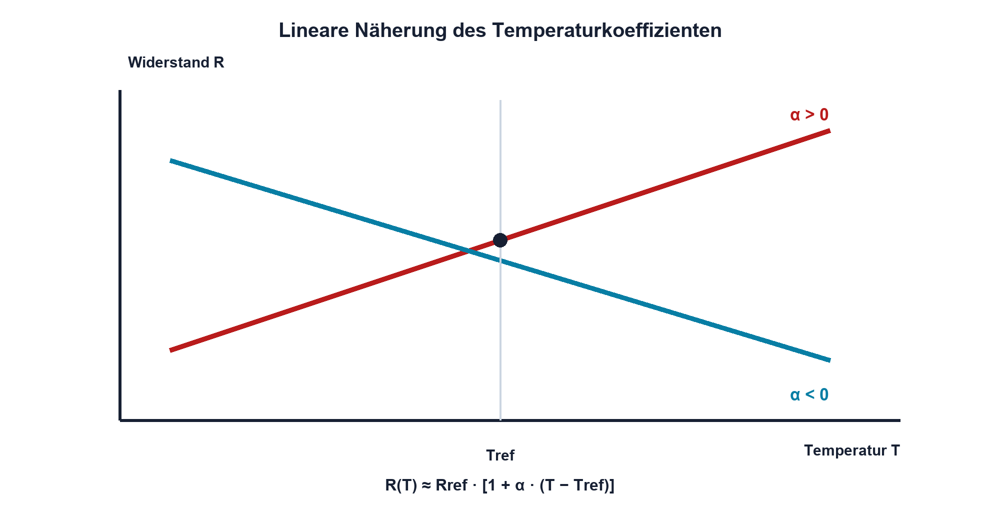
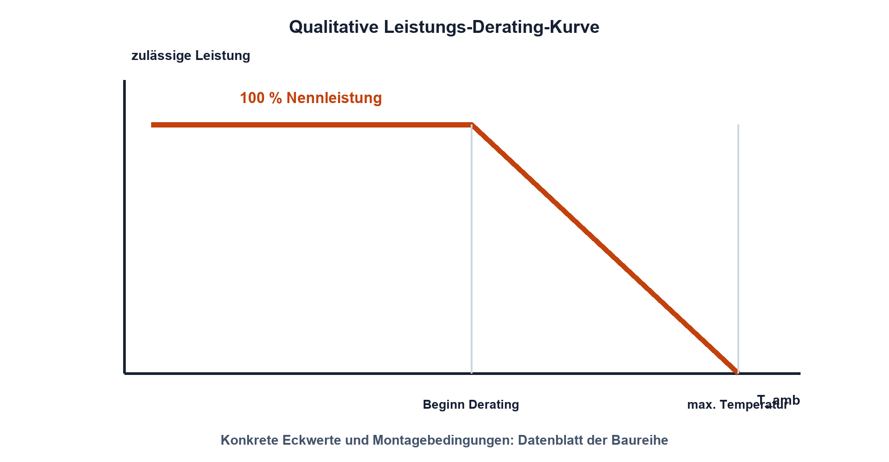

# 04.3 – Temperaturkoeffizient und Belastbarkeit

[← Zurück](02-toleranz-und-worst-case-grundlagen.md) · [Modulübersicht](README.md) · [Kursübersicht](../README.md) · [Weiter →](04-verlustleistung-und-impulsbelastung.md)

## Lernziele

Nach dieser Lektion kannst du:

- Widerstandsänderungen mit einem linearen Temperaturkoeffizienten abschätzen
- Umgebungstemperatur, Eigenerwärmung und Derating unterscheiden
- eine Widerstandsbelastung gegen Datenblattgrenzen prüfen

## Warum ist das wichtig?

Widerstände wandeln elektrische Leistung in Wärme um. Gleichzeitig verändert Temperatur ihren Widerstandswert und begrenzt die zulässige Belastung. Eine Rechnung bei 25 °C reicht daher nicht automatisch für ein Gerät, das in einem geschlossenen Gehäuse oder neben warmen Leistungshalbleitern arbeitet.

Der Temperaturkoeffizient beschreibt die Wertänderung, während eine Derating-Kurve die zulässige Leistung bei erhöhter Umgebungstemperatur begrenzt. Beide betreffen Temperatur, beantworten aber unterschiedliche Fragen.

## Theorie

### Linearer Temperaturkoeffizient

Für einen begrenzten Temperaturbereich kann die Widerstandsänderung vieler Festwiderstände linear angenähert werden:

`R(T) ≈ R_ref · [1 + α·(T − T_ref)]`

| Formelzeichen | Bedeutung | Einheit |
|---|---|---|
| `R(T)` | Widerstand bei der Temperatur `T` | Ω |
| `R_ref` | Widerstand bei der Referenztemperatur `T_ref` | Ω |
| `α` | Temperaturkoeffizient, oft in ppm/K | 1/K |
| `T`, `T_ref` | aktuelle und Referenztemperatur | °C oder K für Differenzen |

`ppm` bedeutet «parts per million». Ein Koeffizient von 100 ppm/K entspricht `100·10⁻⁶/K = 0,0001/K = 0,01 %/K`. Temperaturdifferenzen haben in Kelvin und Grad Celsius denselben Zahlenwert.

Die lineare Näherung ist nicht automatisch für NTCs oder grosse Temperaturbereiche geeignet. Dort werden Kennlinie oder materialspezifische Modelle benötigt.

### Umgebung, Bauteiltemperatur und Eigenerwärmung

Die Umgebungstemperatur ist nicht gleich der Temperatur des Widerstandselements. Verlustleistung erwärmt das Bauteil über seine Umgebung. Wärmepfade führen über Anschlüsse, Leiterplatte und Luft. Kleine SMD-Bauformen können trotz geringer Leistung eine deutliche Temperaturerhöhung erreichen.

Diese Eigenerwärmung verändert den Widerstand und kann benachbarte temperaturempfindliche Bauteile beeinflussen. Bei Präzisionsschaltungen wird deshalb nicht nur der elektrische Wert, sondern auch die Platzierung betrachtet.

### Derating

Die Nennleistung gilt nur unter den im Datenblatt genannten Bedingungen. Oberhalb einer festgelegten Umgebungstemperatur muss die zulässige Leistung häufig reduziert werden. Bei der maximalen Bauteiltemperatur ist keine Dauerverlustleistung mehr zulässig.

Eine Derating-Kurve wird nicht zwischen unterschiedlichen Bauteilserien übertragen. Auch Leiterplattenfläche, Montage und Kühlung können Bestandteil der Prüfbedingungen sein.

### Spannungsgrenze nicht vergessen

Selbst wenn `P = U²/R` unterhalb der Nennleistung liegt, kann die maximal zulässige Arbeitsspannung überschritten sein. Das betrifft besonders hochohmige Widerstände. Umgekehrt kann ein niederohmiger Widerstand seine Leistungsgrenze bei relativ kleiner Spannung erreichen.

## Anschauliches Beispiel

Ein präziser 10-kΩ-Widerstand mit 25 ppm/K ändert sich bei 40 K Temperaturanstieg näherungsweise um 0,1 %. Das sind 10 Ω. Für einen LED-Vorwiderstand ist dies oft unkritisch; in einem genauen Messverstärker kann es die gesamte Fehlerreserve aufbrauchen.

## Berechnungsbeispiel

Gegeben sind `R_ref = 10,000 kΩ`, `α = 50 ppm/K`, `T_ref = 25 °C` und `T = 85 °C`. Die Differenz beträgt 60 K. Die relative Änderung ist `50·10⁻⁶/K · 60 K = 0,003 = 0,3 %`. Damit ergibt sich näherungsweise `R(85 °C) = 10,030 kΩ`.

## Praxisbezug

Belaste einen geeigneten Widerstand deutlich unterhalb seiner Datenblattgrenze und beobachte Widerstands- oder Spannungsänderung nach dem Einschalten. Berühre heisse Bauteile nicht. Temperaturmessung, Wartezeit, Luftbewegung und Messstrom werden protokolliert, weil sie das Resultat beeinflussen.

## 🔗 Hardware ↔ Firmware

Eine Firmwarekalibrierung bei Raumtemperatur kann Temperaturdrift nicht automatisch beseitigen. Ist ein Temperatursensor vorhanden, kann die Firmware eine charakterisierte Drift kompensieren. Dafür braucht sie jedoch ein belastbares Modell und gültige Kalibrierdaten; eine unbekannte Eigenerwärmung bleibt ein Hardwareproblem.

## Merksatz

> Temperaturkoeffizient beschreibt Wertänderung; Derating beschreibt die zulässige Belastung bei Temperatur.

## Häufige Fehler und Missverständnisse

- ppm/K ohne Umrechnung direkt als Prozent einsetzen.
- Umgebungstemperatur mit Bauteiltemperatur gleichsetzen.
- Nennleistung unabhängig von Temperatur und Montage annehmen.
- Leistungsgrenze prüfen, aber maximale Arbeitsspannung übersehen.

## Zusammenfassung

Temperatur beeinflusst Widerstandswert und zulässige Leistung auf unterschiedliche Weise. Der lineare Temperaturkoeffizient erlaubt eine erste Driftabschätzung; die konkrete Derating-Kurve und Spannungsgrenze müssen aus dem Datenblatt des gewählten Bauteils stammen.

## Übungsfragen

1. Wieviel Prozent pro Kelvin entsprechen 200 ppm/K?
2. Berechne die Änderung eines 1-kΩ-Widerstands mit 100 ppm/K über 50 K.
3. Weshalb kann die Bauteiltemperatur über der Umgebungstemperatur liegen?
4. Welche zwei Grenzwerte müssen bei einem hochohmigen Widerstand neben der Toleranz geprüft werden?

Weitere Aufgaben: [Übungen zu Modul 04](../uebungen/modul-04.md).

## Bezug Bildungsplan 2026

- Handlungskompetenzen: `a3`, `b1-LK01–04`, `b1-LK07`, `b4-LK03`, `b5-LK01–05`
- Nachweise: Temperaturabschätzung und Belastbarkeitsprüfung; [Kompetenzmatrix](../bildungsplan-2026/kompetenzmatrix.md)
