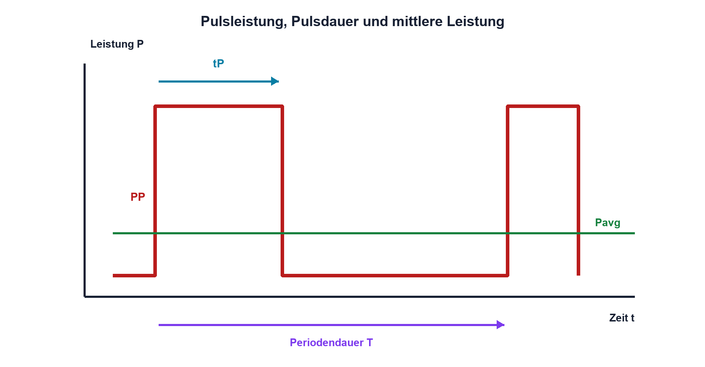
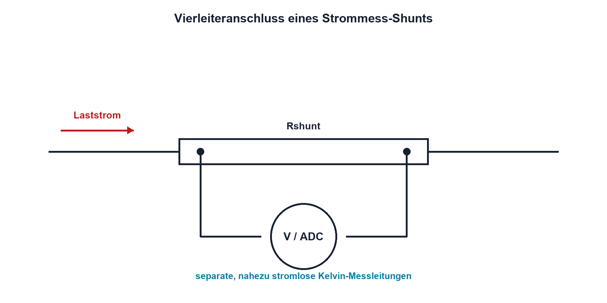

# 04.4 – Verlustleistung und Impulsbelastung

[← Zurück](03-temperaturkoeffizient-und-belastbarkeit.md) · [Modulübersicht](README.md) · [Kursübersicht](../README.md) · [Weiter →](05-smd-widerstaende-und-potentiometer.md)

## Lernziele

Nach dieser Lektion kannst du:

- Dauerverlustleistung in einem Widerstand berechnen
- Energie und mittlere Leistung eines einfachen Pulses bestimmen
- erklären, weshalb mittlere Leistung allein keine Impulsfreigabe beweist

## Warum ist das wichtig?

Widerstände werden nicht nur durch Dauerstrom belastet. Einschaltvorgänge, Kondensatorentladung, Motorstart oder Schutzpulse können kurzzeitig viel höhere Leistungen erzeugen. Ein Widerstand mit scheinbar ausreichender Nennleistung kann dabei beschädigt werden, obwohl die über viele Sekunden gemittelte Leistung klein ist.

Das Bauteil muss sowohl die thermische Dauerbelastung als auch den einzelnen Puls elektrisch und mechanisch überstehen. Für eine Freigabe sind deshalb Datenblattkurven zur Pulsdauer, Wiederholrate und maximalen Spannung erforderlich.

## Theorie

### Dauerverlustleistung

Elektrische Energie wird im Widerstand überwiegend in Wärme umgewandelt. Für einen ohmschen Widerstand gelten `P = U·I`, `P = I²R` und `P = U²/R`. Verwendet werden jeweils Spannung und Strom am selben Bauteil und im selben Betriebszustand.

Die berechnete Verlustleistung sollte nicht ohne Reserve genau der Nennleistung entsprechen. Umgebungstemperatur, Toleranzen, Lüftung und Leiterplattenaufbau bestimmen die notwendige Reserve.

### Energie eines Rechteckpulses

Während eines konstanten Pulses gilt:

`E_P = P_P · t_P`

| Formelzeichen | Bedeutung | Einheit |
|---|---|---|
| `E_P` | Energie eines Pulses | J |
| `P_P` | Leistung während des Pulses | W |
| `t_P` | Pulsdauer | s |
| `T` | Periodendauer vom Beginn eines Pulses bis zum Beginn des nächsten | s |
| `P_avg` | über eine vollständige Periode gemittelte Leistung | W |

Bei wiederholten identischen Pulsen mit Periodendauer `T` beträgt die idealisierte mittlere Leistung `P_avg = E_P/T`. `P_avg` bezeichnet die zeitlich gemittelte Leistung. Diese Rechnung prüft die langfristige Erwärmung, nicht automatisch die lokale Spitzentemperatur oder Spannungsfestigkeit.

### Warum Pulse gesondert geprüft werden

Wärme verteilt sich im Widerstand nicht augenblicklich. Ein kurzer starker Puls kann lokal eine Widerstandsschicht beschädigen, bevor das ganze Gehäuse warm wird. Zusätzlich können hohe Spannungen einen Überschlag oder eine bleibende Widerstandsänderung verursachen. Die zulässige Pulsleistung ist daher keine beliebige Vielfache der Dauerleistung.

Datenblätter unterscheiden häufig Einzelpuls und wiederholte Pulse. Für Wiederholbetrieb sind Tastgrad, Abkühlzeit, Zahl der Pulse und Umgebungstemperatur relevant. Fehlt eine passende Spezifikation, darf die Eignung nicht erfunden werden.

### Strommess-Shunt

Ein Shunt setzt Strom in eine kleine Messspannung um. Ein kleiner Wert reduziert Verlustleistung, erzeugt aber ein kleineres Signal. Bei hohen Strömen beeinflussen Leiterbahn- und Kontaktwiderstände das Resultat. Kelvinanschlüsse trennen den Laststrompfad von den Spannungsmessleitungen und vermindern diesen Fehler.

## Anschauliches Beispiel

Ein 0,25-W-Widerstand darf nicht allein deshalb einen 10-W-Puls vertragen, weil dieser nur 1 ms dauert. Die Pulsenergie beträgt zwar nur 10 mJ, doch ob Widerstandsschicht und Anschlussaufbau dies überstehen, zeigt ausschliesslich die passende Impulskurve des konkreten Bauteils.

## Berechnungsbeispiel

Ein 10-Ω-Widerstand führt während 5 ms einen Strom von 1 A. Die Pulsleistung beträgt `P_P = 1²·10 Ω = 10 W`, die Energie `E_P = 10 W·5 ms = 50 mJ`. Wiederholt sich der Puls alle 500 ms, ergibt sich ideal `P_avg = 50 mJ/0,5 s = 0,10 W`. Trotzdem müssen 10-W-/5-ms-Einzelpulse und Wiederholbetrieb im Datenblatt freigegeben sein.

## Praxisbezug

Für den Laborversuch werden nur Widerstände innerhalb klarer Dauergrenzen betrieben. Pulsversuche erfordern einen freigegebenen Aufbau, Strombegrenzung und geeignete Messgeräte. Temperaturänderungen werden berührungslos oder mit geeignet befestigtem Sensor gemessen; «mit dem Finger testen» ist keine sichere Methode.

## 🔗 Hardware ↔ Firmware

Firmware bestimmt bei PWM Tastgrad, Frequenz und Einschaltzeit. Daraus folgen reale Pulsenergie und mittlere Verlustleistung im Widerstand. Ein Softwarelimit ist nur wirksam, wenn Startzustand, Fehlerfall und Reset berücksichtigt sind. Ein fest verdrahteter Schutz kann erforderlich bleiben.

## Merksatz

> Dauerleistung prüft die langfristige Erwärmung; Pulsfestigkeit muss zusätzlich für Pulsform und Wiederholung belegt sein.

## Häufige Fehler und Missverständnisse

- Nur die mittlere Leistung berechnen und die Spitzenbelastung ignorieren.
- Einzelpulsdaten auf periodischen Betrieb übertragen.
- Nennleistung ohne Derating und thermische Reserve ausnutzen.
- Shuntspannung an stromführenden Lötstellen statt über Kelvinpunkte messen.

## Zusammenfassung

Widerstände müssen Dauerleistung, Pulsenergie, Spitzenspannung und thermische Randbedingungen einhalten. Mittlere Leistung und Einzelpulsbelastung beantworten verschiedene Fragen. Beim Shunt entscheidet zusätzlich eine saubere Anschlussführung über die Messgenauigkeit.

## Übungsfragen

1. Welche Energie enthält ein 4-W-Puls von 20 ms?
2. Warum reicht `P_avg` zur Bauteilfreigabe nicht aus?
3. Was unterscheidet Einzelpuls- von Wiederholpulsbetrieb?
4. Welchen Vorteil bieten Kelvinanschlüsse an einem Shunt?

Weitere Aufgaben: [Übungen zu Modul 04](../uebungen/modul-04.md).

## Bezug Bildungsplan 2026

- Handlungskompetenzen: `a3`, `b1-LK01–04`, `b1-LK07`, `b4-LK03`, `b5-LK01–05`
- Nachweise: Leistungs-, Energie- und Datenblattprüfung; [Kompetenzmatrix](../bildungsplan-2026/kompetenzmatrix.md)
