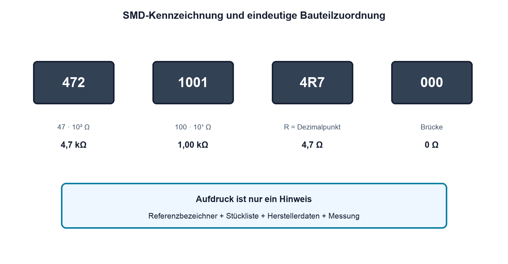
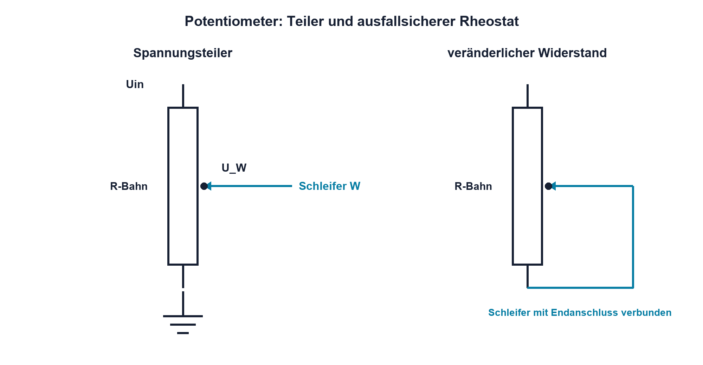

# 04.5 – SMD-Widerstände und Potentiometer

[← Zurück](04-verlustleistung-und-impulsbelastung.md) · [Modulübersicht](README.md) · [Kursübersicht](../README.md) · [Weiter →](06-ntc-und-ptc.md)

## Lernziele

Nach dieser Lektion kannst du:

- gebräuchliche SMD-Widerstandskennzeichnungen lesen und ihre Grenzen nennen
- Bauform, Footprint und elektrische Belastbarkeit auseinanderhalten
- Potentiometer als Teiler oder veränderlichen Widerstand korrekt beschalten

## Einleitung

Auf einer Leiterplatte ist der aufgedruckte Code oft die erste Orientierung. Er ersetzt aber weder Stückliste noch Schaltplan: kleine SMD-Widerstände können unbeschriftet sein, Codes sind nicht in jedem System eindeutig und 0-Ω-Brücken sehen anderen Widerständen ähnlich.

Potentiometer besitzen drei Anschlüsse und können Spannungen teilen oder als veränderlicher Widerstand verwendet werden. Falsch angeschlossen kann ein Schleiferunterbruch einen Eingang offen lassen oder am Endanschlag einen unerwünscht kleinen Widerstand erzeugen.

<!-- context-expansion-2026 -->
Ein Widerstand ist nicht nur ein Zahlenwert in Ohm. Technologie, Toleranz, Temperatur, Spannung, Pulsenergie, Bauform und Alterung entscheiden, ob er seine Aufgabe zuverlässig erfüllt. Widerstandssensoren nutzen dieselben Abhängigkeiten gezielt als Messprinzip.

Beim Thema **SMD-Widerstände und Potentiometer** geht es deshalb nicht nur um eine einzelne Formel oder Definition. Entscheidend ist, wie sich das Prinzip im Schema erkennen, im Datenblatt beurteilen, im Aufbau messen und bei einer Abweichung systematisch überprüfen lässt.

## Theorie

<!-- theory-expansion-2026 -->
### Einordnung und Grundidee

Bei der Bauteilauswahl werden Nennwert und Bauform mit den realen Betriebsbedingungen verknüpft. Neben dem Normalbetrieb werden Toleranz, Temperatur, Verlustleistung, kurzzeitige Überlast und Fehlerfall geprüft. Das Datenblatt ist dabei Teil der Schaltungsauslegung.

### SMD-Codes

Beim dreistelligen Zahlencode sind die ersten zwei Ziffern signifikant und die dritte ist der Zehnerpotenz-Multiplikator in Ohm. `472` bedeutet `47·10² Ω = 4,7 kΩ`. Beim vierstelligen Code sind die ersten drei Ziffern signifikant: `1001` bedeutet `100·10¹ Ω = 1,00 kΩ`. Der Buchstabe `R` dient häufig als Dezimaltrennzeichen, beispielsweise `4R7 = 4,7 Ω`.

EIA-96-Codes kombinieren Ziffern und Buchstaben und benötigen eine Tabelle. Nicht jeder Hersteller verwendet Codes identisch, und sehr kleine Bauteile sind oft unmarkiert. Verbindlich bleiben Bestückungsunterlagen und Stückliste.

### Bauform und Footprint

Bezeichnungen wie 0603 sind ohne Einheitensystem mehrdeutig: 0603 imperial entspricht ungefähr 1608 metrisch. In professionellen Unterlagen wird die Konvention eindeutig angegeben. Der Footprint muss nicht nur geometrisch passen; Lötverfahren, Spannungsabstand, Leistung und Fertigungstoleranzen sind ebenfalls zu prüfen.

Die zulässige Leistung hängt von Bauteilserie, Umgebung und Leiterplattenanbindung ab. Ein grösseres Gehäuse verträgt häufig mehr, aber die konkrete Datenblattangabe ist massgeblich.

### Potentiometer als Spannungsteiler

Ein Potentiometer besitzt zwei Endanschlüsse der Widerstandsbahn und einen Schleifer. Zwischen den Endanschlüssen liegt der Gesamtwiderstand annähernd konstant. Der Schleifer teilt die Bahn in zwei Teilwiderstände.

Im unbelasteten linearen Modell beschreibt die Schleiferstellung `x` den Anteil von 0 bis 1:

`UW ≈ x · Uin`

| Formelzeichen | Bedeutung | Einheit |
|---|---|---|
| `UW` | Spannung am Schleifer gegen den unteren Endanschluss | V |
| `x` | normierte Schleiferstellung von 0 bis 1 | einheitenlos |

Die Beziehung gilt für eine lineare Kennlinie und geringe Schleiferlast. Logarithmische Potentiometer besitzen absichtlich einen anderen Zusammenhang.

### Als veränderlicher Widerstand

Werden Schleifer und ein Endanschluss verwendet, entsteht ein Rheostat. Häufig wird der Schleifer mit dem verwendeten Endanschluss verbunden. Verliert der Schleifer kurzzeitig den Kontakt, bleibt dann eher der volle Bahnwert statt eines vollständig offenen Kreises wirksam. Ob diese Beschaltung geeignet ist, hängt vom Fehlerfall der Schaltung ab.

Schleiferstrom und gesamte Bahnleistung sind begrenzt. Bei kleinem eingestelltem Teilwiderstand darf nicht automatisch die volle Nennleistung der gesamten Bahn in diesem kurzen Abschnitt umgesetzt werden.

## Anwendungsfall

Typische elektronische Anwendungen und Baugruppen für dieses Thema sind:

- Bestückung kompakter Leiterplatten
- Abgleich von Verstärkung oder Offset
- Bedienelemente und einstellbare Sollwerte

In einer konkreten Entwicklung wird nicht nur geprüft, ob die gewünschte Funktion grundsätzlich entsteht. Ebenso wichtig sind zulässige Grenzwerte, Toleranzen, Temperatur, Messbarkeit und das Verhalten bei Unterbruch, Kurzschluss oder falscher Ansteuerung.

## Anschauliches Beispiel

Ein 10-kΩ-Potentiometer steht geometrisch in Mittelstellung. Unbelastet werden ungefähr 5 kΩ zu beiden Enden gemessen. Liegt am Schleifer eine 5-kΩ-Last nach GND, ist die Ausgangsspannung jedoch nicht mehr halb so gross wie die Eingangsspannung, weil der untere Bahnabschnitt belastet wird.

## Berechnungsbeispiel

Ein lineares 10-kΩ-Potentiometer liegt an 3,3 V und steht bei `x = 0,25`. Unbelastet sind etwa 0,825 V zu erwarten. Werden 10 kΩ vom Schleifer nach GND angeschlossen, liegt der untere Bahnabschnitt von 2,5 kΩ parallel zu 10 kΩ und wirkt als 2,0 kΩ. Mit dem oberen Abschnitt von 7,5 kΩ ergibt sich nur noch etwa `3,3 V·2,0/(7,5+2,0) = 0,695 V`.

## Praxisbezug

Identifiziere an einem ausgebauten Potentiometer die Endanschlüsse und den Schleifer ausschliesslich mit dem Ohmmeter an spannungsfreiem Bauteil. Drehe langsam über den gesamten Bereich und beobachte Gesamt- sowie Teilwiderstände. Sprünge können auf Kontaktprobleme oder ungeeignete Messkontaktierung hinweisen.

## 🔗 Hardware ↔ Firmware

Ein Potentiometer am ADC liefert einen Sollwert. Firmware kann Mittelung und Plausibilitätsgrenzen anwenden. Ein Schleiferunterbruch sollte durch einen definierten Hardware-Pull-up oder Pull-down einen erkennbaren Fehlerwert erzeugen, statt einen schwebenden Eingang zu hinterlassen. ADC-Abtastzeit und Quellimpedanz bleiben zu beachten.

## Merksatz

> Aufdruck und Bauform geben Hinweise; eindeutige Identifikation und Grenzwerte kommen aus Unterlagen und Datenblatt.

## Häufige Fehler und Missverständnisse

- 0603 ohne Angabe «metrisch» oder «imperial» verwenden.
- Einen Zahlencode ohne Prüfung des Codiersystems deuten.
- Potentiometer-Mittelstellung unter Last automatisch mit halber Spannung gleichsetzen.
- Schleifer- und Bahnleistung ignorieren.

## Zusammenfassung

SMD-Codes helfen bei der Identifikation, sind aber nicht universell. Footprint, Serie und Datenblatt bestimmen die reale Eignung. Potentiometer sind belastete Spannungsteiler mit begrenztem Schleiferstrom und benötigen eine durchdachte Fehlerbeschaltung.

## Übungsfragen

1. Welche Werte bedeuten `103`, `4701` und `2R2` im üblichen Zahlencode?
2. Weshalb ist «0603» ohne Zusatz potenziell mehrdeutig?
3. Wie erkennst du den Schleifer eines unbekannten Potentiometers mit dem Ohmmeter?
4. Weshalb kann eine Schleifer-Endanschluss-Brücke das Fehlerverhalten verbessern?

Weitere Aufgaben: [Übungen zu Modul 04](../uebungen/modul-04.md).

## Bezug Bildungsplan 2026

- Handlungskompetenzen: `a3`, `b1-LK01–04`, `b2-LK06`, `b3-LK01–02`, `b4-LK11`
- Nachweise: Bauteilidentifikation, Anschlussprüfung und dokumentierte Messung; [Kompetenzmatrix](../bildungsplan-2026/kompetenzmatrix.md)
