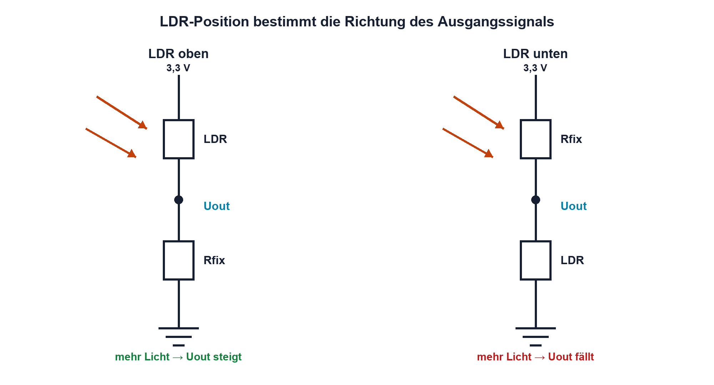
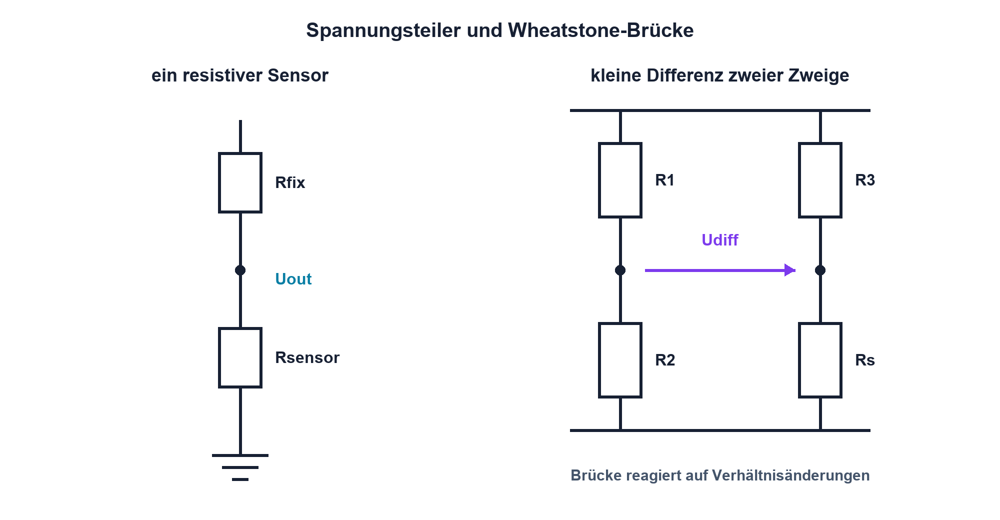

# 04.7 – LDR und weitere Widerstandssensoren

[← Zurück](06-ntc-und-ptc.md) · [Modulübersicht](README.md) · [Kursübersicht](../README.md) · [Weiter →](../05-kondensatoren/README.md)

## Lernziele

Nach dieser Lektion kannst du:

- einen LDR als nichtlinearen lichtabhängigen Widerstand einsetzen
- resistive Sensoren nach Messprinzip und Randbedingungen vergleichen
- eine fehlersichere Sensorbeschaltung mit plausiblen Diagnosegrenzen planen

## Einleitung

Viele Sensoren verändern einen Widerstand: LDR reagieren auf Licht, Dehnungsmessstreifen auf mechanische Dehnung und potentiometrische Sensoren auf Weg oder Winkel. Das Messgerät oder der Mikrocontroller erfasst aber meist eine Spannung. Deshalb wird die Widerstandsänderung durch einen Spannungsteiler, eine Brücke oder eine Stromquelle in ein messbares Signal übersetzt.

Der Widerstandswert allein beschreibt die Messgrösse nur zusammen mit Bedingungen wie Temperatur, Versorgung, Geometrie und Alterung. Eine robuste Auswertung berücksichtigt ausserdem Unterbruch und Kurzschluss der Sensorleitung.

<!-- context-expansion-2026 -->
Ein Widerstand ist nicht nur ein Zahlenwert in Ohm. Technologie, Toleranz, Temperatur, Spannung, Pulsenergie, Bauform und Alterung entscheiden, ob er seine Aufgabe zuverlässig erfüllt. Widerstandssensoren nutzen dieselben Abhängigkeiten gezielt als Messprinzip.

Beim Thema **LDR und weitere Widerstandssensoren** geht es deshalb nicht nur um eine einzelne Formel oder Definition. Entscheidend ist, wie sich das Prinzip im Schema erkennen, im Datenblatt beurteilen, im Aufbau messen und bei einer Abweichung systematisch überprüfen lässt.

## Theorie

<!-- theory-expansion-2026 -->
### Einordnung und Grundidee

Bei der Bauteilauswahl werden Nennwert und Bauform mit den realen Betriebsbedingungen verknüpft. Neben dem Normalbetrieb werden Toleranz, Temperatur, Verlustleistung, kurzzeitige Überlast und Fehlerfall geprüft. Das Datenblatt ist dabei Teil der Schaltungsauslegung.

### LDR

Ein lichtabhängiger Widerstand (*Light Dependent Resistor*) wird bei zunehmender Beleuchtungsstärke typischerweise niederohmiger. Die Kennlinie ist stark nichtlinear und besitzt grosse Exemplarstreuungen. LDR eignen sich gut zur einfachen Helligkeitserkennung, aber nicht ohne Kalibrierung für präzise Beleuchtungsstärkemessung.

Die Beleuchtungsstärke wird mit `Ev` bezeichnet und in Lux (`lx`) angegeben. Das tiefgestellte `v` weist auf die photometrische, an die Hellempfindlichkeit des menschlichen Auges gewichtete Grösse hin. Zwischen LDR-Widerstand und Lux besteht kein allgemein gültiger linearer Zusammenhang; massgeblich ist die Kennlinie des konkreten Sensors.

### Signalrichtung festlegen

Liegt der LDR oben an der Versorgung und der Festwiderstand unten, steigt die Ausgangsspannung bei mehr Licht. Liegt der LDR unten, fällt sie. Diese Entscheidung wird so getroffen, dass Normalbereich und Fehlerzustände sinnvoll zum ADC-Bereich passen.

Der Festwiderstand beeinflusst Empfindlichkeit und Messbereich. In der Nähe des Arbeitspunkts entsteht eine grosse Spannungsänderung, wenn Fest- und Sensorwiderstand ähnlich gross sind. Ein einzelner Festwiderstand kann aber nicht über mehrere Dekaden überall dieselbe Empfindlichkeit liefern.

### Weitere resistive Sensoren

- **Dehnungsmessstreifen (DMS):** sehr kleine relative Widerstandsänderung; meist in Viertel-, Halb- oder Vollbrücke ausgewertet.
- **Potentiometrische Weg- und Winkelsensoren:** grosse, direkt messbare Änderung, aber mechanischer Kontakt und Verschleiss.
- **Kraftabhängige Widerstände (FSR):** stark nichtlinear und häufig mit Hysterese; geeignet zur qualitativen Kraft- oder Druckerkennung, nicht automatisch zur Präzisionsmessung.
- **Magnetoresistive Sensoren:** Widerstandsänderung durch Magnetfeld; oft als Brückenstruktur integriert.

### Ratiometrische Messung

Werden Spannungsteiler und ADC von derselben Referenz gespeist, hängt der digitale Code ideal vom Widerstandsverhältnis und weniger von der absoluten Versorgung ab. Dies heisst ratiometrische Messung. Sie beseitigt jedoch keine Fehler durch Widerstandstoleranz, Leckstrom oder einen übersteuerten ADC-Eingang.

### Diagnose von Leitungsfehlern

Ein Sensorbereich sollte nicht den gesamten ADC-Bereich von 0 V bis Versorgung ausnutzen. Dann können Werte nahe 0 V als Kurzschluss nach GND und Werte nahe Versorgung als Unterbruch oder Kurzschluss nach Versorgung erkannt werden. Welche Fehler eindeutig unterscheidbar sind, hängt von der Schaltung ab und wird durch gezielte Fehlerfälle geprüft.

## Anwendungsfall

Typische elektronische Anwendungen und Baugruppen für dieses Thema sind:

- Helligkeitserkennung und Dämmerungsschalter
- Druck-, Kraft- und Wegmessung mit resistiven Sensoren
- Einfache Anwesenheits- oder Feuchtedetektion

In einer konkreten Entwicklung wird nicht nur geprüft, ob die gewünschte Funktion grundsätzlich entsteht. Ebenso wichtig sind zulässige Grenzwerte, Toleranzen, Temperatur, Messbarkeit und das Verhalten bei Unterbruch, Kurzschluss oder falscher Ansteuerung.

## Anschauliches Beispiel

Ein LDR hat in heller Umgebung 2 kΩ und im Dunkeln 100 kΩ. Mit einem 10-kΩ-Festwiderstand gegen GND liefert die Schaltung bei 3,3 V ungefähr 2,75 V im Hellen und 0,30 V im Dunkeln. Das Signal nutzt einen grossen ADC-Bereich, ist aber nicht proportional zur Beleuchtungsstärke.

## Berechnungsbeispiel

Für einen LDR oben und `Rfix = 10 kΩ` unten gilt `Uout = Uin·Rfix/(RLDR+Rfix)`. Bei `RLDR = 2 kΩ` entstehen `3,3 V·10/(2+10) = 2,75 V`. Bei 100 kΩ entstehen `3,3 V·10/(100+10) = 0,30 V`. Die Rechnung sagt nur die Spannung für angenommene Widerstände voraus; die Lux-Zuordnung benötigt Kennlinie oder Kalibrierung.

## Praxisbezug

Miss einen LDR bei mehreren reproduzierbaren Beleuchtungssituationen und dokumentiere Abstand, Lichtquelle, Ausrichtung, Umgebungslicht und Temperatur. Ein Smartphone-Luxwert kann höchstens als nicht rückführbare Orientierung dienen. Für belastbare Messungen wird ein geeignetes Referenzgerät verwendet.

## 🔗 Hardware ↔ Firmware

Firmware filtert den ADC-Wert, setzt Schaltschwellen und diagnostiziert unplausible Bereiche. Hysterese verhindert Flattern nahe einer Schwelle. Die Hardware bestimmt Signalrichtung, Bereich, Quellimpedanz und Fehlerpegel. Ein vertauschtes Teilerverhältnis kann nicht durch ein blosses Vorzeichen im Code alle elektrischen Nachteile beseitigen.

## Merksatz

> Ein resistiver Sensor liefert zuerst einen Widerstand; erst die Beschaltung macht daraus ein mess- und diagnostizierbares Signal.

## Häufige Fehler und Missverständnisse

- LDR-Widerstand als linear proportional zur Beleuchtungsstärke behandeln.
- Beleuchtungsbedingungen nicht dokumentieren.
- ADC-Grenzwerte ohne Reserve für Leitungsfehler und Toleranzen festlegen.
- Sensorbrücke und einfachen Spannungsteiler als austauschbar betrachten.

## Zusammenfassung

LDR und andere Widerstandssensoren benötigen eine zur Kennlinie passende Auswerteschaltung. Spannungsteiler sind einfach, Brücken machen kleine relative Änderungen besser zugänglich. Ratiometrie, Diagnosebereiche und dokumentierte Randbedingungen verbinden Sensorhardware mit einer robusten Firmwareauswertung.

## Übungsfragen

1. Wie ändert sich die Ausgangsspannung bei einem LDR oben im Teiler, wenn es heller wird?
2. Warum lässt sich aus einem einzelnen LDR-Widerstand nicht allgemein ein genauer Luxwert ableiten?
3. Welchen Vorteil bietet eine ratiometrische ADC-Messung?
4. Wie können 0 V und 3,3 V ausserhalb des Normalbereichs zur Leitungsdiagnose genutzt werden?

Weitere Aufgaben: [Übungen zu Modul 04](../uebungen/modul-04.md).

## Bezug Bildungsplan 2026

- Handlungskompetenzen: `a3`, `b1-LK01–06`, `b1-LK08`, `b4-LK01–10`, `b5-LK01–05`, `c1–c2`
- Nachweise: Sensorauswahl, Übertragungsrechnung und Diagnosekonzept; [Kompetenzmatrix](../bildungsplan-2026/kompetenzmatrix.md)
