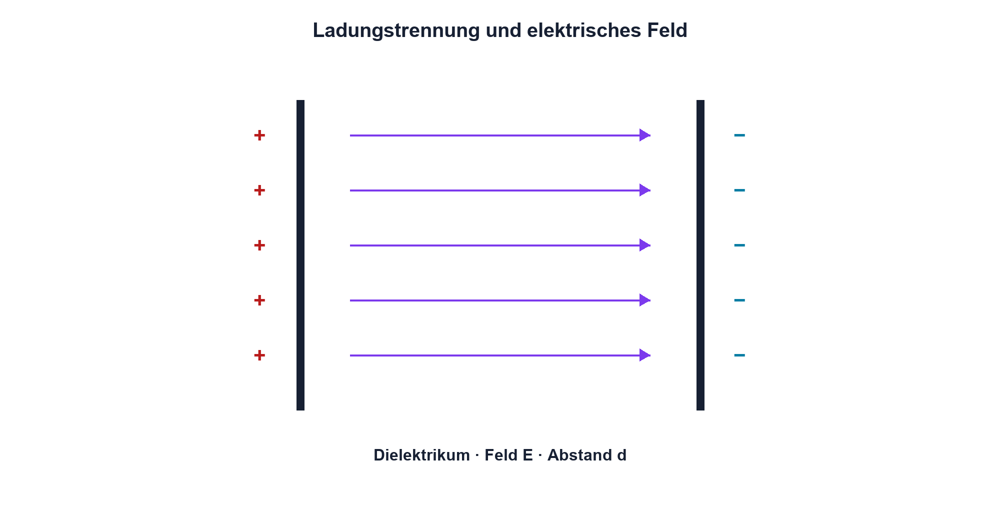

# 05.1 – Physikalischer Aufbau und Kapazität

[← Zurück](README.md) · [Modulübersicht](README.md) · [Kursübersicht](../README.md) · [Weiter →](02-laden-entladen-und-gespeicherte-energie.md)

## Lernziele

Nach dieser Lektion kannst du:

- den Aufbau eines Kondensators und die Ladungstrennung erklären
- Kapazität aus Ladung und Spannung sowie aus Geometrie deuten
- Spannungsfestigkeit und Dielektrikum als reale Grenzen berücksichtigen

## Einleitung

Kondensatoren speichern getrennte elektrische Ladungen und reagieren deshalb auf Spannungsänderungen. Sie glätten Versorgungen, koppeln Wechselanteile, bestimmen Zeitabläufe und liefern kurzfristig Strom. Ohne Vorstellung vom elektrischen Feld bleibt ihr Verhalten leicht eine Sammlung aus Formeln.

Die Kapazität sagt, wie viel Ladung pro Volt gespeichert wird. Sie hängt von Plattenfläche, Abstand und Isolierstoff ab. Diese Zusammenhänge erklären zugleich, weshalb kleine, hochkapazitive Bauteile empfindlich auf Spannung, Temperatur und Fertigungstoleranz reagieren können.

<!-- context-expansion-2026 -->
Kondensatoren speichern Ladung in einem elektrischen Feld. Dadurch verbinden sie Gleichstromverhalten, zeitliche Vorgänge und hochfrequente Strompfade. Ihre Aufgabe wird erst verständlich, wenn neben dem Kapazitätswert auch Polarität, ESR, ESL und der reale Einbauort betrachtet werden.

Beim Thema **Physikalischer Aufbau und Kapazität** geht es deshalb nicht nur um eine einzelne Formel oder Definition. Entscheidend ist, wie sich das Prinzip im Schema erkennen, im Datenblatt beurteilen, im Aufbau messen und bei einer Abweichung systematisch überprüfen lässt.

## Theorie

<!-- theory-expansion-2026 -->
### Einordnung und Grundidee

Das ideale Kondensatormodell erklärt Ladung und Zeitverhalten. Für eine reale Baugruppe werden zusätzlich Serienwiderstand, Serieninduktivität, Leckstrom, Spannungsabhängigkeit und Polarität berücksichtigt. Je höher die Frequenz, desto wichtiger werden Anschluss- und Leiterbahngeometrie.

**Ein Kondensator besitzt zwei Elektroden, die durch ein Dielektrikum getrennt sind.** Im Schaltplan zeigen zwei parallele Platten das Grundprinzip; der Referenzbezeichner beginnt mit `C`. Unpolare Kondensatoren dürfen in beiden Richtungen betrieben werden. Elektrolytkondensatoren besitzen dagegen einen gekennzeichneten Plus- beziehungsweise Minusanschluss und können bei falscher Polarität beschädigt werden.

### Ladungstrennung und Feld

Zwei leitfähige Flächen sind durch ein Dielektrikum getrennt. Eine Quelle verschiebt Elektronen: Auf einer Elektrode entsteht Überschuss, auf der anderen Mangel. Zwischen ihnen baut sich ein elektrisches Feld auf. Durch das ideale Dielektrikum fliesst im stationären Zustand kein Gleichstrom.

Die Kapazität wird definiert als `C = Q/U`.

| Zeichen | Bedeutung | Einheit |
|---|---|---|
| `C` | Kapazität | F (Farad) |
| `Q` | getrennte Ladungsmenge | C (Coulomb) |

Ein Farad ist für viele Elektronikschaltungen gross; üblich sind µF, nF und pF. Die Spannung ist dabei Ursache und Folge der Ladungstrennung, nicht «im Kondensator gespeicherter Strom».

### Geometrie

Für einen idealen Plattenkondensator gilt `C = ε0·εr·A/d`. `A` ist die wirksame Fläche, `d` der Abstand, `ε0` die elektrische Feldkonstante und `εr` die relative Permittivität des Dielektrikums. Mehr Fläche und höheres `εr` erhöhen C; grösserer Abstand verkleinert C.

### Durchschlag und Leckstrom

Wird die Feldstärke zu gross, kann das Dielektrikum beschädigt werden. Die Nennspannung ist daher keine Zielspannung. Reale Kondensatoren besitzen ausserdem Leckstrom und können nach dem Trennen einer Quelle noch gefährliche Ladung tragen.

## Anwendungsfall

Typische elektronische Anwendungen und Baugruppen für dieses Thema sind:

- Energiespeicher in Netzteilen
- Koppelkondensatoren in Signalpfaden
- Zeitglieder und lokale Abblockung

In einer konkreten Entwicklung wird nicht nur geprüft, ob die gewünschte Funktion grundsätzlich entsteht. Ebenso wichtig sind zulässige Grenzwerte, Toleranzen, Temperatur, Messbarkeit und das Verhalten bei Unterbruch, Kurzschluss oder falscher Ansteuerung.

## Anschauliches Beispiel

Stelle dir zwei elastische Membranen vor, die gegeneinander gedrückt werden, ohne sich zu berühren. Je grösser die Fläche und je dünner die trennende Schicht, desto mehr Verschiebung ist bei gleichem «Druckunterschied» möglich. Die Analogie hilft bei Geometrie und Speicherung; tatsächlich werden elektrische Ladungen getrennt und ein Feld aufgebaut.

## Berechnungsbeispiel

Ein Kondensator von 100 µF wird auf 5 V geladen. Die Ladung beträgt `Q = C·U = 100 µF·5 V = 500 µC`. Verdoppelt man bei gleicher Kapazität die Spannung, verdoppelt sich die getrennte Ladung. Die zulässige Nennspannung muss dabei eingehalten werden.

## Praxisbezug

Vergleiche 100 nF, 10 µF und 470 µF hinsichtlich Baugrösse, Polarität und Spannungsangabe. Kapazität wird nur am entladenen Bauteil gemessen. Vor dem Berühren wird die Restspannung kontrolliert und über einen geeigneten Widerstand abgebaut.

## 🔗 Hardware ↔ Firmware

Am MCU-Pin bildet jede externe und interne Kapazität zusammen mit dem Ausgangswiderstand einen zeitabhängigen Strompfad. Firmware kann einen Pegel umschalten; wie schnell die reale Spannung folgt, bestimmen Treiber, Leitung und Kapazität. Diese Flanke ist mit dem Oszilloskop messbar.

## Merksatz

> Ein Kondensator speichert Ladungstrennung und Feldenergie; seine Kapazität beschreibt Ladung pro Volt.

## Häufige Fehler und Missverständnisse

- Farad und Coulomb verwechseln.
- Einen geladenen Kondensator als sicher entladen annehmen.
- Spannungsfestigkeit oder Polarität ignorieren.
- Das ideale Plattenmodell ohne Hinweis auf reale Bauformen übertragen.

## Zusammenfassung

Kapazität entsteht aus zwei Leitern und einem Dielektrikum. Ladung, Spannung, Geometrie und Feld sind miteinander verknüpft. Reale Auswahl verlangt zusätzlich Spannungsfestigkeit, Polarität und Leckverhalten.

## Übungsfragen

1. Wie verändert grössere Plattenfläche die Kapazität?
2. Welche Ladung speichert 22 µF bei 3,3 V?
3. Weshalb darf die Nennspannung nicht überschritten werden?
4. Was lässt sich beim Umschalten eines kapazitiv belasteten GPIO messen?

Weitere Aufgaben: [Übungen zu Modul 05](../uebungen/modul-05.md).

## Bezug Bildungsplan 2026

- Handlungskompetenzen: `a3`, `b1-LK01–04`, `b1-LK06`, `b4-LK03`
- Nachweise: Bauteilvergleich, Kapazitätsrechnung und sichere Restspannungsprüfung; [Kompetenzmatrix](../bildungsplan-2026/kompetenzmatrix.md)
