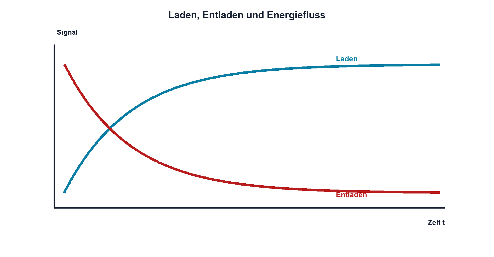

# 05.2 – Laden, Entladen und gespeicherte Energie

[← Zurück](01-physikalischer-aufbau-und-kapazitaet.md) · [Modulübersicht](README.md) · [Kursübersicht](../README.md) · [Weiter →](03-rc-zeitkonstante.md)

## Lernziele

Nach dieser Lektion kannst du:

- Strom und Spannung beim Laden und Entladen erklären
- die Feldenergie berechnen
- sichere Entladepfade dimensionieren

## Warum ist das wichtig?

Beim Einschalten kann ein ungeladener Kondensator kurzzeitig viel Strom aufnehmen. Beim Ausschalten kann er eine Schaltung weiter speisen. Diese beiden Vorgänge erklären Einschaltstrom, Reset-Verzögerung, Funken und scheinbar «weiterlebende» Baugruppen.

Entscheidend ist die Energie: Auch wenn kein stationärer Strom fliesst, kann ein geladener Kondensator Arbeit verrichten. Deshalb gehört zu jeder sicheren Schaltung ein definierter Entlade- oder Bleederpfad, wenn gefährliche oder störende Restladung möglich ist.

## Theorie

### Strom folgt der Spannungsänderung

Der Zusammenhang lautet `iC = C·duC/dt`. `duC/dt` beschreibt die Spannungsänderung pro Zeit. Eine sprunghafte Änderung der Kondensatorspannung würde unendlich grossen Strom verlangen und ist in einer realen Schaltung unmöglich.

Beim Laden fliesst Energie aus der Quelle in das Feld. Beim Entladen fliesst Strom in umgekehrter Richtung zur Last. Die gespeicherte Energie ist `EC = 1/2·C·U²`.

| Zeichen | Bedeutung | Einheit |
|---|---|---|
| `iC` | momentaner Kondensatorstrom | A |
| `uC` | momentane Kondensatorspannung | V |
| `EC` | gespeicherte Feldenergie | J |
| `duC/dt` | Änderungsgeschwindigkeit der Spannung | V/s |

### Energie steigt quadratisch

Doppelte Spannung bedeutet bei gleicher Kapazität vierfache Energie. Deshalb erhöht eine Spannungssteigerung die Beanspruchung und das Gefahrenpotential stärker als eine gleich grosse Kapazitätssteigerung.

### Definierte Entladung

Ein Entladewiderstand begrenzt den Strom und sorgt für eine berechenbare Restspannung. Seine Leistung ist direkt nach dem Abschalten am grössten. Widerstand, Zeit, Spannungsfestigkeit und Energiebelastung werden gemeinsam geprüft.

## Anschauliches Beispiel

Ein Schwungrad speichert Energie, obwohl es im Moment keine neue Antriebsleistung erhält. Je schneller es dreht, desto mehr Energie steckt darin. Der Kondensator ist kein mechanisches Schwungrad, doch die Analogie macht verständlich, warum ein ausgeschaltetes System noch Energie besitzen kann.

## Berechnungsbeispiel

Ein Kondensator von 470 µF liegt an 24 V. `EC = 0,5·470 µF·(24 V)² ≈ 0,135 J`. Bei 48 V wären es etwa 0,542 J, also viermal so viel. Vor Arbeiten muss die Restspannung gemessen und sicher entladen werden.

## Praxisbezug

Lade einen Kleinspannungskondensator über einen bekannten Widerstand und beobachte Stromrichtung und Spannung. Entlade niemals durch Kurzschluss. Protokolliere Anfangsspannung, Widerstand, erwartete Energie und Abbruchkriterium.

## 🔗 Hardware ↔ Firmware

Nach Abschalten einer Peripherieversorgung kann ein Kondensator den MCU-Eingang über Schutzstrukturen rückspeisen. Firmware sieht dann undefinierte Pegel oder startet unvollständig neu. Ein Messvergleich von Versorgung, Reset und Pinspannung trennt elektrische Nachspeisung von Programmlogik.

## Merksatz

> Kondensatorspannung kann nicht sprungartig ändern, und die gespeicherte Energie wächst mit dem Quadrat der Spannung.

## Häufige Fehler und Missverständnisse

- Restenergie unterschätzen
- beim Entladen keinen Strombegrenzungswiderstand verwenden
- Momentanstrom mit gespeichertem Strom verwechseln
- Rückspeisung über Signalpins übersehen

## Zusammenfassung

Laden und Entladen sind Energieübertragungen. Der Strom ist proportional zur Änderungsgeschwindigkeit der Spannung; die Feldenergie hängt quadratisch von U ab. Sichere Systeme besitzen einen definierten Entladeweg.

## Übungsfragen

1. Warum bleibt uC beim Umschalten zunächst stetig?
2. Wie viel Energie speichern 1000 µF bei 12 V?
3. Wann ist ein Bleederwiderstand nötig?
4. Wie kann ein Signalpin eine abgeschaltete Baugruppe rückspeisen?

Weitere Aufgaben: [Übungen zu Modul 05](../uebungen/modul-05.md).

## Bezug Bildungsplan 2026

- Handlungskompetenzen: `a3`, `b1-LK02–03`, `b1-LK06`, `b4-LK03–09`
- Nachweise: Energie- und Entladerechnung sowie sichere Messung; [Kompetenzmatrix](../bildungsplan-2026/kompetenzmatrix.md)
