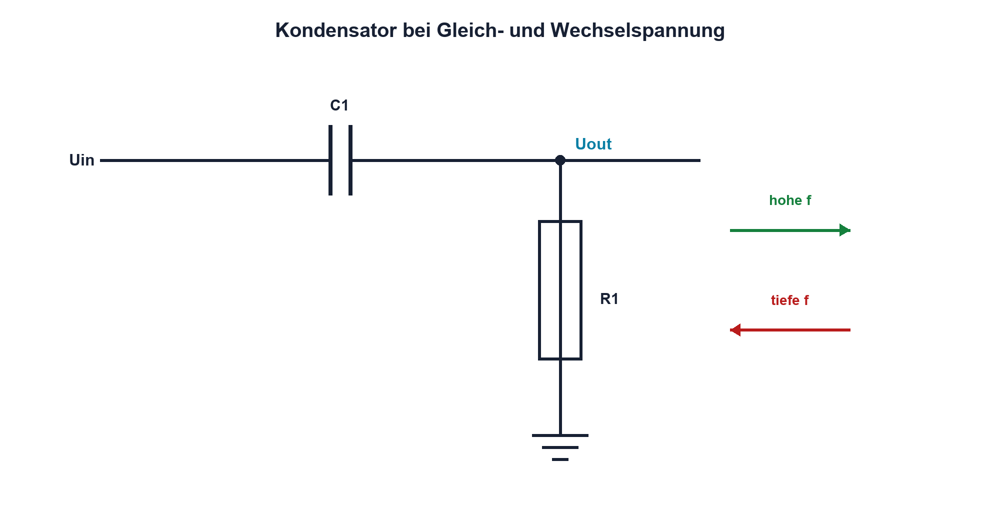

# 05.4 – Kondensatoren an Gleich- und Wechselspannung

[← Zurück](03-rc-zeitkonstante.md) · [Modulübersicht](README.md) · [Kursübersicht](../README.md) · [Weiter →](05-kondensatorbauarten-und-auswahl.md)

## Lernziele

Nach dieser Lektion kannst du:

- das Verhalten bei Gleich- und Wechselspannung unterscheiden
- kapazitiven Blindwiderstand berechnen
- Phasenlage von Strom und Spannung erklären

## Einleitung

Die Aussage «ein Kondensator sperrt Gleichstrom und lässt Wechselstrom durch» ist nur eine Kurzfassung. Beim Einschalten fliesst auch an Gleichspannung Strom, und bei Wechselspannung hängt die Wirkung stark von Frequenz und Kapazität ab.

Wer den Strom als Reaktion auf Spannungsänderung versteht, kann Kopplung, Entkopplung und Filterwirkung korrekt beurteilen.

<!-- context-expansion-2026 -->
Kondensatoren speichern Ladung in einem elektrischen Feld. Dadurch verbinden sie Gleichstromverhalten, zeitliche Vorgänge und hochfrequente Strompfade. Ihre Aufgabe wird erst verständlich, wenn neben dem Kapazitätswert auch Polarität, ESR, ESL und der reale Einbauort betrachtet werden.

Beim Thema **Kondensatoren an Gleich- und Wechselspannung** geht es deshalb nicht nur um eine einzelne Formel oder Definition. Entscheidend ist, wie sich das Prinzip im Schema erkennen, im Datenblatt beurteilen, im Aufbau messen und bei einer Abweichung systematisch überprüfen lässt.

## Theorie

<!-- theory-expansion-2026 -->
### Einordnung und Grundidee

Das ideale Kondensatormodell erklärt Ladung und Zeitverhalten. Für eine reale Baugruppe werden zusätzlich Serienwiderstand, Serieninduktivität, Leckstrom, Spannungsabhängigkeit und Polarität berücksichtigt. Je höher die Frequenz, desto wichtiger werden Anschluss- und Leiterbahngeometrie.

### Gleichspannung

Nach dem Einschwingvorgang ist uC konstant; damit ist `duC/dt = 0` und im idealen Modell fliesst kein Strom. Beim Ein- und Ausschalten gilt diese Vereinfachung nicht.

### Wechselspannung und Blindwiderstand

Bei einer Sinusspannung ändert sich uC fortlaufend. Der kapazitive Blindwiderstand ist `XC = 1/(2πfC)`.

| Zeichen | Bedeutung | Einheit |
|---|---|---|
| `XC` | Betrag des kapazitiven Blindwiderstands | Ω |
| `f` | Frequenz | Hz |
| `π` | Kreiszahl | – |

Mit steigender Frequenz oder Kapazität sinkt XC. Beim idealen Kondensator eilt der Strom der Spannung um 90° voraus. Es wird periodisch Energie gespeichert und zur Quelle zurückgegeben; ein idealer Blindwiderstand setzt im Mittel keine Wirkleistung um.

### Gleichanteil und Wechselanteil

Ein Koppelkondensator kann einen Gleichanteil blockieren und einen ausreichend schnellen Wechselanteil übertragen. Zusammen mit den umgebenden Widerständen entsteht immer ein frequenzabhängiges Netzwerk.

## Anwendungsfall

Typische elektronische Anwendungen und Baugruppen für dieses Thema sind:

- DC-Sperre und AC-Kopplung
- Frequenzabhängige Spannungsteiler
- Glättung und Signalübertragung

In einer konkreten Entwicklung wird nicht nur geprüft, ob die gewünschte Funktion grundsätzlich entsteht. Ebenso wichtig sind zulässige Grenzwerte, Toleranzen, Temperatur, Messbarkeit und das Verhalten bei Unterbruch, Kurzschluss oder falscher Ansteuerung.

## Anschauliches Beispiel

Eine elastische Membran in einem Rohr blockiert einen dauerhaften Flüssigkeitsstrom, kann aber schnelle Hin-und-her-Bewegungen übertragen. Je langsamer die Bewegung, desto weniger wird übertragen. Die Membran transportiert dabei keine Flüssigkeit dauerhaft durch sich hindurch – ähnlich bleibt das Dielektrikum isolierend.

## Berechnungsbeispiel

Für `C = 100 nF` und `f = 1 kHz` gilt `XC ≈ 1/(2π·1000·100 nF) ≈ 1,59 kΩ`. Bei 10 kHz sinkt XC auf ungefähr 159 Ω. Das Ergebnis zeigt die starke Frequenzabhängigkeit.

## Praxisbezug

Speise einen sicheren Kondensator über einen Serienwiderstand mit Sinus unterschiedlicher Frequenz. Miss Spannungen über R und C. Die Spannung über R ist proportional zum Strom und macht die Phasenbeziehung sichtbar.

## 🔗 Hardware ↔ Firmware

PWM enthält einen Gleichanteil und viele Frequenzanteile. Ein Kondensator reagiert auf die Flanken und Oberwellen, nicht nur auf die PWM-Grundfrequenz. Firmware beeinflusst Frequenz und Tastgrad; Hardware bestimmt Stromspitzen und Filterung.

## Merksatz

> Ein Kondensator reagiert auf Spannungsänderung; sein Blindwiderstand sinkt mit Frequenz und Kapazität.

## Häufige Fehler und Missverständnisse

- den Einschaltvorgang bei Gleichspannung ignorieren
- XC ohne Frequenzangabe nennen
- Phasenverschiebung mit Zeitverzögerung verwechseln
- Kondensator als verlustfrei annehmen

## Zusammenfassung

Im Gleichstrom-Endzustand sperrt der ideale Kondensator. Bei Wechselspannung bestimmt XC den Strom; ideal eilt dieser um 90° voraus. Reale Schaltungen kombinieren Kondensator und Widerstände zu frequenzabhängigen Netzwerken.

## Übungsfragen

1. Wie ändert sich XC bei zehnfacher Frequenz?
2. Warum fliesst beim Einschalten Gleichstrom?
3. Welche Phase hat der ideale Kondensatorstrom?
4. Welche Anteile einer PWM belasten den Kondensator besonders?

Weitere Aufgaben: [Übungen zu Modul 05](../uebungen/modul-05.md).

## Bezug Bildungsplan 2026

- Handlungskompetenzen: `a3`, `b1-LK02–03`, `b1-LK06`, `b4-LK07–09`
- Nachweise: Blindwiderstandsrechnung und Phasenmessung; [Kompetenzmatrix](../bildungsplan-2026/kompetenzmatrix.md)
