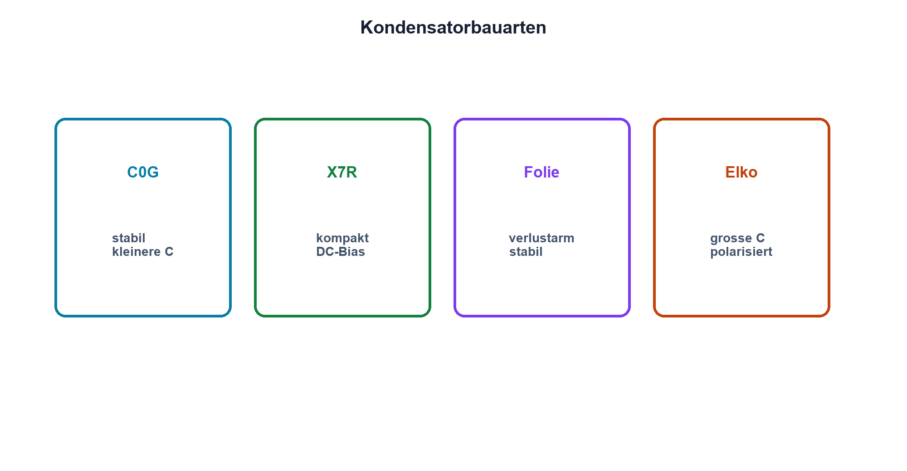

# 05.5 – Kondensatorbauarten und Auswahl

[← Zurück](04-kondensatoren-an-gleich-und-wechselspannung.md) · [Modulübersicht](README.md) · [Kursübersicht](../README.md) · [Weiter →](06-esr-esl-und-reale-kondensatoren.md)

## Lernziele

Nach dieser Lektion kannst du:

- Keramik Folie und Elektrolyt vergleichen
- Spannungs- Temperatur- und Frequenzeinflüsse prüfen
- einen Kondensator datenblattgestützt auswählen

## Warum ist das wichtig?

Gleiche Kapazität bedeutet nicht gleiches Verhalten. Keramik-, Folien- und Elektrolytkondensatoren unterscheiden sich bei Polarität, Toleranz, Verlusten, Baugrösse und Alterung. Besonders Mehrschicht-Keramikkondensatoren können unter Gleichspannung deutlich Kapazität verlieren.

## Theorie

### Bauarten

Keramikkondensatoren sind klein und für hohe Frequenzen geeignet. C0G/NP0 ist stabil, aber bei hoher Kapazität gross oder teuer. X7R und ähnliche Klassen bieten mehr Kapazität, zeigen jedoch Spannungs-, Temperatur- und Alterungseinflüsse. Folienkondensatoren sind oft verlustarm und stabil. Aluminium-Elektrolytkondensatoren bieten grosse Kapazität, sind meist polarisiert und besitzen begrenzte Lebensdauer. Tantalvarianten verlangen besonders sorgfältige Spannungs- und Strombegrenzung.

### Auswahlkriterien

Zu prüfen sind effektive Kapazität im Arbeitspunkt, Toleranz, Nennspannung mit Reserve, Temperaturbereich, ESR, zulässiger Ripple-Strom, Lebensdauer, Bauform und Sicherheitsklasse. Bei Netz- oder Schutzanwendungen sind ausdrücklich dafür zugelassene Typen erforderlich; dieser Kursversuch bleibt bei Kleinspannung.

### Polarität und Kennzeichnung

Polarisierte Kondensatoren dürfen nicht beliebig verpolt werden. Die Markierung muss für die konkrete Bauart gelesen werden; optische Gewohnheit ersetzt kein Datenblatt.

## Anschauliches Beispiel

Verschiedene Wasserbehälter können dasselbe Volumen besitzen, aber einer ist druckfest, einer schnell befüllbar und einer nur aufrecht verwendbar. Die Zahl «10 Liter» reicht ebenso wenig zur Auswahl wie «10 µF» bei einem Kondensator.

## Berechnungsbeispiel

Benötigt werden mindestens 8 µF effektiv bei 10 V Gleichspannung. Ein nomineller 10-µF-X7R, der laut Herstellerkurve bei 10 V noch 65 % besitzt, liefert nur etwa 6,5 µF und ist ungeeignet. Ein grösserer Wert, anderes Gehäuse oder anderes Dielektrikum muss geprüft werden.

## Praxisbezug

Vergleiche für drei konkrete Bauteile Herstellerdaten zu Kapazität, DC-Bias, ESR und Temperatur. Dokumentiere Teilenummer und Kurvenfundstelle. Keine typischen Werte einer Baureihe auf ein anderes Gehäuse übertragen.

## 🔗 Hardware ↔ Firmware

Startprobleme können von einer unter Gleichspannung stark reduzierten Stützkondensatorkapazität stammen. Firmwareänderungen an Reset-Zeit oder Lastprofil können Symptome verschieben, ersetzen aber keine korrekte Bauteilauswahl.

## Merksatz

> Der Nennwert ist nur der Anfang; entscheidend ist die wirksame Kapazität im realen Arbeitspunkt.

## Häufige Fehler und Missverständnisse

- DC-Bias bei Keramik ignorieren
- polarisierte Bauarten verpolen
- Ripple-Strom und Lebensdauer übersehen
- Sicherheitsklassen durch Standardtypen ersetzen

## Zusammenfassung

Bauart und Dielektrikum bestimmen reale Eigenschaften. Eine professionelle Auswahl prüft den Arbeitspunkt und alle Grenzwerte anhand des konkreten Datenblatts.

## Übungsfragen

1. Warum kann 10 µF nominell weniger als 8 µF wirksam bedeuten?
2. Welche Bauart ist häufig besonders stabil?
3. Was begrenzt die Lebensdauer eines Elektrolytkondensators?
4. Warum reicht die Nennspannung allein nicht?

Weitere Aufgaben: [Übungen zu Modul 05](../uebungen/modul-05.md).

## Bezug Bildungsplan 2026

- Handlungskompetenzen: `a3`, `b1-LK01–04`, `b1-LK07`, `b5-LK01`
- Nachweise: dokumentierter Datenblattvergleich und Arbeitspunktprüfung; [Kompetenzmatrix](../bildungsplan-2026/kompetenzmatrix.md)
