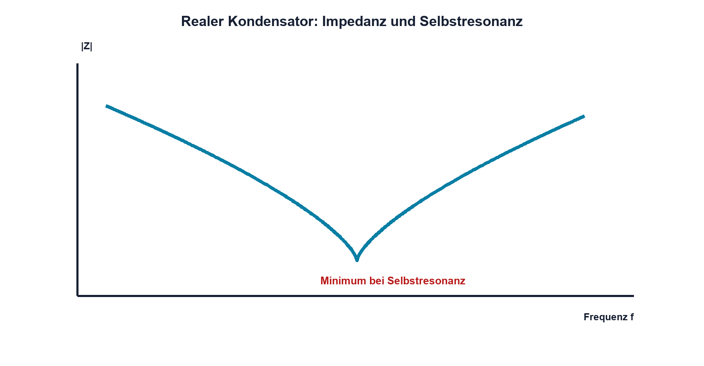

# 05.6 – ESR, ESL und reale Kondensatoren

[← Zurück](05-kondensatorbauarten-und-auswahl.md) · [Modulübersicht](README.md) · [Kursübersicht](../README.md) · [Weiter →](07-entkopplung-und-abblockung.md)

## Lernziele

Nach dieser Lektion kannst du:

- ESR und ESL im Ersatzmodell erklären
- Selbstresonanz und Ripple-Erwärmung beurteilen
- Messabweichungen realer Kondensatoren deuten

## Warum ist das wichtig?

Ein realer Kondensator ist bei hoher Frequenz nicht nur C. Anschluss- und Aufbauinduktivität sowie Verluste verändern seine Impedanz. Deshalb kann ein grosser Kondensator schnelle Stromspitzen schlechter abfangen als ein kleiner, günstig platzierter Typ.

## Theorie

### Ersatzmodell

Das einfache Serienmodell enthält ideale Kapazität C, äquivalenten Serienwiderstand ESR und äquivalente Serieninduktivität ESL. Ein Parallelwiderstand modelliert Leckstrom.

ESR setzt Ripple-Strom in Wärme um: `PESR = Irms²·ESR`. ESL verursacht bei schneller Stromänderung eine Spannung `uESL = ESL·di/dt`.

| Zeichen | Bedeutung | Einheit |
|---|---|---|
| `ESR` | äquivalenter Serienwiderstand | Ω |
| `ESL` | äquivalente Serieninduktivität | H |
| `Irms` | Effektivwert des Ripple-Stroms | A |

### Selbstresonanz

Unterhalb der Selbstresonanz dominiert C und die Impedanz sinkt. Am Minimum kompensieren sich kapazitiver und induktiver Anteil. Oberhalb dominiert ESL; das Bauteil wirkt zunehmend induktiv.

### Messbedingungen

Ein LCR-Meter misst bei definierter Frequenz und Signalhöhe. Kapazitäts-, ESR- und Impedanzwerte ohne Messbedingung sind unvollständig. Ein Oszilloskop zeigt die Wirkung im realen Strompfad, nicht direkt einen einzelnen Modellparameter.

## Anschauliches Beispiel

Ein Wasserspeicher mit engem Zulauf besitzt zwar grosses Volumen, kann aber einen sehr kurzen Bedarfspuls nicht liefern. ESR entspricht einer Reibung im Zulauf, ESL der Trägheit des bewegten Wassers. Für schnelle Vorgänge muss der Weg kurz und breit sein.

## Berechnungsbeispiel

Ein Kondensator trägt 0,8 A RMS Ripple und besitzt 80 mΩ ESR. `PESR = 0,8²·0,08 Ω = 51,2 mW`. Diese innere Erwärmung beeinflusst Lebensdauer und muss gegen Ripple- und Temperaturangaben geprüft werden.

## Praxisbezug

Vergleiche Kondensatoren mit LCR-Meter bei mehreren verfügbaren Frequenzen oder untersuche den Ripple in einer freigegebenen Kleinspannungsschaltung. Anschlusslänge und Masseführung werden dokumentiert, weil sie ESL und Messbild beeinflussen.

## 🔗 Hardware ↔ Firmware

Schnelle GPIO- oder PWM-Flanken besitzen hohe di/dt-Anteile. Firmware kann Flankenrate, Schaltfrequenz oder gleichzeitige Ausgänge beeinflussen; ESR, ESL und Platzierung bestimmen die resultierenden Versorgungsspitzen.

## Merksatz

> Oberhalb seiner Selbstresonanz verhält sich ein realer Kondensator zunehmend wie eine Induktivität.

## Häufige Fehler und Missverständnisse

- Kapazitätswert ohne Messfrequenz vergleichen
- Ripple-Strom mit Gleichstrom verwechseln
- Anschlussinduktivität ignorieren
- ESR pauschal als unerwünscht betrachten

## Zusammenfassung

ESR erzeugt Verluste, ESL begrenzt schnelle Stromlieferung und beide bestimmen zusammen mit C die Selbstresonanz. Das reale Impedanzverhalten ist frequenz- und aufbauabhängig.

## Übungsfragen

1. Wie entsteht ESR-Erwärmung?
2. Was geschieht oberhalb der Selbstresonanz?
3. Warum sind kurze Anschlüsse wichtig?
4. Welche Firmwareeinstellung kann di/dt verändern?

Weitere Aufgaben: [Übungen zu Modul 05](../uebungen/modul-05.md).

## Bezug Bildungsplan 2026

- Handlungskompetenzen: `a3`, `b1-LK01–04`, `b4-LK02`, `b4-LK06–09`
- Nachweise: Ersatzmodell, Verlustrechnung und frequenzabhängige Messung; [Kompetenzmatrix](../bildungsplan-2026/kompetenzmatrix.md)
