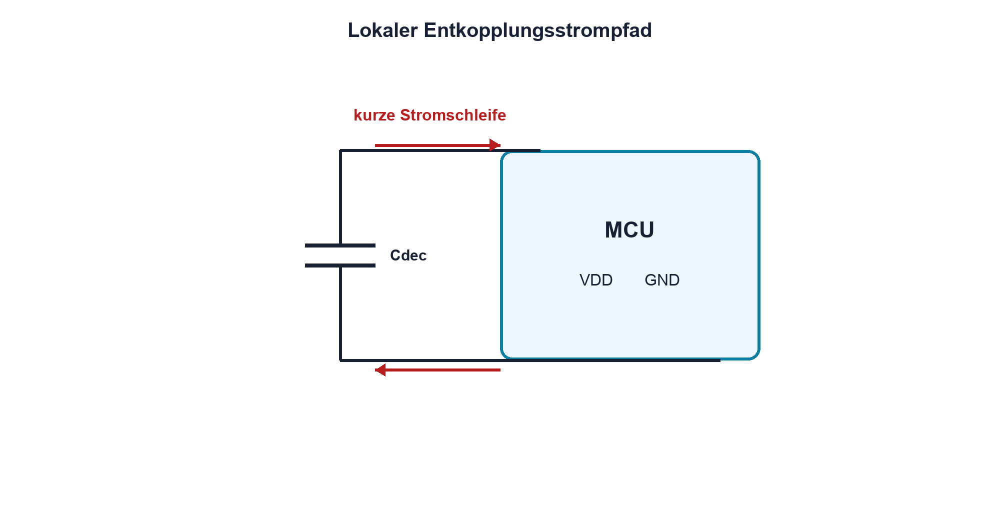

# 05.7 – Entkopplung und Abblockung

[← Zurück](06-esr-esl-und-reale-kondensatoren.md) · [Modulübersicht](README.md) · [Kursübersicht](../README.md) · [Weiter →](../06-spulen-elektromagnetismus/README.md)

## Lernziele

Nach dieser Lektion kannst du:

- lokale Entkopplungsstrompfade erklären
- Kondensatoren platzierungs- und frequenzgerecht auswählen
- Versorgungseinbrüche gemeinsam mit MCU-Aktivität untersuchen

## Einleitung

Digitale ICs ziehen beim Umschalten kurze Stromimpulse. Die entfernte Versorgung kann wegen Leiterbahninduktivität nicht augenblicklich liefern. Ein lokaler Kondensator stellt den Strom über eine kleine Schleife bereit und hält die Versorgung am IC stabil.

<!-- context-expansion-2026 -->
Kondensatoren speichern Ladung in einem elektrischen Feld. Dadurch verbinden sie Gleichstromverhalten, zeitliche Vorgänge und hochfrequente Strompfade. Ihre Aufgabe wird erst verständlich, wenn neben dem Kapazitätswert auch Polarität, ESR, ESL und der reale Einbauort betrachtet werden.

Beim Thema **Entkopplung und Abblockung** geht es deshalb nicht nur um eine einzelne Formel oder Definition. Entscheidend ist, wie sich das Prinzip im Schema erkennen, im Datenblatt beurteilen, im Aufbau messen und bei einer Abweichung systematisch überprüfen lässt.

## Theorie

<!-- theory-expansion-2026 -->
### Einordnung und Grundidee

Das ideale Kondensatormodell erklärt Ladung und Zeitverhalten. Für eine reale Baugruppe werden zusätzlich Serienwiderstand, Serieninduktivität, Leckstrom, Spannungsabhängigkeit und Polarität berücksichtigt. Je höher die Frequenz, desto wichtiger werden Anschluss- und Leiterbahngeometrie.

### Stromschleife statt Dekoration

Ein Abblockkondensator gehört zwischen Versorgungspin und zugehörigen Massepin, möglichst mit kurzer, breiter Verbindung. Entscheidend ist die Fläche der Hochfrequenz-Stromschleife, nicht nur die geometrische Nähe zum Gehäuse.

### Mehrere Frequenzbereiche

Kleine Keramikkondensatoren besitzen geringe ESL und bedienen schnelle Anteile. Grössere lokale oder zentrale Kondensatoren stützen langsamere Laständerungen. Mehrere Werte werden nicht nach einer universellen Rezeptzahl verteilt, sondern nach IC-Datenblatt, Stromprofil, Layout und Impedanzziel.

### Ladungsabschätzung

Für einen Lastsprung kann zunächst `ΔU = ΔI·Δt/C` abgeschätzt werden. `ΔI` ist die Stromänderung, `Δt` die Zeit, bis die übrige Versorgung übernimmt, und `ΔU` der erlaubte Spannungseinbruch. ESR und ESL erzeugen zusätzliche Sprünge.

### Messen am richtigen Ort

Ripple wird direkt an den Versorgungspins mit sehr kleiner Tastkopfschleife gemessen. Eine lange Masseleitung zeigt zusätzliche induzierte Spannung und kann das Problem grösser erscheinen lassen.

## Anwendungsfall

Typische elektronische Anwendungen und Baugruppen für dieses Thema sind:

- Versorgung von MCU, FPGA und Sensor
- Stabilisierung lokaler IC-Spannungen
- Schliessen kurzer hochfrequenter Laststromschleifen

In einer konkreten Entwicklung wird nicht nur geprüft, ob die gewünschte Funktion grundsätzlich entsteht. Ebenso wichtig sind zulässige Grenzwerte, Toleranzen, Temperatur, Messbarkeit und das Verhalten bei Unterbruch, Kurzschluss oder falscher Ansteuerung.

## Anschauliches Beispiel

Ein kleiner Wasserspeicher direkt neben einer schnell öffnenden Maschine liefert den ersten Schwall, während die lange Hauptleitung nachzieht. Ein grosser Tank weit entfernt ersetzt den kurzen lokalen Weg nicht vollständig.

## Berechnungsbeispiel

Ein IC benötigt für 2 µs zusätzlich 50 mA; höchstens 100 mV Einbruch sind erlaubt. Ideal wären `C = ΔI·Δt/ΔU = 50 mA·2 µs/0,1 V = 1 µF`. Wegen Toleranz, DC-Bias, ESR und ESL wird der konkrete Aufbau mit Reserve und Datenblatt geprüft.

## Praxisbezug

Vergleiche Versorgungspitzen mit korrekt platziertem Kondensator und mit absichtlich verlängerter Verbindung an einer ungefährlichen Testschaltung. Tastkopfanschluss, Bandbreite und Lastzustand müssen identisch bleiben.

## 🔗 Hardware ↔ Firmware

Firmware kann mehrere Ausgänge gleichzeitig umschalten, CPU-Takt oder Funk aktivieren und dadurch Lastsprünge erzeugen. Ein Trigger auf GPIO-Ereignis und gleichzeitige Versorgungsspannungsmessung verbindet Codeereignis mit realem Ripple.

## Merksatz

> Entkopplung ist ein kurzer lokaler Strompfad, nicht bloss ein Kapazitätswert im Schema.

## Häufige Fehler und Missverständnisse

- Kondensator weit vom Massepin platzieren
- lange Oszilloskop-Masseleitung verwenden
- DC-Bias ignorieren
- jeden Versorgungseinbruch als Firmwarefehler deuten

## Zusammenfassung

Gute Entkopplung verbindet passende Kapazität, geringe ESR/ESL und eine kleine Stromschleife. Lastprofil, Layout und Messmethode entscheiden gemeinsam über die Wirksamkeit.

## Übungsfragen

1. Warum ist Schleifenfläche wichtig?
2. Was beschreibt ΔU = ΔI·Δt/C?
3. Welche Stromanteile übernimmt ein kleiner Keramikkondensator?
4. Wie kann Firmware einen Lastsprung reproduzierbar auslösen?

Weitere Aufgaben: [Übungen zu Modul 05](../uebungen/modul-05.md).

## Bezug Bildungsplan 2026

- Handlungskompetenzen: `a3`, `b1-LK01–04`, `b1-LK06`, `b2-LK03–04`, `b4-LK01–10`, `c1–c2`
- Nachweise: Entkopplungsdimensionierung und Ripple-Messplan; [Kompetenzmatrix](../bildungsplan-2026/kompetenzmatrix.md)
