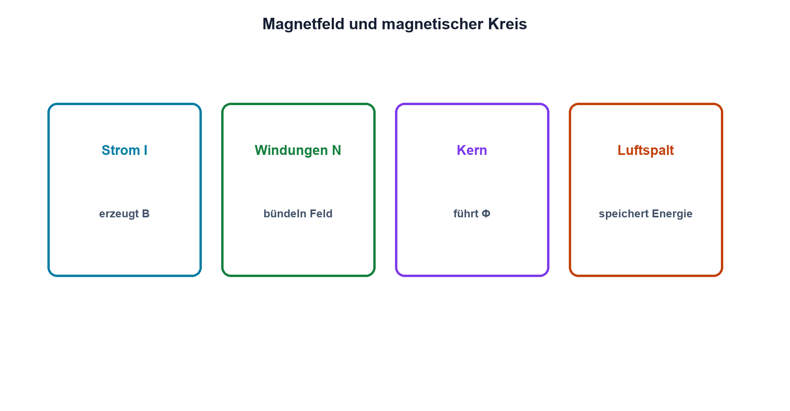

# 06.1 – Magnetismus und Elektromagnetismus

[← Zurück](README.md) · [Modulübersicht](README.md) · [Kursübersicht](../README.md) · [Weiter →](02-induktivitaet-und-stromaenderung.md)

## Lernziele

Nach dieser Lektion kannst du:

- Magnetfeld und magnetischen Fluss anschaulich erklären
- die Feldrichtung einer stromdurchflossenen Spule bestimmen
- Kernmaterial und Luftspalt funktional einordnen

## Einleitung

Strom erzeugt ein Magnetfeld. Diese Verbindung ermöglicht Relais, Motoren, Transformatoren, Stromsensoren und Schaltregler. Magnetismus ist deshalb kein isoliertes Physikthema, sondern ein realer Energie- und Signalpfad in vielen Baugruppen.

Feldlinien sind ein Modell zur Darstellung von Richtung und Dichte. Sie sind keine sichtbaren Drähte. Eine gute Vorstellung verbindet Stromrichtung, Wicklung, Kern und den geschlossenen magnetischen Kreis.

<!-- context-expansion-2026 -->
Spulen und Transformatoren speichern oder übertragen Energie über Magnetfelder. Weil sich der Spulenstrom nicht sprunghaft ändern kann, entstehen beim Ein- und Ausschalten charakteristische Spannungen. Kernmaterial, Sättigung und Wicklungswiderstand machen aus dem idealen Symbol ein reales Bauteil.

Beim Thema **Magnetismus und Elektromagnetismus** geht es deshalb nicht nur um eine einzelne Formel oder Definition. Entscheidend ist, wie sich das Prinzip im Schema erkennen, im Datenblatt beurteilen, im Aufbau messen und bei einer Abweichung systematisch überprüfen lässt.

## Theorie

<!-- theory-expansion-2026 -->
### Einordnung und Grundidee

Das ideale Induktivitätsgesetz beschreibt die Spannung bei einer Stromänderung. Reale Spulen ergänzen Wicklungswiderstand, Kernverluste, parasitäre Kapazität und Sättigung. Der Strompfad muss sowohl während der Energieaufnahme als auch während der Energieabgabe geschlossen sein.

### Feld um Leiter und Spule

Um einen stromdurchflossenen Leiter verläuft ein Magnetfeld. In einer Spule addieren sich die Felder der Windungen. Die Rechte-Hand-Regel verbindet technische Stromrichtung mit Feldrichtung und Nordpol.

Die magnetische Flussdichte B beschreibt die Feldwirkung pro Fläche und wird in Tesla angegeben. Der magnetische Fluss `Φ = ∫B·dA` fasst den Fluss durch eine Fläche zusammen und wird in Weber angegeben.

| Zeichen | Bedeutung | Einheit |
|---|---|---|
| `B` | magnetische Flussdichte | T (Tesla) |
| `Φ` | magnetischer Fluss | Wb (Weber) |

### Kern und magnetischer Kreis

Ferromagnetische Kerne führen den Fluss wesentlich besser als Luft, besitzen aber Verluste und Sättigung. Ein Luftspalt erhöht den magnetischen Widerstand, speichert einen grossen Teil der Feldenergie und macht das Verhalten kontrollierbarer.

### Kräfte

Ein Magnetfeld kann auf bewegte Ladungen, Leiter und ferromagnetische Teile Kräfte ausüben. Im Relais zieht diese Kraft den Anker an; bei Motoren erzeugt sie Drehmoment.

## Anwendungsfall

Typische elektronische Anwendungen und Baugruppen für dieses Thema sind:

- Elektromagnete, Relais und Motoren
- Transformatoren und induktive Sensoren
- Energiespeicher in Schaltreglern

In einer konkreten Entwicklung wird nicht nur geprüft, ob die gewünschte Funktion grundsätzlich entsteht. Ebenso wichtig sind zulässige Grenzwerte, Toleranzen, Temperatur, Messbarkeit und das Verhalten bei Unterbruch, Kurzschluss oder falscher Ansteuerung.

## Anschauliches Beispiel

Ein magnetischer Kreis lässt sich vorsichtig mit einem geschlossenen Wasserweg vergleichen: Der Strom in der Wicklung wirkt wie eine Pumpe, der Kern wie eine gut leitende Rohrstrecke und der Luftspalt wie eine enge Stelle. Anders als Wasser wird magnetischer Fluss jedoch nicht als Stoff transportiert.

## Berechnungsbeispiel

Verdoppelt man bei unverändertem, nicht gesättigtem Kern den Spulenstrom, steigt die magnetisierende Wirkung näherungsweise mit. Die genaue Flussdichte erfordert Geometrie, Windungszahl und Kernkennlinie; ohne diese Daten wäre ein Zahlenwert erfunden.

## Praxisbezug

Untersuche mit Kleinspannung die Anziehung eines Eisenankers bei unterschiedlichem Spulenstrom. Strombegrenzung und Spulentemperatur werden überwacht. Ein Permanentmagnet darf nicht unkontrolliert an empfindliche Geräte gebracht werden.

## 🔗 Hardware ↔ Firmware

Firmware schaltet den Treiberstrom, das Magnetfeld entsteht jedoch in der realen Spule. PWM verändert Mittelstrom und Ripple. Messbar sind Spulenstrom, Treiberspannung und mechanische Reaktion; ein gesetztes GPIO-Bit beweist noch keine Magnetwirkung.

## Merksatz

> Elektrischer Strom erzeugt ein Magnetfeld; Kern, Windungen und Luftspalt formen seinen Weg.

## Häufige Fehler und Missverständnisse

- Feldlinien als materielle Fäden deuten
- Kern ohne Sättigungsgrenze betrachten
- Stromrichtung und Elektronenbewegung verwechseln
- mechanische Wirkung allein aus einem Firmwarezustand ableiten

## Zusammenfassung

Leiterstrom erzeugt ein zirkulierendes Feld, eine Spule bündelt es. Kern und Luftspalt bestimmen Flussführung, Energie und Grenzen. Diese Vorstellung bereitet Induktivität und Schaltvorgänge vor.

## Übungsfragen

1. Wie bestimmt die Rechte-Hand-Regel die Feldrichtung?
2. Worin unterscheiden sich B und Φ?
3. Warum wird ein Luftspalt eingesetzt?
4. Welche Messung beweist die reale Relaisansteuerung?

Weitere Aufgaben: [Übungen zu Modul 06](../uebungen/modul-06.md).

## Bezug Bildungsplan 2026

- Handlungskompetenzen: `a3`, `b1-LK02–03`, `b1-LK06`, `b4-LK07`
- Nachweise: Feldrichtungsanalyse und strombegrenzter Magnetversuch; [Kompetenzmatrix](../bildungsplan-2026/kompetenzmatrix.md)
