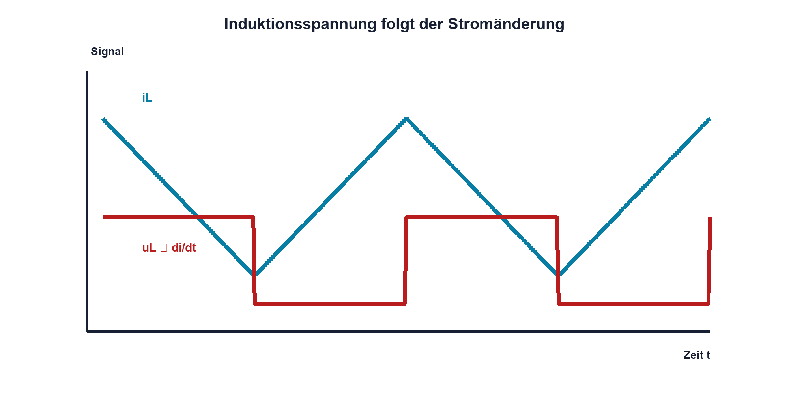

# 06.2 – Induktivität und Stromänderung

[← Zurück](01-magnetismus-und-elektromagnetismus.md) · [Modulübersicht](README.md) · [Kursübersicht](../README.md) · [Weiter →](03-ein-und-ausschaltvorgaenge.md)

## Lernziele

Nach dieser Lektion kannst du:

- Induktivität als Widerstand gegen schnelle Stromänderung erklären
- Induktionsspannung berechnen
- Windungszahl und Kern als Einflussgrössen benennen

## Einleitung

Eine Spule reagiert nicht auf Strom an sich, sondern auf dessen Änderung. Beim Einschalten verzögert sie den Stromanstieg; beim Ausschalten erzeugt sie die nötige Spannung, um den Strom weiterzuführen. Dieses Verhalten verursacht sowohl nützliche Energieübertragung als auch gefährliche Spannungsspitzen.

<!-- context-expansion-2026 -->
Spulen und Transformatoren speichern oder übertragen Energie über Magnetfelder. Weil sich der Spulenstrom nicht sprunghaft ändern kann, entstehen beim Ein- und Ausschalten charakteristische Spannungen. Kernmaterial, Sättigung und Wicklungswiderstand machen aus dem idealen Symbol ein reales Bauteil.

Beim Thema **Induktivität und Stromänderung** geht es deshalb nicht nur um eine einzelne Formel oder Definition. Entscheidend ist, wie sich das Prinzip im Schema erkennen, im Datenblatt beurteilen, im Aufbau messen und bei einer Abweichung systematisch überprüfen lässt.

## Theorie

<!-- theory-expansion-2026 -->
### Einordnung und Grundidee

Das ideale Induktivitätsgesetz beschreibt die Spannung bei einer Stromänderung. Reale Spulen ergänzen Wicklungswiderstand, Kernverluste, parasitäre Kapazität und Sättigung. Der Strompfad muss sowohl während der Energieaufnahme als auch während der Energieabgabe geschlossen sein.

**Eine Spule besitzt zwei Wicklungsanschlüsse und wird mit `L` bezeichnet.** Das Schaltzeichen zeigt mehrere Windungen; bei gekoppelten Spulen ergänzt ein Kern- und Punktsymbol die magnetische Zuordnung. Eine einzelne ideale Spule hat keine feste Polarität, doch der gewählte Strom- und Spannungspfeil bestimmt das Vorzeichen in der Gleichung.

### Induktionsgesetz

Für eine idealisierte Spule gilt `uL = L·diL/dt`. Eine schnelle Stromänderung erzeugt eine grosse Spannung. Die Polarität ist so, dass die verursachende Stromänderung entgegengewirkt wird; dies beschreibt die Lenzsche Regel.

| Zeichen | Bedeutung | Einheit |
|---|---|---|
| `L` | Induktivität | H (Henry) |
| `uL` | momentane Spulenspannung | V |
| `diL/dt` | Änderungsgeschwindigkeit des Spulenstroms | A/s |

Die Gleichung verwendet eine festgelegte Strom- und Spannungspolung. Ein negatives Ergebnis bedeutet eine entgegengesetzte reale Richtung, nicht eine «negative Induktivität».

### Einfluss von Aufbau und Kern

Mehr Windungen erhöhen L stark; im einfachen Bereich wächst L ungefähr mit dem Quadrat der Windungszahl. Kernmaterial und magnetischer Kreis erhöhen den Fluss, während ein Luftspalt L reduziert und Sättigung kontrollierbarer macht.

### Strom ist stetig

Ein idealer Spulenstrom kann nicht sprunghaft ändern, weil dazu unendliche Spannung nötig wäre. Reale parasitäre Kapazitäten und Überschläge begrenzen die Spannung, wenn kein sicherer Strompfad vorhanden ist.

## Anwendungsfall

Typische elektronische Anwendungen und Baugruppen für dieses Thema sind:

- Drosseln in Filtern und Wandlern
- Stromglättung in Buck-Reglern
- Erzeugen von Induktionsspannung bei Stromänderung

In einer konkreten Entwicklung wird nicht nur geprüft, ob die gewünschte Funktion grundsätzlich entsteht. Ebenso wichtig sind zulässige Grenzwerte, Toleranzen, Temperatur, Messbarkeit und das Verhalten bei Unterbruch, Kurzschluss oder falscher Ansteuerung.

## Anschauliches Beispiel

Eine schwere Wasserströmung in einem langen Rohr widersetzt sich schneller Geschwindigkeitsänderung. Wird das Ventil abrupt geschlossen, entsteht ein Druckstoss. Die Spule zeigt elektrisch ein ähnliches Trägheitsverhalten, speichert aber Energie im Magnetfeld.

## Berechnungsbeispiel

Der Strom in `L = 100 mH` soll in 2 ms von 0 auf 0,20 A steigen. Die ideale mittlere Spulenspannung beträgt `uL = 0,1 H·0,2 A/0,002 s = 10 V`. Wicklungswiderstand und Versorgungsspannung müssen zusätzlich berücksichtigt werden.

## Praxisbezug

Miss den Strom indirekt über einen kleinen Serienwiderstand und die Spulenspannung mit dem Oszilloskop. Massebezug und zulässige Eingangsspannung werden vor dem Anschluss geprüft.

## 🔗 Hardware ↔ Firmware

PWM bestimmt Ein- und Ausschaltzeiten; L und Versorgung bestimmen die reale Stromsteigung. Ein Timerwert ist daher nicht direkt ein Stromwert. Strommessung oder ein validiertes Modell verbindet Firmwarevorgabe und Magnetwirkung.

## Merksatz

> Eine Spule widersetzt sich der Änderung ihres Stroms, nicht einem konstanten Strom an sich.

## Häufige Fehler und Missverständnisse

- Spule im Einschaltmoment als Kurzschluss betrachten
- Vorzeichen ohne Pfeile deuten
- Wicklungswiderstand vergessen
- Stromsprung im idealen Modell annehmen

## Zusammenfassung

Induktivität verknüpft Stromänderung und Spannung. Aufbau, Kern und Windungszahl bestimmen L; reale Widerstände und parasitäre Kapazitäten ergänzen das Modell.

## Übungsfragen

1. Was bewirkt eine doppelt so schnelle Stromänderung?
2. Welche Spannung entsteht bei 10 mH und 1 A/ms?
3. Warum ist Spulenstrom stetig?
4. Wie beeinflusst PWM die Stromwelligkeit?

Weitere Aufgaben: [Übungen zu Modul 06](../uebungen/modul-06.md).

## Bezug Bildungsplan 2026

- Handlungskompetenzen: `a3`, `b1-LK02–03`, `b1-LK06`, `b4-LK01–09`
- Nachweise: Induktionsrechnung und Stromanstiegsmessung; [Kompetenzmatrix](../bildungsplan-2026/kompetenzmatrix.md)
