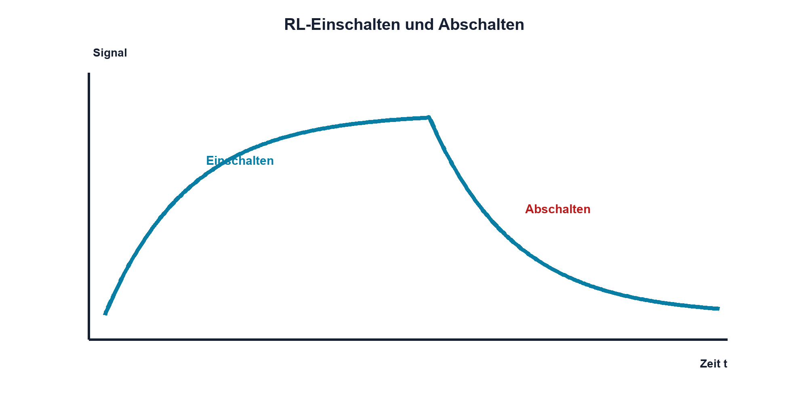

# 06.3 – Ein- und Ausschaltvorgänge

[← Zurück](02-induktivitaet-und-stromaenderung.md) · [Modulübersicht](README.md) · [Kursübersicht](../README.md) · [Weiter →](04-energie-in-der-spule.md)

## Lernziele

Nach dieser Lektion kannst du:

- die RL-Zeitkonstante bestimmen
- Stromanstieg und Abfall berechnen
- Schaltspannung und reale Begrenzung erklären

## Warum ist das wichtig?

Eine reale Spule besitzt Widerstand. Zusammen bilden R und L ein zeitabhängiges Netzwerk. Der Strom nähert sich exponentiell seinem Endwert und erzeugt beim Abschalten eine Spannung mit umgekehrter Polarität.

## Theorie

### RL-Zeitkonstante

Für eine Reihenschaltung gilt `τ = L/Rges`. Nach einer Zeitkonstante hat der Strom beim Einschalten etwa 63,2 % seines Endwerts erreicht. Der Endwert wird durch `Iend = U/Rges` bestimmt.

`Rges` enthält Wicklungswiderstand, Treiberwiderstand und weitere Serienanteile. Beim Ausschalten hängt der Stromabfall vom verfügbaren Freilaufpfad und dessen Spannung ab.

### Ausschalten

Die Spule kehrt ihre Spannungspolarität so um, dass der bisherige Strom weiterfliessen kann. Ohne Schutz steigt die Spannung, bis parasitäre Kapazität, Halbleiterdurchbruch, Lichtbogen oder Isolation einen Pfad bilden. Das ist kein kontrollierter Betriebszustand.

### Schnell oder schonend

Eine einfache Freilaufdiode begrenzt die Spannung stark und lässt den Strom langsam abklingen. Eine höhere kontrollierte Klemmschaltung baut Energie schneller ab, beansprucht den Schalter aber stärker. Die Auswahl folgt Relais-Abfallzeit und Spannungsgrenze.

## Anschauliches Beispiel

Ein fahrender Zug kann nicht augenblicklich anhalten. Eine sanfte Bremse braucht Zeit; eine stärkere Bremse erzeugt grössere Kräfte und stoppt schneller. Ebenso bestimmt die zulässige Abschaltspannung, wie schnell Spulenstrom und Magnetfeld abgebaut werden.

## Berechnungsbeispiel

`L = 200 mH`, `Rges = 100 Ω` und U = 12 V ergeben `τ = 2 ms` und `Iend = 120 mA`. Nach 2 ms fliessen etwa 75,8 mA, nach 10 ms nahezu 119 mA.

## Praxisbezug

Untersuche nur an einer freigegebenen Kleinspannungsschaltung. Trigger auf das Abschaltsignal und miss Spulenspannung sowie Shuntspannung. Beginne mit wirksamem Schutz; ungeschütztes Schalten erfordert ausdrücklich geeignete Begrenzung und Geräte.

## 🔗 Hardware ↔ Firmware

Eine Firmwarewartezeit bis zum Ablesen eines Relaiskontakts muss elektrischen Stromaufbau und mechanische Bewegung berücksichtigen. Beim Ausschalten beeinflusst die Schutzbeschaltung die Abfallzeit; ein Timerwert allein kann Kontaktprellen nicht verhindern.

## Merksatz

> Die RL-Zeitkonstante bestimmt den Stromaufbau; die Abschaltklemme bestimmt den Energieabbau.

## Häufige Fehler und Missverständnisse

- nur den Induktivitätswert statt Rges verwenden
- Abschaltspannung unkontrolliert messen
- Freilaufdiode als schnellste Lösung ansehen
- mechanische Relaiszeit ignorieren

## Zusammenfassung

Ein RL-Kreis zeigt exponentiellen Stromverlauf. Beim Ausschalten hält die Spule den Strom aufrecht und benötigt einen sicheren Energiepfad. Spannungsschutz und gewünschte Abfallzeit stehen im Zielkonflikt.

## Übungsfragen

1. Berechne τ für 50 mH und 25 Ω.
2. Warum kehrt die Spulenspannung beim Ausschalten um?
3. Wie beeinflusst eine höhere Klemmschwellenspannung die Abfallzeit?
4. Welche Verzögerungen muss Firmware bei einem Relais beachten?

Weitere Aufgaben: [Übungen zu Modul 06](../uebungen/modul-06.md).

## Bezug Bildungsplan 2026

- Handlungskompetenzen: `a3`, `b1-LK02–03`, `b1-LK06`, `b4-LK01–10`
- Nachweise: RL-Berechnung und Schaltverlaufsmessung; [Kompetenzmatrix](../bildungsplan-2026/kompetenzmatrix.md)
