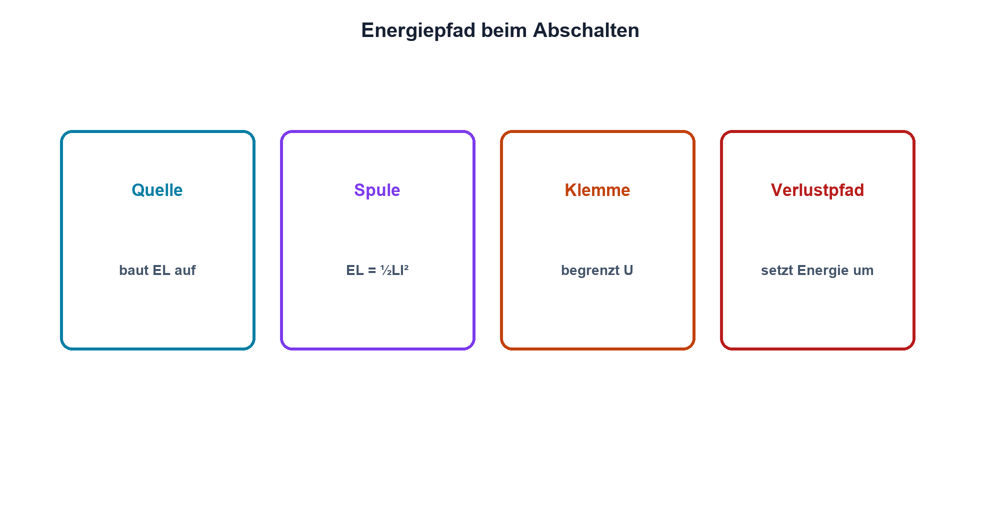

# 06.4 – Energie in der Spule

[← Zurück](03-ein-und-ausschaltvorgaenge.md) · [Modulübersicht](README.md) · [Kursübersicht](../README.md) · [Weiter →](05-relais-und-freilaufdiode.md)

## Lernziele

Nach dieser Lektion kannst du:

- Magnetfeldenergie berechnen
- Energiepfade beim Abschalten verfolgen
- Bauteilbelastung aus Strom und Induktivität abschätzen

## Warum ist das wichtig?

Beim Abschalten verschwindet Magnetfeldenergie nicht. Sie muss in Widerständen, Diode, Klemme, Lichtbogen oder Last umgesetzt werden. Die Energiebilanz erklärt, weshalb eine kleine Relaisspule einen Halbleiter zerstören kann und weshalb Schutzbauteile Energieangaben besitzen.

## Theorie

### Feldenergie

Die gespeicherte Energie einer linearen Induktivität ist `EL = 1/2·L·I²`. Sie wächst quadratisch mit dem Strom. In Sättigung ist L nicht konstant; dann ist diese einfache Rechnung nur eine Näherung.

| Zeichen | Bedeutung | Einheit |
|---|---|---|
| `EL` | magnetische Feldenergie | J |

### Energieabbau

Bei einer Diode wird Energie hauptsächlich in Wicklungswiderstand und Diode umgesetzt. Bei TVS oder Zenerklemme fliesst sie bei höherer Spannung schneller ab. Schalter, Klemme und Leiterbahn müssen Spitzenstrom und Energie vertragen.

### Wiederholbetrieb

Bei periodischem Schalten zählt neben Einzelenergie die Wiederholrate. Die mittlere umgesetzte Leistung ist näherungsweise Energie pro Zyklus mal Schaltfrequenz, sofern die Energie jedes Mal vollständig auf- und abgebaut wird.

## Anschauliches Beispiel

Eine gespannte Feder gibt ihre Energie beim Loslassen ab. Ein weiches Dämpfungselement bremst lange mit kleiner Kraft, ein hartes kurz mit grosser Kraft. Die Energie muss in beiden Fällen irgendwo hin.

## Berechnungsbeispiel

Eine Spule mit 150 mH führt 100 mA. `EL = 0,5·0,15 H·(0,1 A)² = 0,75 mJ`. Bei 20 Schaltungen pro Sekunde werden idealisiert 15 mW Feldenergie pro Sekunde umgesetzt; Schaltspitzen bleiben trotzdem separat zu prüfen.

## Praxisbezug

Bestimme L und stationären Strom aus Datenblatt oder Messung. Berechne EL vor dem Versuch und vergleiche Abschaltzeit sowie Spannungsmaximum für verschiedene freigegebene Schutzpfade.

## 🔗 Hardware ↔ Firmware

Eine maximale Schaltfrequenz ist eine Schutzanforderung. Firmware kann sie begrenzen, doch Reset, Fehlzustand oder externe Ansteuerung müssen berücksichtigt werden. Energiegrenzen dürfen nicht nur von einem normalen Programmablauf abhängen.

## Merksatz

> Magnetfeldenergie verschwindet beim Abschalten nicht; sie wechselt nur den Ort und die Form.

## Häufige Fehler und Missverständnisse

- quadratische Stromwirkung übersehen
- Einzelenergie mit Leistung verwechseln
- Kernsättigung ignorieren
- Schutz nur auf Spitzenspannung prüfen

## Zusammenfassung

Spulenenergie hängt von L und I² ab. Beim Abschalten muss ein definierter Pfad Energie und Spitzenstrom sicher aufnehmen. Wiederholrate ergänzt die Einzelpulsprüfung.

## Übungsfragen

1. Wie verändert doppelter Strom EL?
2. Berechne EL für 47 mH und 0,5 A.
3. Wo wird Energie bei einer Freilaufdiode umgesetzt?
4. Warum ist eine Firmwarefrequenzgrenze allein kein vollständiger Schutz?

Weitere Aufgaben: [Übungen zu Modul 06](../uebungen/modul-06.md).

## Bezug Bildungsplan 2026

- Handlungskompetenzen: `a3`, `b1-LK02–04`, `b4-LK03`, `b5-LK01–05`
- Nachweise: Energie- und Wiederholleistungsrechnung; [Kompetenzmatrix](../bildungsplan-2026/kompetenzmatrix.md)
