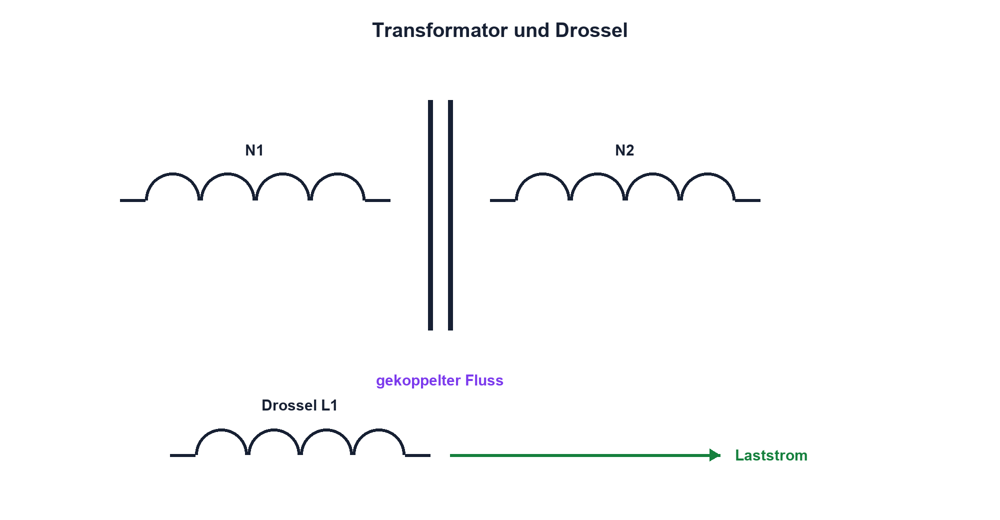

# 06.6 – Transformator und Drosseln

[← Zurück](05-relais-und-freilaufdiode.md) · [Modulübersicht](README.md) · [Kursübersicht](../README.md) · [Weiter →](07-reale-spulen-saettigung-und-verluste.md)

## Lernziele

Nach dieser Lektion kannst du:

- Transformator und Drossel funktional unterscheiden
- Übersetzungsverhältnisse berechnen
- galvanische Trennung und gemeinsame Masse korrekt beurteilen

## Warum ist das wichtig?

Transformatoren übertragen Wechselenergie magnetisch zwischen Wicklungen; Drosseln begrenzen Stromänderungen oder filtern Störungen. Ähnliche Bauteile können sehr verschiedene Aufgaben und Sicherheitsanforderungen besitzen.

## Theorie

### Idealer Transformator

Für sinusförmigen Betrieb im vorgesehenen Bereich gilt `U1/U2 = N1/N2` und näherungsweise `I1/I2 = N2/N1`. N ist die Windungszahl. Leistung bleibt ideal erhalten; real treten Kupfer-, Kern- und Streuverluste auf.

Gleichspannung wird nicht dauerhaft transformiert. Ein Gleichanteil kann den Kern in Sättigung treiben und hohen Strom verursachen.

### Galvanische Trennung

Getrennte Wicklungen besitzen keinen beabsichtigten leitenden Pfad. Sobald Oszilloskop, USB oder Schutzleiter verbunden werden, kann diese Trennung aufgehoben werden. Für Netztrennung sind geprüfte Sicherheitsbauteile und Normen erforderlich; Laborübungen bleiben bei SELV.

### Drosseln

Eine Seriendrossel behindert schnelle Stromänderungen. Gleichtaktdrosseln wirken auf gleichgerichtete Störströme beider Leiter anders als auf den Nutzstrom. Auswahlgrössen sind L, Nennstrom, Sättigungsstrom, Gleichstromwiderstand und Verlustkurven.

### Übersetzung, Belastung und reale Grenzen

Für den idealen Transformator gilt `U1/U2 = N1/N2`. Die Spannungsübersetzung entspricht dem Windungsverhältnis. Weil die Leistung ideal erhalten bleibt, verhält sich der Strom umgekehrt: `I1/I2 = N2/N1`. `N1` und `N2` bezeichnen die Windungszahlen der Primär- und Sekundärwicklung. Diese Beziehungen gelten nur näherungsweise, denn Wicklungswiderstände, Streufluss und Kernverluste verursachen Spannungsabfall und Erwärmung.

Ein Transformator benötigt einen zeitlich veränderlichen Fluss. Reine Gleichspannung erzeugt nach dem Einschaltvorgang keine dauerhafte Sekundärspannung, kann den Kern aber in Sättigung treiben und einen gefährlich hohen Primärstrom verursachen. Bei getakteten Wandlern begrenzen deshalb Frequenz, Tastgrad, Eingangsspannung, Windungszahl und Kernquerschnitt gemeinsam die Flussdichte. Eine Drossel wird dagegen nach Induktivität, Gleichstromwiderstand, Sättigungsstrom, Verlusten und zulässiger Temperaturerhöhung ausgewählt. Gleiche Induktivitätswerte bedeuten daher nicht automatisch austauschbare Bauteile.

## Anschauliches Beispiel

Zwei Zahnräder übertragen Bewegung mit anderem Verhältnis, ohne dass ihre Zähne gleich schnell laufen. Ein Transformator übersetzt Spannung und Strom über das gemeinsame Feld; die Analogie endet bei Gleichspannung und magnetischen Verlusten.

## Berechnungsbeispiel

Ein idealer Transformator mit `N1:N2 = 5:1` erhält 10 V RMS. Sekundär entstehen 2 V RMS. Bei 0,5 A sekundär wären ideal 0,1 A primär nötig; reale Verluste erhöhen den Primärstrom.

## Praxisbezug

Untersuche nur einen Kleinspannungs- oder Signaltransformator. Bestimme Wicklungen mit dem Ohmmeter spannungsfrei und miss Übersetzung mit kleiner Sinusspannung. Keine unbekannten Wicklungen an Netzspannung anschliessen.

## 🔗 Hardware ↔ Firmware

Ein per PWM angesteuerter Transformator benötigt symmetrische Flussbilanz und geeignete Treiber. Ein kleiner Tastgradfehler oder Gleichanteil kann Sättigung verursachen; Hardwarestrommessung und Abschaltung bleiben erforderlich.

## Merksatz

> Transformatoren benötigen wechselnden Fluss; Gleichanteile können den Kern sättigen.

## Häufige Fehler und Missverständnisse

- Gleichspannung an einen Transformator legen
- galvanische Trennung nach Messgeräteanschluss voraussetzen
- Stromübersetzung gleich der Spannungsübersetzung setzen
- Sättigungsstrom einer Drossel ignorieren

## Zusammenfassung

Transformatoren übersetzen Spannung und Strom über gekoppelten Fluss; Drosseln formen Stromänderungen. Reale Auswahl berücksichtigt Verluste, Sättigung, Isolation und Betriebsfrequenz.

## Übungsfragen

1. Warum transformiert konstante Gleichspannung nicht?
2. Berechne U2 bei 12 V und 3:1.
3. Wann geht galvanische Trennung durch Messgeräte verloren?
4. Welche Daten bestimmen eine Leistungsdrossel?

Weitere Aufgaben: [Übungen zu Modul 06](../uebungen/modul-06.md).

## Bezug Bildungsplan 2026

- Handlungskompetenzen: `a3`, `b1-LK01–04`, `b1-LK06`, `b4-LK03`, `b5-LK01`
- Nachweise: sichere Wicklungsidentifikation und Übersetzungsmessung; [Kompetenzmatrix](../bildungsplan-2026/kompetenzmatrix.md)
