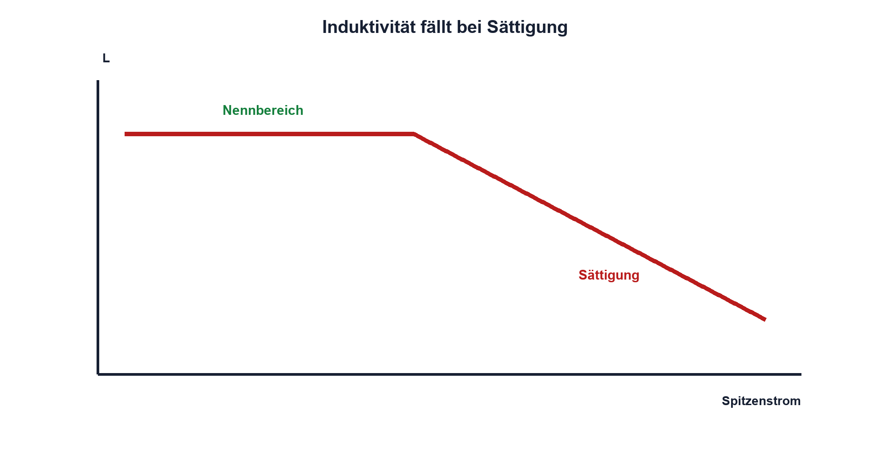

# 06.7 – Reale Spulen, Sättigung und Verluste

[← Zurück](06-transformator-und-drosseln.md) · [Modulübersicht](README.md) · [Kursübersicht](../README.md) · [Weiter →](../07-periodische-signale/README.md)

## Lernziele

Nach dieser Lektion kannst du:

- ein reales Spulenmodell verwenden
- Sättigungs- und Erwärmungsgrenzen unterscheiden
- Datenblattkurven für Strom und Frequenz auswerten

## Einleitung

Die aufgedruckte Induktivität gilt nur unter definierten Messbedingungen. Gleichstrom, Ripple, Frequenz und Temperatur verändern reale Spulen. In Sättigung fällt die differentielle Induktivität; der Strom kann dadurch sehr schnell ansteigen.

<!-- context-expansion-2026 -->
Spulen und Transformatoren speichern oder übertragen Energie über Magnetfelder. Weil sich der Spulenstrom nicht sprunghaft ändern kann, entstehen beim Ein- und Ausschalten charakteristische Spannungen. Kernmaterial, Sättigung und Wicklungswiderstand machen aus dem idealen Symbol ein reales Bauteil.

Beim Thema **Reale Spulen, Sättigung und Verluste** geht es deshalb nicht nur um eine einzelne Formel oder Definition. Entscheidend ist, wie sich das Prinzip im Schema erkennen, im Datenblatt beurteilen, im Aufbau messen und bei einer Abweichung systematisch überprüfen lässt.

## Theorie

<!-- theory-expansion-2026 -->
### Einordnung und Grundidee

Das ideale Induktivitätsgesetz beschreibt die Spannung bei einer Stromänderung. Reale Spulen ergänzen Wicklungswiderstand, Kernverluste, parasitäre Kapazität und Sättigung. Der Strompfad muss sowohl während der Energieaufnahme als auch während der Energieabgabe geschlossen sein.

### Reales Modell

Wicklungswiderstand DCR erzeugt Kupferverlust `PCu = Irms²·DCR`. Kernverluste hängen nichtlinear von Material, Frequenz und Flussänderung ab. Parasitäre Kapazität führt zu einer Selbstresonanz.

### Zwei Stromgrenzen

Der Sättigungsstrom wird über einen spezifizierten Induktivitätsabfall definiert. Der thermische Nennstrom wird über eine zulässige Temperaturerhöhung bestimmt. Je nach Anwendung kann eine der beiden Grenzen zuerst erreicht werden; beide sind zu prüfen.

### Ripple und Spitzenstrom

In Schaltreglern setzt sich Strom aus Mittelwert und Ripple zusammen. Für Sättigung zählt der Spitzenstrom, für Kupfererwärmung der Effektivwert. Ein Datenblattwert ohne Definition darf nicht als beliebige harte Grenze interpretiert werden.

### Layout

Kurze Stromschleifen, ausreichende Leiterbahnen und Abstand zu empfindlichen Signalen reduzieren Verluste und Einkopplung. Das Streufeld kann Sensoren oder analoge Eingänge beeinflussen.

### Datenblatt und Messbedingungen

Der aufgedruckte Induktivitätswert gilt gewöhnlich bei einer festgelegten Messfrequenz, kleinen Wechselstromamplitude und häufig ohne Gleichstromvormagnetisierung. Im Einsatz kann ein grosser Gleichstrom die effektive Induktivität bereits deutlich reduzieren, lange bevor ein abrupter Sättigungsknick sichtbar wird. Datenblätter zeigen dafür Kurven wie `L/L0` über dem Biasstrom sowie Temperaturanstieg über dem Effektivstrom. Der Sättigungsstrom und der thermisch zulässige Strom beschreiben unterschiedliche Grenzen; verwendet wird der kleinere Wert für die konkrete Anwendung.

Mit einem LCR-Meter lässt sich die Kleinsignalinduktivität prüfen, nicht automatisch das Verhalten im Schaltregler. Dort werden zusätzlich Stromrampe, Tastgrad, Schaltfrequenz und Spitzentemperatur beobachtet. Beginnt die Stromrampe innerhalb eines Schaltzyklus nach oben zu krümmen, ist das ein starkes Zeichen fallender Induktivität. Die Messung erfolgt mit geeigneter Stromsonde oder niederinduktivem Shunt und kurzer Tastkopfschleife, damit die parasitäre Messanordnung nicht mit der Spule verwechselt wird.

## Anwendungsfall

Typische elektronische Anwendungen und Baugruppen für dieses Thema sind:

- Auswahl von Leistungsinduktivitäten
- Vermeidung von Kernsättigung
- Berechnung von Kupfer-, Kern- und Schaltverlusten

In einer konkreten Entwicklung wird nicht nur geprüft, ob die gewünschte Funktion grundsätzlich entsteht. Ebenso wichtig sind zulässige Grenzwerte, Toleranzen, Temperatur, Messbarkeit und das Verhalten bei Unterbruch, Kurzschluss oder falscher Ansteuerung.

## Anschauliches Beispiel

Ein weicher Schwamm federt zunächst gut, wird aber unter hoher Last zusammengedrückt und bietet kaum zusätzlichen Federweg. Ähnlich verliert ein gesättigter Kern einen Teil seiner inkrementellen Induktivitätswirkung.

## Berechnungsbeispiel

Eine Spule besitzt 120 mΩ DCR und führt 1,5 A RMS. Die Kupferverlustleistung beträgt `PCu = 1,5²·0,12 Ω = 0,27 W`. Kernverluste kommen hinzu; die Temperatur muss unter realer Kühlung geprüft werden.

## Praxisbezug

Miss DCR mit geeignetem Verfahren und vergleiche den erwarteten Kupferverlust mit der Temperaturerhöhung. Eine Sättigungsmessung erfordert einen strombegrenzten Pulsaufbau und wird nur mit freigegebener Schaltung durchgeführt.

## 🔗 Hardware ↔ Firmware

Firmware kann Tastgrad oder Stromsollwert begrenzen. Bei Sättigung steigt di/dt dennoch schneller als im Modell. Hardware-Komparator oder Strombegrenzung reagiert zuverlässiger als eine langsam ablaufende Softwareprüfung.

## Merksatz

> Für Sättigung zählt Spitzenstrom, für Kupferwärme vor allem Effektivstrom.

## Häufige Fehler und Missverständnisse

- thermischen und Sättigungsstrom verwechseln
- nur DCR-Verlust betrachten
- Nenninduktivität bei jedem Strom annehmen
- Streufeld und Layout ignorieren

## Zusammenfassung

Reale Spulen besitzen DCR, Kernverlust, Kapazität und Sättigung. Stromform, Frequenz, Temperatur und Aufbau bestimmen, ob eine Datenblattauswahl im Betrieb trägt.

## Übungsfragen

1. Was unterscheidet Sättigungs- und thermischen Strom?
2. Berechne PCu für 80 mΩ und 2 A RMS.
3. Warum zählt für Sättigung der Spitzenstrom?
4. Welche Schutzfunktion sollte nicht nur in Firmware liegen?

Weitere Aufgaben: [Übungen zu Modul 06](../uebungen/modul-06.md).

## Bezug Bildungsplan 2026

- Handlungskompetenzen: `a3`, `b1-LK01–04`, `b1-LK07`, `b2-LK03–04`, `b4-LK01–09`
- Nachweise: Verlustrechnung, Datenblattkurven und thermische Messung; [Kompetenzmatrix](../bildungsplan-2026/kompetenzmatrix.md)
