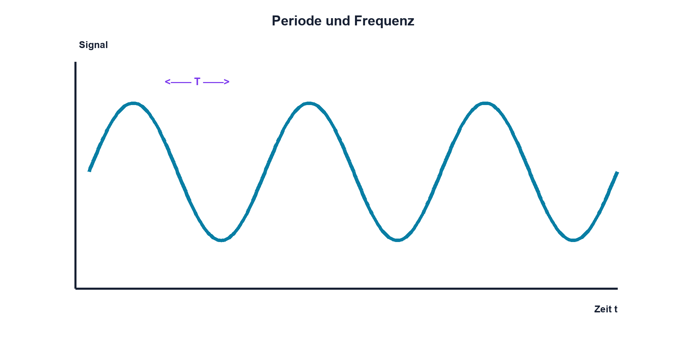

# 07.1 – Periodische Vorgänge, Frequenz und Periodendauer

[← Zurück](README.md) · [Modulübersicht](README.md) · [Kursübersicht](../README.md) · [Weiter →](02-sinus-rechteck-und-dreieck.md)

## Lernziele

Nach dieser Lektion kannst du:

- Periode und Frequenz aus einem Zeitdiagramm bestimmen
- zwischen periodisch und wiederkehrend gestört unterscheiden
- passende Zeitbasis und Abtastrate wählen

## Einleitung

Takt, PWM, Netzripple und Sensorsignale wiederholen sich zeitlich. Frequenz beschreibt, wie oft ein vollständiger Vorgang pro Sekunde auftritt; Periodendauer beschreibt die Zeit eines Zyklus. Beide Sichtweisen werden beim Oszilloskop und in Firmware ständig benötigt.

<!-- context-expansion-2026 -->
Elektronische Signale verändern sich mit der Zeit. Frequenz, Amplitude, Effektivwert und Phase beschreiben unterschiedliche Eigenschaften desselben Verlaufs. Für Messung und Schaltungsentwurf muss deshalb stets geklärt werden, welche Signalgrösse gemeint ist und unter welchen Bedingungen sie gilt.

Beim Thema **Periodische Vorgänge, Frequenz und Periodendauer** geht es deshalb nicht nur um eine einzelne Formel oder Definition. Entscheidend ist, wie sich das Prinzip im Schema erkennen, im Datenblatt beurteilen, im Aufbau messen und bei einer Abweichung systematisch überprüfen lässt.

## Theorie

<!-- theory-expansion-2026 -->
### Einordnung und Grundidee

Ein Signal wird zuerst im Zeitdiagramm mit Bezugslinie und Einheiten beschrieben. Daraus lassen sich Periodendauer, Frequenz, Momentanwert und Phasenbezug ableiten. Messgeräte können je nach Kopplung, Bandbreite und Auswerteverfahren unterschiedliche Kennwerte desselben Signals anzeigen.

### Ein vollständiger Zyklus

Zwei Punkte markieren nur dann eine Periode, wenn Signalzustand und Bewegungsrichtung gleich sind, etwa zwei aufeinanderfolgende steigende Nulldurchgänge. Für stabile periodische Signale gilt `f = 1/T`.

| Zeichen | Bedeutung | Einheit |
|---|---|---|
| `f` | Frequenz | Hz |
| `T` | Periodendauer | s |

1 Hz bedeutet einen Zyklus pro Sekunde. kHz und MHz müssen vor Rechnungen sauber in Zehnerpotenzen umgewandelt werden.

### Repetition ist nicht immer stabile Periodizität

Jitter verändert die Lage einzelner Flanken, Drift verändert die mittlere Frequenz, und fehlende Pulse unterbrechen die Folge. Ein einzelner automatischer Messwert kann diese Fehler verbergen. Zeitbild und Statistik ergänzen sich.

### Messfenster

Für eine Periodenmessung müssen genügend Signalabschnitte sichtbar und ausreichend abgetastet sein. Eine lange Aufzeichnung verbessert Frequenzauflösung, während eine kurze Zeitbasis Flankendetails zeigt.

## Anwendungsfall

Typische elektronische Anwendungen und Baugruppen für dieses Thema sind:

- Takt- und PWM-Signale
- Netzfrequenz und Sensorsignale
- Festlegen von Oszilloskop-Zeitbasis und Abtastrate

In einer konkreten Entwicklung wird nicht nur geprüft, ob die gewünschte Funktion grundsätzlich entsteht. Ebenso wichtig sind zulässige Grenzwerte, Toleranzen, Temperatur, Messbarkeit und das Verhalten bei Unterbruch, Kurzschluss oder falscher Ansteuerung.

## Anschauliches Beispiel

Bei einem Karussell ist T die Zeit für eine Runde und f die Zahl der Runden pro Sekunde. Beobachtest du nur einen kleinen Ausschnitt, erkennst du die Geschwindigkeit, aber nicht zuverlässig, ob jede Runde gleich lange dauert.

## Berechnungsbeispiel

Ein PWM-Signal hat `T = 20 µs`. Damit ist `f = 1/(20 µs) = 50 kHz`. Zehn Perioden dauern 200 µs; eine passende Zeitbasis zeigt sowohl mehrere Zyklen als auch genügend Flankendetail.

## Praxisbezug

Miss T mit Cursorn über mehrere Perioden und teile durch deren Anzahl. Vergleiche mit automatischer Frequenzmessung. Dokumentiere Abtastrate, Zeitbasis und Triggerquelle.

## 🔗 Hardware ↔ Firmware

Timer-Takt, Prescaler und Periodenregister bestimmen die ideale Wiederholrate. Reale Abweichungen entstehen durch Taktgenauigkeit, Interrupt-Latenz oder falschen Ausgangsmodus. Das Oszilloskop misst das Ergebnis am Pin.

## Merksatz

> Frequenz und Periodendauer sind Kehrwerte desselben vollständigen Zyklus.

## Häufige Fehler und Missverständnisse

- halbe oder doppelte Periode markieren
- µs und ms verwechseln
- nur einen Automatikwert übernehmen
- Jitter durch ungeeigneten Trigger verdecken

## Zusammenfassung

T misst Zeit pro Zyklus, f Zyklen pro Sekunde. Eine belastbare Messung definiert gleiche Phasenpunkte, geeignetes Fenster und ausreichende Abtastung.

## Übungsfragen

1. Welche Frequenz hat T = 2,5 ms?
2. Warum misst man besser über mehrere Perioden?
3. Was unterscheidet Jitter und Drift?
4. Welche Timerparameter beeinflussen die Ausgangsfrequenz?

Weitere Aufgaben: [Übungen zu Modul 07](../uebungen/modul-07.md).

## Bezug Bildungsplan 2026

- Handlungskompetenzen: `b1-LK02–03`, `b4-LK01–10`, `c1–c2`
- Nachweise: Cursor- und Automatikmessung eines Timersignals; [Kompetenzmatrix](../bildungsplan-2026/kompetenzmatrix.md)
