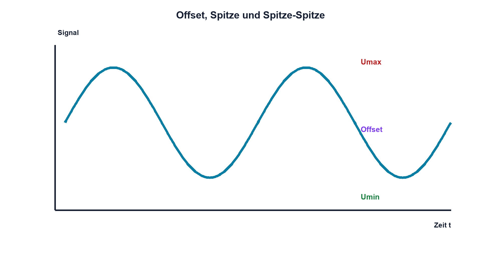

# 07.3 – Amplitude, Spitze und Peak-to-Peak

[← Zurück](02-sinus-rechteck-und-dreieck.md) · [Modulübersicht](README.md) · [Kursübersicht](../README.md) · [Weiter →](04-effektivwert-und-leistung.md)

## Lernziele

Nach dieser Lektion kannst du:

- Offset Spitze und Spitze-Spitze unterscheiden
- Messwerte aus dem Oszilloskop korrekt zuordnen
- zulässige Eingangsgrenzen mit Extremwerten prüfen

## Warum ist das wichtig?

«Das Signal hat 2 V» ist unvollständig. Gemeint sein können Amplitude, Effektivwert oder Spitze-Spitze-Wert. Für Übersteuerung und Schutz zählen absolute Maximal- und Minimalwerte inklusive Gleichanteil.

## Theorie

### Bezugsgrössen

`Upp = Umax − Umin`. Bei einem symmetrischen Sinus ohne Offset gilt `Upp = 2·Û`; Û bezeichnet den Spitzenwert. Der Gleichanteil oder Offset verschiebt die gesamte Kurve.

| Zeichen | Bedeutung | Einheit |
|---|---|---|
| `Upp` | Spitze-Spitze-Spannung | V |
| `Û` | Spitzenwert bezogen auf den Mittelwert | V |
| `Umax`, `Umin` | absolute Extremwerte gegen Bezug | V |

### AC- und DC-Kopplung

DC-Kopplung zeigt Gleich- und Wechselanteil. AC-Kopplung entfernt langsame beziehungsweise konstante Anteile über einen internen Hochpass und kann das Signalbild bei niedriger Frequenz verfälschen.

### Grenzen

Für einen MCU-Eingang werden Umax und Umin gegen absolute und normale Betriebsgrenzen geprüft. Upp allein kann einen gefährlichen Offset verbergen.

## Anschauliches Beispiel

Die Wellenhöhe eines Sees kann von Tal zu Kamm gemessen werden, während der Wasserstand die gesamte Welle anhebt. Upp ist die Wellenhöhe, der Offset der mittlere Wasserstand.

## Berechnungsbeispiel

Ein Signal hat 1,5 V Offset und 2,0 Vpp. Bei symmetrischer Form beträgt die Amplitude 1,0 V; somit liegen Umin bei 0,5 V und Umax bei 2,5 V.

## Praxisbezug

Vergleiche Cursor- und Automatikwerte für Umax, Umin, Upp und Mittelwert. Verschiebe den Generatoroffset und beobachte, welche Grössen gleich bleiben.

## 🔗 Hardware ↔ Firmware

Ein ADC-Code bildet den absoluten Pinpegel relativ zur Referenz ab. Firmware muss Offset und Skalierung kennen. Ein AC-gekoppeltes Oszilloskopbild darf nicht ungeprüft mit ADC-Rohwerten verglichen werden.

## Merksatz

> Upp beschreibt die gesamte Auslenkung; Schutzgrenzen benötigen Umin und Umax gegen den realen Bezug.

## Häufige Fehler und Missverständnisse

- Amplitude und Upp verwechseln
- Offset ignorieren
- AC-Kopplung unbemerkt verwenden
- automatische Messung ohne sichtbare stabile Kurve glauben

## Zusammenfassung

Signalhöhe besitzt mehrere Definitionen. Klare Bezeichnung und Bezug verhindern Übersteuerung und falsche Vergleiche zwischen Generator, Oszilloskop und ADC.

## Übungsfragen

1. Was ist Upp bei −1 V bis 4 V?
2. Welche Extremwerte hat 3 Vpp bei 1,8 V Offset?
3. Wann verfälscht AC-Kopplung?
4. Welche Grösse ist für MCU-Schutz entscheidend?

Weitere Aufgaben: [Übungen zu Modul 07](../uebungen/modul-07.md).

## Bezug Bildungsplan 2026

- Handlungskompetenzen: `b1-LK02–03`, `b4-LK01–10`, `c1–c2`
- Nachweise: vollständige Pegelbeschreibung und Grenzwertprüfung; [Kompetenzmatrix](../bildungsplan-2026/kompetenzmatrix.md)
