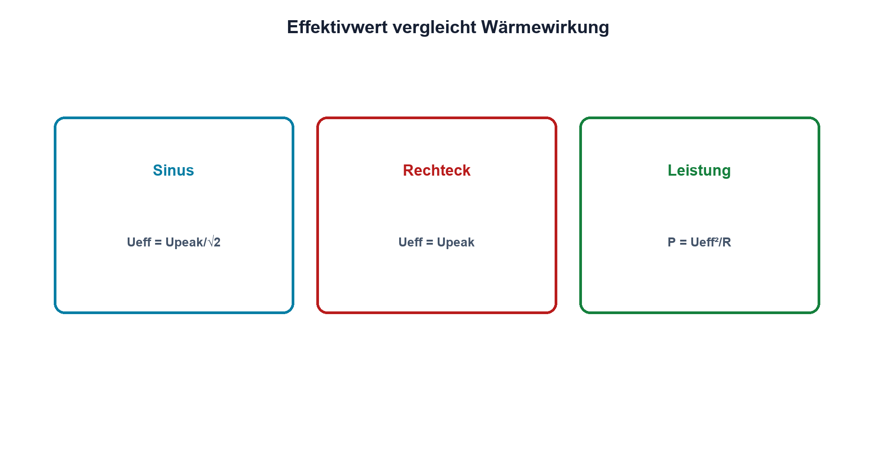

# 07.4 – Effektivwert und Leistung

[← Zurück](03-amplitude-spitze-und-peak-to-peak.md) · [Modulübersicht](README.md) · [Kursübersicht](../README.md) · [Weiter →](05-phase-und-phasenverschiebung.md)

## Lernziele

Nach dieser Lektion kannst du:

- Effektivwert als Wärmewirkung erklären
- Effektivwerte einfacher Signalformen berechnen
- True-RMS-Grenzen eines Messgeräts prüfen

## Warum ist das wichtig?

Der Effektivwert beantwortet, welche Gleichspannung an einem ohmschen Widerstand dieselbe mittlere Leistung erzeugen würde. Er ist deshalb für Erwärmung und Leistung wichtig und nicht einfach ein anderer Name für den Mittelwert.

## Theorie

### Definition

Der Effektivwert entsteht durch Quadrieren, zeitliches Mitteln und Wurzelziehen: `Ueff = sqrt[(1/T)·∫u²(t)dt]`.

Für einen Sinus ohne Offset gilt `Ueff = Û/√2`. Ein symmetrisches Rechteck mit den Pegeln ±Û besitzt `Ueff = Û`. Bei Gleichanteil muss das vollständige Signal berücksichtigt werden.

### Leistung

An einem ohmschen Widerstand gilt `P = Ueff²/R = Ieff²·R`. Bei phasenverschobenen oder nichtlinearen Lasten reicht das Produkt aus getrennten Effektivwerten nicht automatisch für Wirkleistung; momentane Leistung muss gemittelt werden.

### True RMS

Ein True-RMS-Messgerät berechnet innerhalb seiner Bandbreite und seines Crest-Factor-Bereichs auch nichtsinusförmige Signale korrekt. «True RMS» ist keine Garantie für beliebige Frequenz, Spitze oder Offset.

### Gleichanteil, Wechselanteil und Crest Factor

Ein Signal kann gleichzeitig einen Gleichanteil und eine überlagerte Wechselkomponente besitzen. Sind beide Anteile getrennt bekannt, gilt `Ueff,gesamt = sqrt(Udc² + Uac,eff²)`. `Udc` ist der zeitliche Mittelwert, `Uac,eff` der Effektivwert der wechselnden Komponente. Je nach AC- oder DC-Kopplung zeigt ein Messgerät nur einen Anteil oder den Gesamtwert. Diese Einstellung gehört zwingend ins Messprotokoll.

Der Crest Factor `CF = Upeak/Ueff` beschreibt, wie hoch die Spitze im Verhältnis zum Effektivwert ist. Kurze, schmale Pulse können einen grossen Crest Factor besitzen. Obwohl ihr Effektivwert moderat ist, übersteuern ihre Spitzen den Eingang eines DMM oder ADC. Ein True-RMS-Gerät kann dann einen plausibel wirkenden, aber falschen Wert anzeigen. Zur Kontrolle werden Signalform und Spitze zusätzlich mit dem Oszilloskop geprüft. Bei Strommessungen gilt dasselbe: Leiterbahn, Shunt und Schalter müssen sowohl Effektivstrom als auch Spitzenstrom sicher verkraften.

## Anschauliches Beispiel

Zwei verschieden verlaufende Fahrten können denselben Treibstoffverbrauch erzeugen. Der Effektivwert vergleicht Signale über ihre Wärmewirkung, auch wenn ihre zeitliche Form verschieden ist.

## Berechnungsbeispiel

Ein Sinus mit 10 Vpp hat Û = 5 V und `Ueff ≈ 3,54 V`. An 100 Ω entstehen `P ≈ 3,54²/100 = 0,125 W`.

## Praxisbezug

Vergleiche DMM- und Oszilloskop-RMS für Sinus und Rechteck bei mehreren Frequenzen. Prüfe Bandbreite, Kopplung und zulässigen Crest Factor des DMM.

## 🔗 Hardware ↔ Firmware

RMS aus ADC-Samples erfordert ausreichend schnelle, gleichmässige Abtastung, Offsetbehandlung und genügend lange Beobachtung. Eine einzelne Spitze oder ein arithmetischer Mittelwert ist kein RMS.

## Merksatz

> Der Effektivwert beschreibt die äquivalente Wärmewirkung, nicht den einfachen Mittelwert.

## Häufige Fehler und Missverständnisse

- Sinusformel auf Rechteck anwenden
- Offset aus RMS entfernen ohne Zieldefinition
- Messgerätebandbreite ignorieren
- Wirkleistung bei Phasenverschiebung als Ueff·Ieff annehmen

## Zusammenfassung

RMS ist eine leistungsbezogene Grösse. Signalform, Gleichanteil, Bandbreite und Lastart bestimmen Berechnung und Messgültigkeit.

## Übungsfragen

1. Welchen Ueff hat ein Sinus mit 4 V Spitze?
2. Warum besitzt ein symmetrisches Rechteck RMS trotz Mittelwert null?
3. Was begrenzt True-RMS-Messungen?
4. Welche ADC-Schritte sind für RMS nötig?

Weitere Aufgaben: [Übungen zu Modul 07](../uebungen/modul-07.md).

## Bezug Bildungsplan 2026

- Handlungskompetenzen: `b1-LK02–03`, `b4-LK02`, `b4-LK06–09`, `c2`
- Nachweise: RMS-Rechnung und Messgerätevergleich; [Kompetenzmatrix](../bildungsplan-2026/kompetenzmatrix.md)
