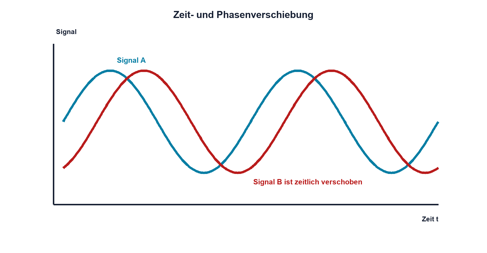

# 07.5 – Phase und Phasenverschiebung

[← Zurück](04-effektivwert-und-leistung.md) · [Modulübersicht](README.md) · [Kursübersicht](../README.md) · [Weiter →](06-blindwiderstand-von-c-und-l.md)

## Lernziele

Nach dieser Lektion kannst du:

- Phase als Lage innerhalb einer Periode erklären
- Zeitverschiebung in Grad umrechnen
- Vorzeichen und Messrichtung konsistent verwenden

## Warum ist das wichtig?

Zwei Signale können gleiche Frequenz und Amplitude besitzen, aber zeitlich gegeneinander verschoben sein. Diese Phase entscheidet bei Filtern, Leistungsübertragung, Motoren und Bussignalen über Funktion und Messinterpretation.

## Theorie

### Phase ist relativ

Eine absolute Phase benötigt einen definierten Bezug. Für zwei gleichfrequente Signale gilt `φ = 360°·Δt/T`.

| Zeichen | Bedeutung | Einheit |
|---|---|---|
| `φ` | Phasenverschiebung | ° oder rad |
| `Δt` | Zeitverschiebung gleicher Phasenpunkte | s |

Das Vorzeichen hängt davon ab, welches Signal als Bezug dient und welche Richtung als «eilt voraus» definiert wird. Diese Festlegung gehört zum Resultat.

### Mehrdeutigkeit

Eine Verschiebung um eine ganze Periode entspricht 360° und erscheint zeitlich wieder gleich. Bei unterschiedlichen Frequenzen ändert sich die relative Phase fortlaufend; eine einzelne Gradangabe ist dann unvollständig.

### Oszilloskopmessung

Beide Kanäle benötigen denselben Zeitbezug. Tastköpfe, Kabellängen und Kanalverzögerung können bei schnellen Signalen relevant werden.

### Vorzeichen und Messung

Eine Phasenangabe ist nur mit klarer Referenz eindeutig. Wird Signal B gegenüber Signal A später erreicht, hinkt B hinterher; bei gleicher Frequenz entspricht die Zeitverschiebung `Δt` dem Winkel `φ = 360°·Δt/T`. Ein negatives Vorzeichen wird häufig für Nacheilen verwendet. Da Fachliteratur und Messgeräte unterschiedliche Vorzeichenkonventionen nutzen können, werden Referenz und Richtung ausdrücklich notiert.

Am Oszilloskop werden beide Signale gleichzeitig und mit gemeinsamem Trigger dargestellt. Man misst zwei gleichartige Punkte, beispielsweise steigende Nulldurchgänge, und nicht beliebige Spitzen eines verzerrten Signals. Unsicherheit entsteht durch begrenzte Abtastrate, Triggerjitter, Kanallaufzeit und Tastköpfe. Bei hohen Frequenzen können schon unterschiedlich lange Leitungen eine sichtbare Phase erzeugen. Vor der Bauteilmessung werden daher beide Kanäle an dasselbe Signal angeschlossen; die beobachtete Restverschiebung ist der systematische Beitrag der Messkette.

## Anschauliches Beispiel

Zwei Läufer auf einer Rundbahn können gleich schnell sein, aber einer ist eine Viertelrunde voraus. Ihre Frequenz ist gleich, ihre Phase um 90° verschieden. Laufen sie unterschiedlich schnell, ändert sich der Abstand ständig.

## Berechnungsbeispiel

Bei `f = 1 kHz` ist T = 1 ms. Eine Verschiebung von 250 µs entspricht `φ = 360°·0,25 = 90°`.

## Praxisbezug

Miss Δt zwischen gleichartigen Nulldurchgängen zweier Kanäle. Wiederhole bei anderer Frequenz und prüfe, ob eine konstante Zeitverzögerung oder konstante Phase vorliegt.

## 🔗 Hardware ↔ Firmware

Timerkanäle können phasenversetzte PWM erzeugen. Registerwerte definieren ideale Kanten; Treiber- und Lastverzögerung verändern die reale Phase. Beide Signale werden gleichzeitig am Pin oder an der Last gemessen.

## Merksatz

> Phase beschreibt die relative Lage im Zyklus; ohne Bezug und Frequenz ist eine Gradangabe unvollständig.

## Häufige Fehler und Missverständnisse

- unterschiedliche Flanken vergleichen
- Vorzeichenkonvention weglassen
- Phase bei verschiedenen Frequenzen als konstant angeben
- Kanalverzögerung ignorieren

## Zusammenfassung

Phase übersetzt Zeitverschiebung in einen Zyklusanteil. Bezug, Vorzeichen, Frequenz und Messpunkte müssen eindeutig sein.

## Übungsfragen

1. Wieviel Grad entsprechen T/8?
2. Welche Zeit sind 45° bei 10 kHz?
3. Warum ist Phase eine relative Grösse?
4. Wo entsteht zusätzliche Hardwareverzögerung bei PWM?

Weitere Aufgaben: [Übungen zu Modul 07](../uebungen/modul-07.md).

## Bezug Bildungsplan 2026

- Handlungskompetenzen: `b1-LK02–03`, `b4-LK01–10`, `c1–c2`
- Nachweise: Zweikanal-Zeit- und Phasenmessung; [Kompetenzmatrix](../bildungsplan-2026/kompetenzmatrix.md)
