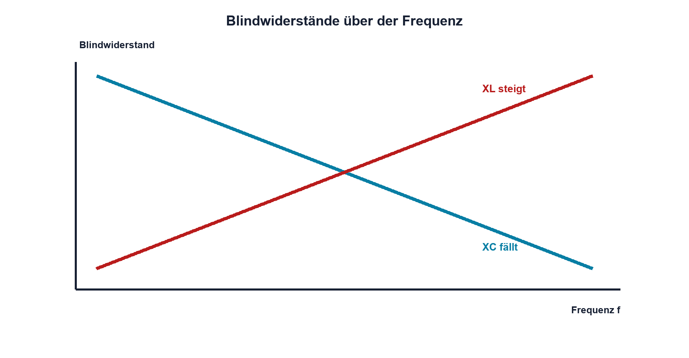

# 07.6 – Blindwiderstand von C und L

[← Zurück](05-phase-und-phasenverschiebung.md) · [Modulübersicht](README.md) · [Kursübersicht](../README.md) · [Weiter →](07-impedanz-und-komplexe-lasten.md)

## Lernziele

Nach dieser Lektion kannst du:

- kapazitiven und induktiven Blindwiderstand berechnen
- Frequenztrends vergleichen
- Phasenlage und Energieaustausch erklären

## Einleitung

Kondensator und Spule verhalten sich bei Sinus nicht wie konstante Widerstände. Ihre Wirkung hängt von f ab und verschiebt Strom und Spannung. Blindwiderstände bilden die Brücke von Zeitvorgängen zu Filter- und Resonanzrechnung.

<!-- context-expansion-2026 -->
Elektronische Signale verändern sich mit der Zeit. Frequenz, Amplitude, Effektivwert und Phase beschreiben unterschiedliche Eigenschaften desselben Verlaufs. Für Messung und Schaltungsentwurf muss deshalb stets geklärt werden, welche Signalgrösse gemeint ist und unter welchen Bedingungen sie gilt.

Beim Thema **Blindwiderstand von C und L** geht es deshalb nicht nur um eine einzelne Formel oder Definition. Entscheidend ist, wie sich das Prinzip im Schema erkennen, im Datenblatt beurteilen, im Aufbau messen und bei einer Abweichung systematisch überprüfen lässt.

## Theorie

<!-- theory-expansion-2026 -->
### Einordnung und Grundidee

Ein Signal wird zuerst im Zeitdiagramm mit Bezugslinie und Einheiten beschrieben. Daraus lassen sich Periodendauer, Frequenz, Momentanwert und Phasenbezug ableiten. Messgeräte können je nach Kopplung, Bandbreite und Auswerteverfahren unterschiedliche Kennwerte desselben Signals anzeigen.

### Gegensätzliche Frequenztrends

`XC = 1/(2πfC)` sinkt mit f; `XL = 2πfL` steigt mit f.

| Zeichen | Bedeutung | Einheit |
|---|---|---|
| `XC` | Betrag des kapazitiven Blindwiderstands | Ω |
| `XL` | Betrag des induktiven Blindwiderstands | Ω |

Beim idealen Kondensator eilt I um 90° voraus; bei der idealen Spule hinkt I um 90° hinter U. Beide speichern Energie zeitweise und geben sie zurück.

### Gültigkeit

Die Formeln gelten für sinusförmigen eingeschwungenen Betrieb und idealisierte Bauteile. ESR, DCR, ESL, parasitäre Kapazität und Sättigung ergänzen reale Modelle.

### Grenzfälle

Für f gegen null wird XC sehr gross und XL sehr klein. Hohe Frequenz kehrt diese Tendenz um, bis parasitäre Eigenschaften dominieren.

### Frequenzgrenzen und Bauteilauswahl

Die Formeln beschreiben ideale Bauteile. Beim Kondensator liegt der kapazitive Bereich nur unterhalb seiner Selbstresonanz; darüber dominiert die parasitäre Induktivität. Bei der Spule begrenzen Wicklungskapazität, Kernverluste und Sättigung den nutzbaren Bereich. Ein berechneter Blindwiderstand ist daher nur dann aussagekräftig, wenn die Arbeitsfrequenz innerhalb des im Datenblatt beschriebenen Bereichs liegt.

Der Blindwiderstand bestimmt zusammen mit realen Widerständen Strom und Spannungsteilung. Ein 100-nF-Kondensator besitzt bei 1 kHz rund 1,59 kΩ, bei 100 kHz dagegen nur etwa 15,9 Ω. Diese starke Frequenzabhängigkeit erklärt, weshalb ein Abblockkondensator schnelle Stromanteile lokal führen kann, langsame Versorgungsschwankungen aber kaum korrigiert. Umgekehrt kann eine Drossel hochfrequente Störungen bremsen, während Gleichstrom nahezu ungehindert fliesst. Für reale Verlustleistung werden zusätzlich ESR beziehungsweise Wicklungswiderstand und der Effektivstrom benötigt.

## Anwendungsfall

Typische elektronische Anwendungen und Baugruppen für dieses Thema sind:

- Auswahl von Kondensatoren und Spulen bei AC
- Dimensionierung frequenzabhängiger Teiler
- Erklärung von Phasenverschiebung und Blindstrom

In einer konkreten Entwicklung wird nicht nur geprüft, ob die gewünschte Funktion grundsätzlich entsteht. Ebenso wichtig sind zulässige Grenzwerte, Toleranzen, Temperatur, Messbarkeit und das Verhalten bei Unterbruch, Kurzschluss oder falscher Ansteuerung.

## Anschauliches Beispiel

Ein elastisches Element lässt langsame dauerhafte Verschiebung anders zu als schnelle Bewegung; eine schwere Masse widersetzt sich besonders schneller Beschleunigung. Kondensator und Spule zeigen elektrische Gegenstücke dieser gegensätzlichen Reaktionen.

## Berechnungsbeispiel

Bei 1 kHz besitzen 100 nF ungefähr `XC = 1,59 kΩ`; 100 mH besitzen `XL = 628 Ω`. Die Zahlen sind Beträge. Für die vollständige Phasenrechnung wird Impedanz verwendet.

## Praxisbezug

Miss Strom indirekt über einen Serienwiderstand bei mehreren Frequenzen. Halte Generatoramplitude und Lastbedingungen konstant und vergleiche mit XC beziehungsweise XL.

## 🔗 Hardware ↔ Firmware

Ändert Firmware eine PWM-Frequenz, ändern sich Kondensator- und Spulenströme selbst bei gleichem Tastgrad. Das kann Ripple, Verlust und EMV deutlich verschieben.

## Merksatz

> XC fällt mit Frequenz, XL steigt mit Frequenz.

## Häufige Fehler und Missverständnisse

- XC und XL vertauschen
- Hz und rad/s mischen
- Beträge als reelle Widerstände addieren
- parasitäre Grenzen vergessen

## Zusammenfassung

Blindwiderstände beschreiben frequenzabhängige Beträge idealer C und L. Ihre gegensätzlichen Trends und Phasen bilden die Grundlage von Filtern und Resonanz.

## Übungsfragen

1. Wie verändert zehnfaches f den XC?
2. Berechne XL für 10 mH bei 5 kHz.
3. Welche Phase besitzt der ideale Spulenstrom?
4. Warum kann eine PWM-Frequenzänderung Verluste verändern?

Weitere Aufgaben: [Übungen zu Modul 07](../uebungen/modul-07.md).

## Bezug Bildungsplan 2026

- Handlungskompetenzen: `b1-LK02–03`, `b1-LK06`, `b4-LK07–09`, `c1`
- Nachweise: Frequenzreihe und Blindwiderstandsvergleich; [Kompetenzmatrix](../bildungsplan-2026/kompetenzmatrix.md)
